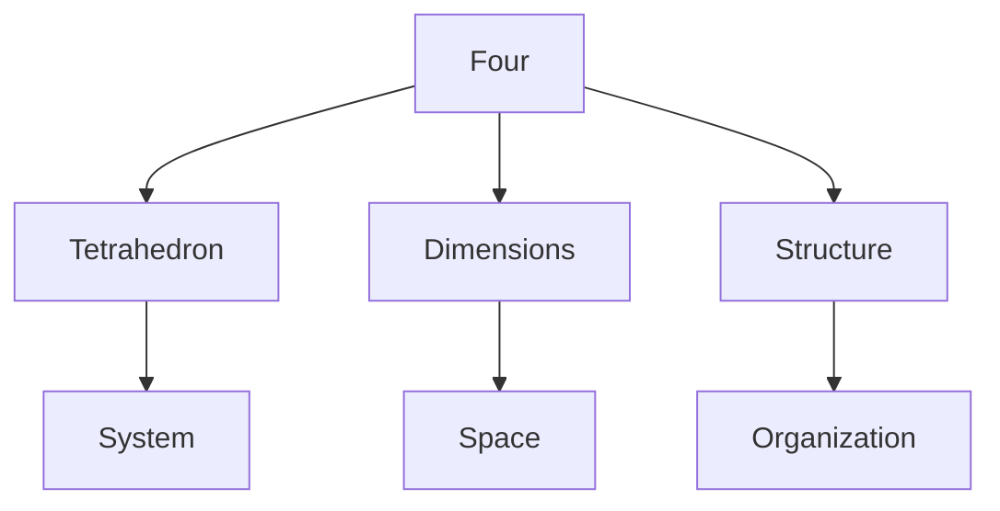
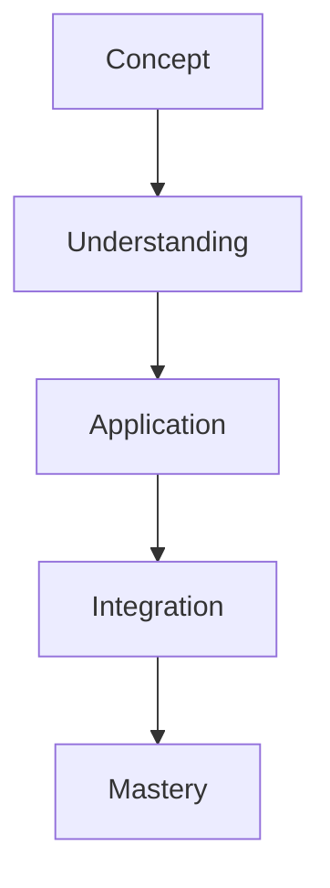

# Four

In R. Buckminster Fuller's work, [[4]] represents fundamental dimensionality and the tetrahedron, the minimum system of universe and the most basic structural system in space.

## Overview

### Definition
```yaml
number:
  value: 4
  type: integer
  category: dimensional/structural
  significance:
    - Four-dimensional systems
    - Tetrahedral geometry
    - Minimum space system
    - Dimensional completeness
  fuller_context:
    - 4D concept
    - Tetrahedron
    - Spatial systems
    - Structural minimum
```

### Key Properties
1. Mathematical Properties
   - First composite number
   - Square number
   - Tetrahedral basis
   - Dimensional marker

2. Synergetic Properties
   - Minimum system
   - Spatial completeness
   - Structural stability
   - Four-dimensional reference

## Mathematical Framework

### Numerical Properties
```mermaid
mindmap
    root((Four))
        Mathematics
            [[Square]]
            [[Composite]]
            [[Tetrahedral]]
        Systems
            [[Dimensions]]
            [[Structure]]
            [[Space]]
        Applications
            [[4D Systems]]
            [[Tetrahedron]]
            [[Spatial Design]]
```

### Mathematical Relationships
1. Dimensional Properties
   - Four-dimensional space
   - Tetrahedral geometry
   - Spatial coordinates
   - System completeness

2. Structural Properties
   - Minimum system
   - Spatial stability
   - Geometric foundation
   - Pattern organization

## Synergetic Significance

### System Properties
1. Structural Principles
   - [[Tetrahedral System]]
   - [[Spatial Organization]]
   - [[Minimum Structure]]
   - [[System Completeness]]

2. Dimensional Applications
   - [[4D Systems]]
   - [[Spatial Design]]
   - [[Structural Planning]]
   - [[System Integration]]

### System Framework


## Natural Occurrence

### Physical Systems
1. Natural Patterns
   - [[Molecular Structure]]
   - [[Crystal Systems]]
   - [[Natural Forms]]
   - [[Growth Patterns]]

2. System Organization
   - [[Spatial Structure]]
   - [[Pattern Formation]]
   - [[System Development]]
   - [[Natural Design]]

### Natural Framework
```mermaid
mindmap
    root((Natural Four))
        Structure
            [[Tetrahedron]]
            [[Space]]
            [[Pattern]]
        Systems
            [[Organization]]
            [[Development]]
            [[Integration]]
```

## Applications

### Implementation Areas
1. Design Systems
   - [[4D Design]]
   - [[Spatial Planning]]
   - [[Structural Systems]]
   - [[Pattern Development]]

2. Analysis Methods
   - [[Spatial Analysis]]
   - [[System Evaluation]]
   - [[Structure Assessment]]
   - [[Pattern Study]]

### Application Framework


## Educational Value

### Teaching Methods
1. Conceptual Models
   - Tetrahedral systems
   - Spatial concepts
   - Four-dimensional thinking
   - Structural principles

2. Learning Tools
   - Physical models
   - Spatial demonstrations
   - System exercises
   - Pattern studies

### Learning Framework


## Historical Context

### Cultural Significance
1. Historical Understanding
   - Four elements
   - Cardinal directions
   - Spatial concepts
   - System organization

2. Modern Interpretation
   - Four-dimensional space
   - Tetrahedral systems
   - Structural design
   - Pattern analysis

### Historical Framework
```mermaid
mindmap
    root((Four History))
        Traditional
            [[Elements]]
            [[Directions]]
            [[Space]]
        Modern
            [[4D Systems]]
            [[Tetrahedron]]
            [[Structure]]
```

## Resources

### Documentation
- [[Technical Papers]]
- [[Research Studies]]
- [[Design Guides]]
- [[Application Notes]]

### Learning Materials
1. Educational Resources
   - [[Teaching Guides]]
   - [[Model Sets]]
   - [[Visual Aids]]
   - [[Practice Materials]]

2. Technical Resources
   - [[Analysis Tools]]
   - [[Design Software]]
   - [[Spatial Systems]]
   - [[Pattern Tools]]

## References
1. Fuller's Synergetics
2. 4D principles
3. Tetrahedral geometry
4. Spatial systems
5. Structural design

## Notes
- Fundamental to spatial systems
- Minimum structural system
- Four-dimensional basis
- Pattern organization principle

## Tags
#number #mathematics #tetrahedron #four-dimensional #synergetics 