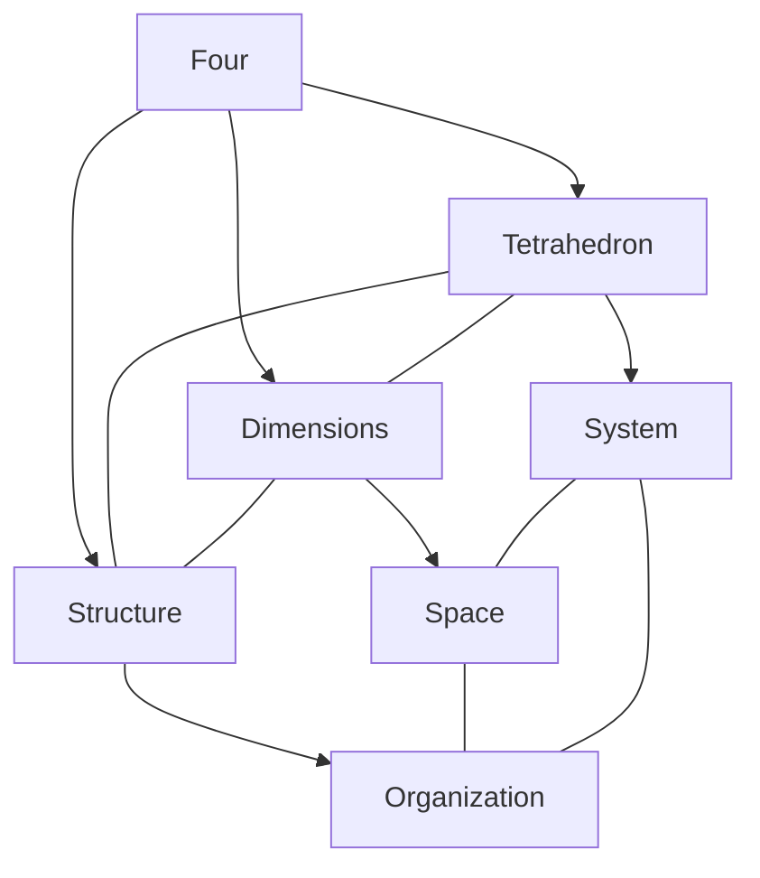
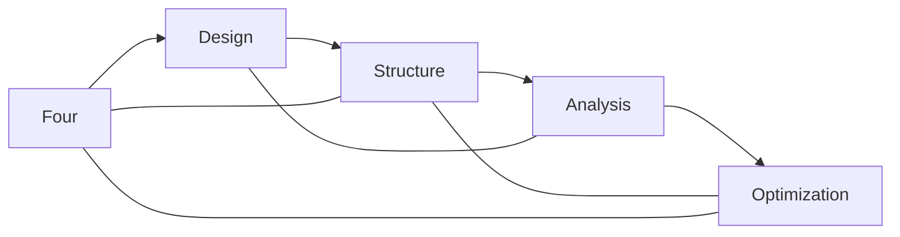
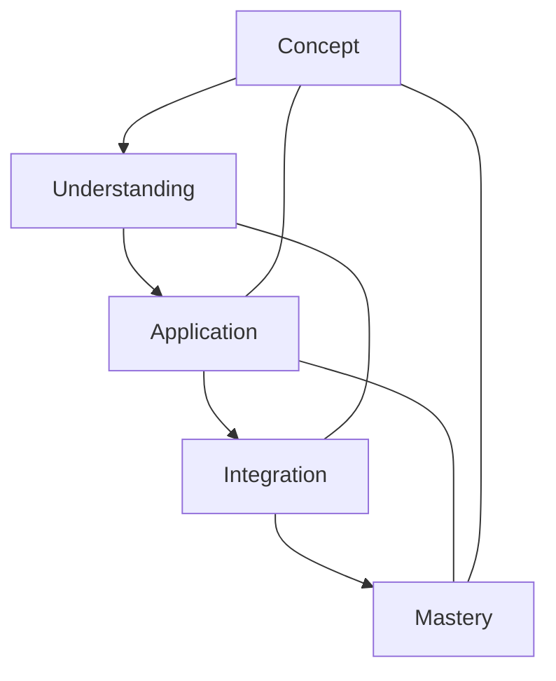

# Four

In [[Buckminster_Fuller|R. Buckminster Fuller]]'s work, [[4]] represents fundamental dimensionality and the [[Tetrahedron]], the minimum system of universe and the most basic structural system in space.

## Overview

### Definition
```yaml
number:
  value: 4
  type: integer
  category: dimensional/structural
  significance:
    - Four-dimensional systems
    - Tetrahedral geometry
    - Minimum space system
    - Dimensional completeness
  fuller_context:
    - 4D concept
    - Tetrahedron
    - Spatial systems
    - Structural minimum
```

### Key Properties
1. Mathematical Properties
   - First composite number
   - Square number
   - Tetrahedral basis
   - Dimensional marker

2. Synergetic Properties
   - Minimum system
   - Spatial completeness
   - Structural stability
   - Four-dimensional reference

## Mathematical Framework

### Numerical Properties
```mermaid
mindmap
    root((Four))
        Mathematics
            [[Square_Number]]
            [[Composite_Number]]
            [[Tetrahedral]]
        Systems
            [[Dimensions]]
            [[Structure]]
            [[Space]]
        Applications
            [[4D_Systems]]
            [[Tetrahedron]]
            [[Spatial_Design]]
```

### Mathematical Relationships
1. Dimensional Properties
   - Four-dimensional space
   - Tetrahedral geometry
   - Spatial coordinates
   - System completeness

2. Structural Properties
   - Minimum system
   - Spatial stability
   - Geometric foundation
   - Pattern organization

## Synergetic Significance

### System Properties
1. Structural Principles
   - [[Tetrahedral_System]]
   - [[Spatial_Organization]]
   - [[Minimum_Structure]]
   - [[System_Completeness]]

2. Dimensional Applications
   - [[4D_Systems]]
   - [[Spatial_Design]]
   - [[Structural_Planning]]
   - [[System_Integration]]

### System Framework


## Natural Occurrence

### Physical Systems
1. Natural Patterns
   - [[Molecular_Structure]]
   - [[Crystal_Systems]]
   - [[Natural_Forms]]
   - [[Growth_Patterns]]

2. System Organization
   - [[Spatial_Structure]]
   - [[Pattern_Formation]]
   - [[System_Development]]
   - [[Natural_Design]]

### Natural Framework
```mermaid
mindmap
    root((Natural Four))
        Structure
            [[Tetrahedron]]
            [[Space]]
            [[Pattern]]
        Systems
            [[Organization]]
            [[Development]]
            [[Integration]]
```

## Applications

### Implementation Areas
1. Design Systems
   - [[4D_Design]]
   - [[Spatial_Planning]]
   - [[Structural_Systems]]
   - [[Pattern_Development]]

2. Analysis Methods
   - [[Spatial_Analysis]]
   - [[System_Evaluation]]
   - [[Structure_Assessment]]
   - [[Pattern_Study]]

### Application Framework


## Educational Value

### Teaching Methods
1. Conceptual Models
   - Tetrahedral systems
   - Spatial concepts
   - Four-dimensional thinking
   - Structural principles

2. Learning Tools
   - Physical models
   - Spatial demonstrations
   - System exercises
   - Pattern studies

### Learning Framework


## Historical Context

### Cultural Significance
1. Historical Understanding
   - Four elements
   - Cardinal directions
   - Spatial concepts
   - System organization

2. Modern Interpretation
   - [[Four_Dimensional_Space]]
   - [[Tetrahedral_Systems]]
   - [[Structural_Design]]
   - [[Pattern_Analysis]]

### Historical Framework
```mermaid
mindmap
    root((Four History))
        Traditional
            [[Elements]]
            [[Directions]]
            [[Space]]
        Modern
            [[4D_Systems]]
            [[Tetrahedron]]
            [[Structure]]
```

## Resources

### Documentation
- [[Technical_Papers]]
- [[Research_Studies]]
- [[Design_Guides]]
- [[Application_Notes]]

### Learning Materials
1. Educational Resources
   - [[Teaching_Guides]]
   - [[Model_Sets]]
   - [[Visual_Aids]]
   - [[Practice_Materials]]

2. Technical Resources
   - [[Analysis_Tools]]
   - [[Design_Software]]
   - [[Spatial_Systems]]
   - [[Pattern_Tools]]

## References
1. [[books/Synergetics|Fuller's Synergetics]]
2. [[4D_Principles]]
3. [[Tetrahedral_Geometry]]
4. [[Spatial_Systems]]
5. [[Structural_Design]]

## Notes
- Fundamental to spatial systems
- Builds upon [[3|triangulation]] to create minimum spatial system
- Minimum structural system in 3D space
- Four-dimensional basis
- Pattern organization principle
- Foundation for more complex structures like [[8|octahedron]] and [[12|vector equilibrium]]

## Tags
#number #mathematics #tetrahedron #four-dimensional #synergetics 