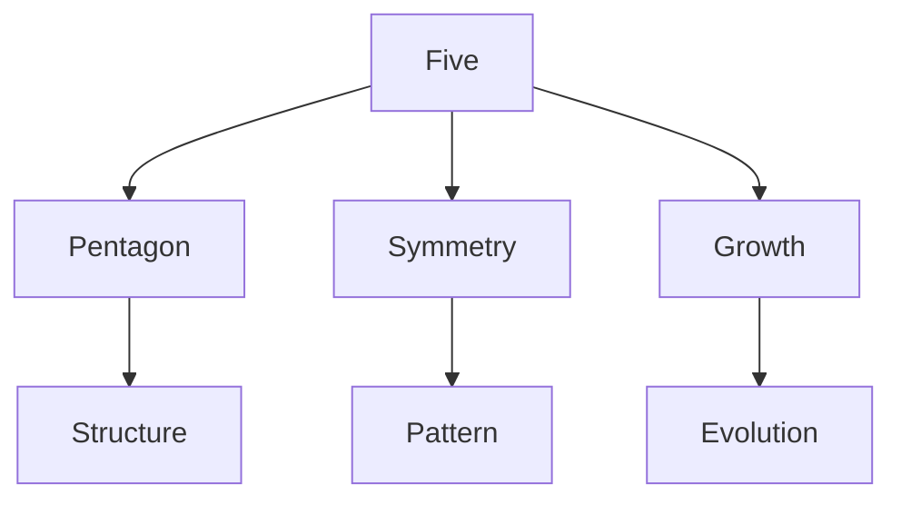
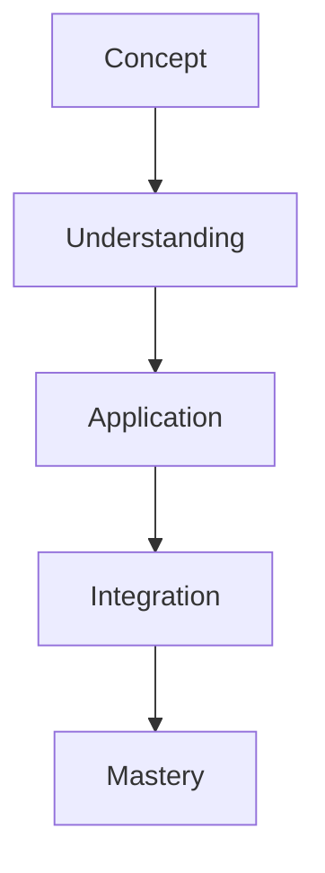

# Five

In R. Buckminster Fuller's work, Five represents pentagonal symmetry and appears in various structural and natural systems, particularly in relation to the icosahedron and certain growth patterns.

## Overview

### Definition
```yaml
number:
  value: 5
  type: integer
  category: symmetry/structure
  significance:
    - Pentagonal symmetry
    - Natural patterns
    - Growth systems
    - Structural relationships
  fuller_context:
    - Icosahedral systems
    - Natural growth
    - Pattern formation
    - System organization
```

### Key Properties
1. Mathematical Properties
   - Prime number
   - Pentagonal basis
   - Golden ratio relationship
   - Fibonacci sequence

2. Synergetic Properties
   - Symmetry patterns
   - Growth systems
   - Natural organization
   - Structural relationships

## Mathematical Framework

### Numerical Properties
```mermaid
mindmap
    root((Five))
        Mathematics
            [[Prime]]
            [[Pentagon]]
            [[Golden Ratio]]
        Systems
            [[Symmetry]]
            [[Growth]]
            [[Pattern]]
        Applications
            [[Structure]]
            [[Organization]]
            [[Design]]
```

### Mathematical Relationships
1. Geometric Properties
   - Pentagonal form
   - Golden ratio
   - Symmetry patterns
   - Growth sequences

2. Structural Properties
   - System organization
   - Pattern formation
   - Growth development
   - Natural relationships

## Synergetic Significance

### System Properties
1. Structural Principles
   - [[Pentagonal Symmetry]]
   - [[Growth Patterns]]
   - [[System Organization]]
   - [[Natural Structure]]

2. Pattern Applications
   - [[Growth Systems]]
   - [[Natural Development]]
   - [[Pattern Formation]]
   - [[System Evolution]]

### System Framework


## Natural Occurrence

### Physical Systems
1. Natural Patterns
   - [[Crystal Growth]]
   - [[Biological Forms]]
   - [[Plant Structure]]
   - [[Natural Systems]]

2. System Organization
   - [[Growth Development]]
   - [[Pattern Formation]]
   - [[System Evolution]]
   - [[Natural Design]]

### Natural Framework
```mermaid
mindmap
    root((Natural Five))
        Pattern
            [[Growth]]
            [[Symmetry]]
            [[Structure]]
        Systems
            [[Development]]
            [[Evolution]]
            [[Organization]]
```

## Applications

### Implementation Areas
1. Design Systems
   - [[Pattern Design]]
   - [[Growth Planning]]
   - [[System Development]]
   - [[Structure Formation]]

2. Analysis Methods
   - [[Pattern Analysis]]
   - [[Growth Study]]
   - [[System Evaluation]]
   - [[Structure Assessment]]

### Application Framework


## Educational Value

### Teaching Methods
1. Conceptual Models
   - Pentagonal systems
   - Growth patterns
   - Symmetry principles
   - Natural development

2. Learning Tools
   - Pattern models
   - Growth demonstrations
   - System exercises
   - Natural examples

### Learning Framework


## Historical Context

### Cultural Significance
1. Historical Understanding
   - Pentagonal symbolism
   - Natural patterns
   - Growth systems
   - Symmetry concepts

2. Modern Interpretation
   - System development
   - Pattern analysis
   - Growth studies
   - Structure design

### Historical Framework
```mermaid
mindmap
    root((Five History))
        Traditional
            [[Symbolism]]
            [[Pattern]]
            [[Nature]]
        Modern
            [[Systems]]
            [[Growth]]
            [[Design]]
```

## Resources

### Documentation
- [[Technical Papers]]
- [[Research Studies]]
- [[Design Guides]]
- [[Application Notes]]

### Learning Materials
1. Educational Resources
   - [[Teaching Guides]]
   - [[Model Sets]]
   - [[Visual Aids]]
   - [[Practice Materials]]

2. Technical Resources
   - [[Analysis Tools]]
   - [[Design Software]]
   - [[Pattern Systems]]
   - [[Growth Tools]]

## References
1. Fuller's Synergetics
2. Pattern principles
3. Growth studies
4. Natural systems
5. Design applications

## Notes
- Key to natural patterns
- Growth system basis
- Symmetry principle
- Development foundation

## Tags
#number #mathematics #pentagonal #symmetry #synergetics 