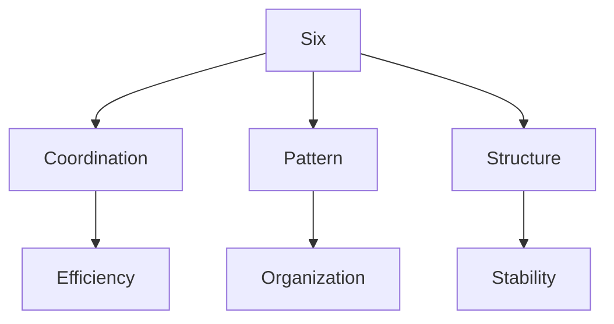
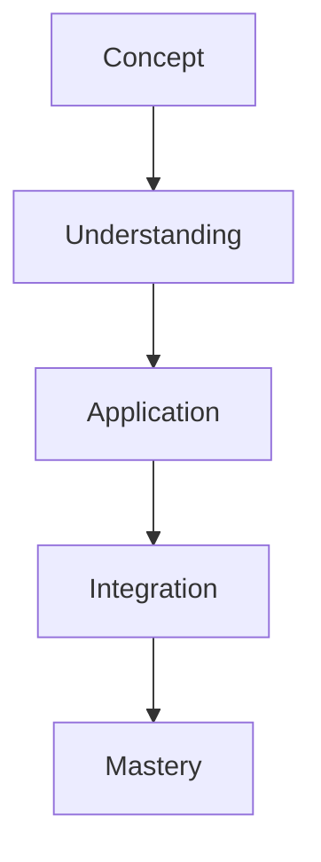

# Six

In R. Buckminster Fuller's work, Six represents the fundamental angular coordination of 60 degrees and hexagonal patterns, central to closest packing and natural system organization.

## Overview

### Definition
```yaml
number:
  value: 6
  type: integer
  category: coordination/structure
  significance:
    - 60-degree coordination
    - Hexagonal patterns
    - Closest packing
    - Natural organization
  fuller_context:
    - Vector equilibrium
    - System coordination
    - Natural efficiency
    - Structural organization
```

### Key Properties
1. Mathematical Properties
   - Perfect number
   - Hexagonal basis
   - 60-degree angles
   - Closest packing

2. Synergetic Properties
   - System coordination
   - Natural efficiency
   - Pattern organization
   - Structural stability

## Mathematical Framework

### Numerical Properties
```mermaid
mindmap
    root((Six))
        Mathematics
            [[Perfect]]
            [[Hexagonal]]
            [[Coordination]]
        Systems
            [[Packing]]
            [[Structure]]
            [[Pattern]]
        Applications
            [[Organization]]
            [[Efficiency]]
            [[Design]]
```

### Mathematical Relationships
1. Geometric Properties
   - Hexagonal form
   - 60-degree angles
   - Closest packing
   - Pattern formation

2. Structural Properties
   - System organization
   - Natural efficiency
   - Pattern coordination
   - Stability principles

## Synergetic Significance

### System Properties
1. Structural Principles
   - [[60_Degree_Coordination]]
   - [[Hexagonal_Pattern]]
   - [[Closest_Packing_of_Spheres]] on a Plane. 
   - [[System_Organization]]

2. Pattern Applications
   - [[Natural_Systems]]
   - [[Efficient_Structure]]
   - [[Pattern_Formation]]
   - [[System_Design]]

### System Framework


## Natural Occurrence

### Physical Systems
1. Natural Patterns
   - [[Crystal Structure]]
   - [[Molecular Organization]]
   - [[Natural Forms]]
   - [[Growth Systems]]

2. System Organization
   - [[Efficient Packing]]
   - [[Pattern Formation]]
   - [[System Development]]
   - [[Natural Design]]

### Natural Framework
```mermaid
mindmap
    root((Natural Six))
        Pattern
            [[Hexagonal]]
            [[Coordination]]
            [[Structure]]
        Systems
            [[Organization]]
            [[Efficiency]]
            [[Development]]
```

## Applications

### Implementation Areas
1. Design Systems
   - [[Structural Design]]
   - [[Pattern Organization]]
   - [[System Efficiency]]
   - [[Space Utilization]]

2. Analysis Methods
   - [[Pattern Analysis]]
   - [[Efficiency Study]]
   - [[Structure Evaluation]]
   - [[System Assessment]]

### Application Framework


## Educational Value

### Teaching Methods
1. Conceptual Models
   - Hexagonal systems
   - Coordination principles
   - Packing efficiency
   - Pattern organization

2. Learning Tools
   - Pattern models
   - Structure demonstrations
   - System exercises
   - Efficiency studies

### Learning Framework


## Historical Context

### Cultural Significance
1. Historical Understanding
   - Natural patterns
   - Efficient organization
   - System coordination
   - Structure design

2. Modern Interpretation
   - System efficiency
   - Pattern analysis
   - Structure optimization
   - Design principles

### Historical Framework
```mermaid
mindmap
    root((Six History))
        Traditional
            [[Pattern]]
            [[Structure]]
            [[Nature]]
        Modern
            [[Efficiency]]
            [[Organization]]
            [[Design]]
```

## Resources

### Documentation
- [[Technical Papers]]
- [[Research Studies]]
- [[Design Guides]]
- [[Application Notes]]

### Learning Materials
1. Educational Resources
   - [[Teaching Guides]]
   - [[Model Sets]]
   - [[Visual Aids]]
   - [[Practice Materials]]

2. Technical Resources
   - [[Analysis Tools]]
   - [[Design Software]]
   - [[Pattern Systems]]
   - [[Efficiency Tools]]

## References
1. Fuller's Synergetics
2. Coordination principles
3. Pattern studies
4. Efficiency analysis
5. Design applications

## Notes
- Fundamental to coordination
- Natural efficiency basis
- Pattern organization principle
- System stability foundation

## Tags
#number #mathematics #hexagonal #60-degree #synergetics 