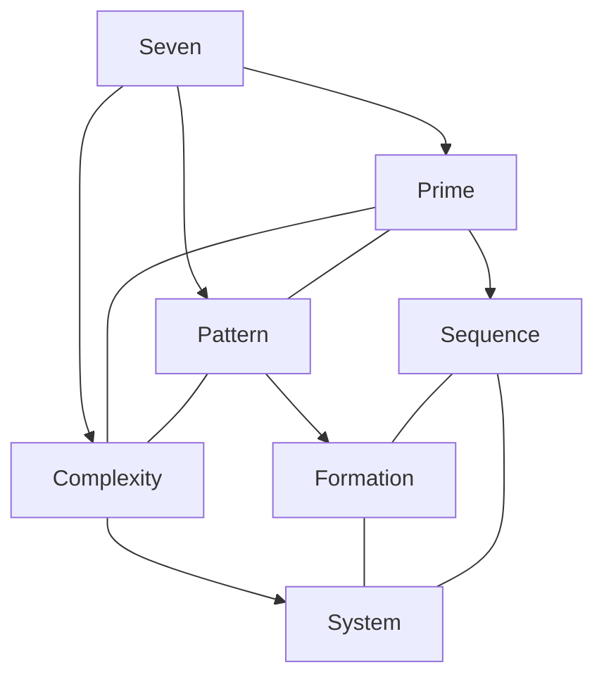
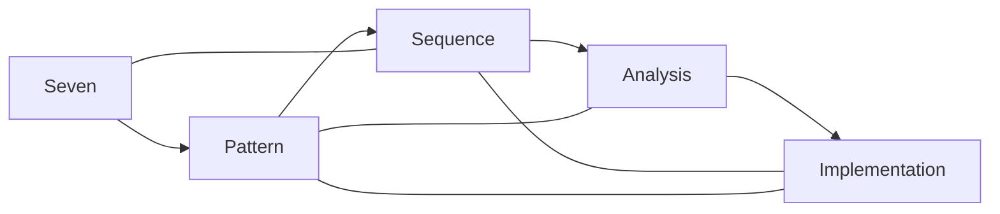
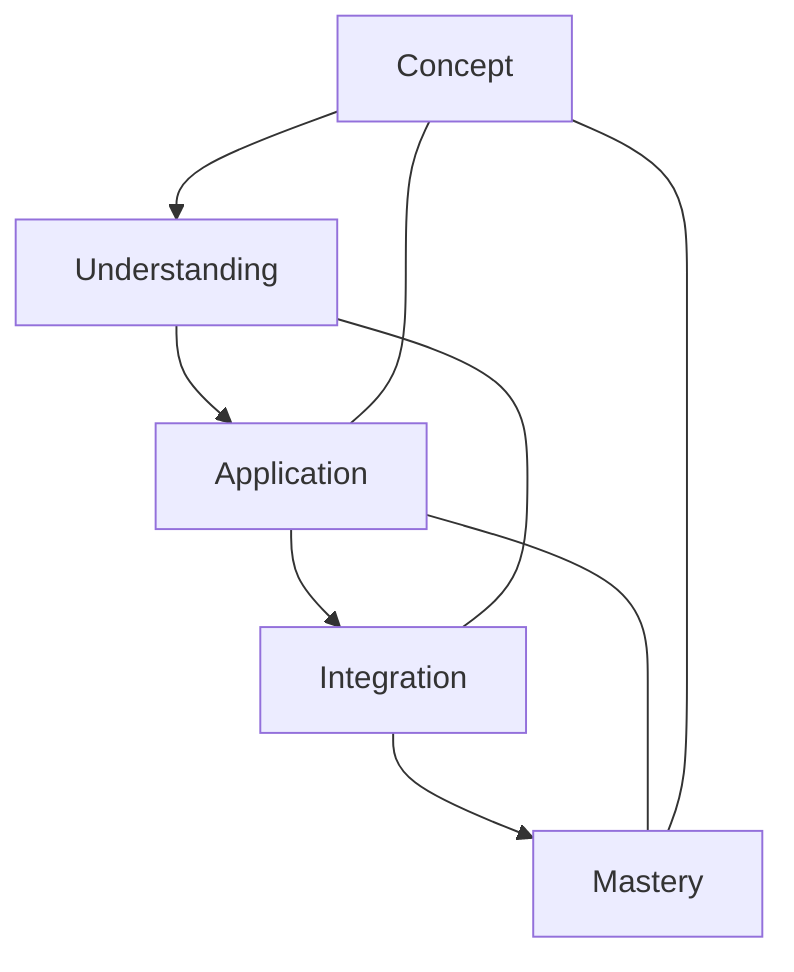

# Seven

In [[Buckminster_Fuller|R. Buckminster Fuller]]'s work, [[7|Seven]] represents significant pattern formulations and appears in various phase transitions, particularly in more complex geometric systems beyond basic structural minimums.

## Overview

### Definition
```yaml
number:
  value: 7
  type: integer
  category: pattern/sequence
  significance:
    - Pattern sequences
    - Prime efficiency
    - Complex systems
    - Phase transitions
  fuller_context:
    - Transformation phases
    - Pattern sequences
    - Complex systems
    - Frequency relationships
```

### Key Properties
1. Mathematical Properties
   - Prime number
   - Non-structural prime
   - Pattern basis
   - Sequence component

2. Synergetic Properties
   - Phase transition
   - System complexity
   - Pattern sequence
   - Transformation component

## Mathematical Framework

### Numerical Properties
```mermaid
mindmap
    root((Seven))
        Mathematics
            [[Prime_Number]]
            [[Sequence]]
            [[Pattern]]
        Systems
            [[Complexity]]
            [[Transition]]
            [[Phase]]
        Applications
            [[Pattern_Systems]]
            [[Complex_Structures]]
            [[Transformations]]
```

### Mathematical Relationships
1. Pattern Properties
   - Sequence formation
   - Prime relationships
   - System patterns
   - Numerical sequences

2. Structural Properties
   - Complexity development
   - Pattern arrangements
   - System organizations
   - Phase transitions

## Synergetic Significance

### Pattern Principles
1. System Properties
   - [[Sequence_Patterns]]
   - [[Prime_Relationships]]
   - [[Pattern_Formation]]
   - [[System_Complexity]]

2. Dynamic Properties
   - [[Phase_Transitions]]
   - [[System_Transformations]]
   - [[Pattern_Evolution]]
   - [[Complex_Organization]]

### System Framework


## Natural Occurrence

### Physical Systems
1. Natural Patterns
   - [[Complex_Structures]]
   - [[Pattern_Sequences]]
   - [[Prime_Organizations]]
   - [[Growth_Systems]]

2. System Organization
   - [[Pattern_Development]]
   - [[Prime_Structures]]
   - [[Complex_Formation]]
   - [[System_Growth]]

### Natural Framework
```mermaid
mindmap
    root((Natural Seven))
        Patterns
            [[Sequence]]
            [[Prime]]
            [[Complexity]]
        Systems
            [[Organization]]
            [[Development]]
            [[Transition]]
```

## Applications

### Implementation Areas
1. Design Systems
   - [[Pattern_Design]]
   - [[Sequence_Planning]]
   - [[Prime_Arrangements]]
   - [[Complex_Structures]]

2. Analysis Methods
   - [[Pattern_Analysis]]
   - [[Sequence_Study]]
   - [[Prime_Evaluation]]
   - [[System_Assessment]]

### Application Framework


## Educational Value

### Teaching Methods
1. Conceptual Models
   - Pattern understanding
   - Prime relationships
   - Sequence principles
   - Complexity models

2. Learning Tools
   - Pattern demonstrations
   - Sequence models
   - System exercises
   - Complexity examples

### Learning Framework


## Historical Context

### Cultural Significance
1. Historical Understanding
   - Seven wonders
   - Seven days
   - Seven principles
   - Seven systems

2. Modern Interpretation
   - [[Pattern_Systems]]
   - [[Sequence_Analysis]]
   - [[Prime_Structures]]
   - [[Complex_Organizations]]

### Historical Framework
```mermaid
mindmap
    root((Seven History))
        Traditional
            [[Cultural]]
            [[Mystical]]
            [[Historical]]
        Modern
            [[Mathematical]]
            [[Scientific]]
            [[Synergetic]]
```

## Resources

### Documentation
- [[Technical_Papers]]
- [[Research_Studies]]
- [[Pattern_Documentation]]
- [[Application_Notes]]

### Learning Materials
1. Educational Resources
   - [[Teaching_Guides]]
   - [[Model_Sets]]
   - [[Visual_Aids]]
   - [[Practice_Materials]]

2. Technical Resources
   - [[Analysis_Tools]]
   - [[Pattern_Software]]
   - [[Sequence_Systems]]
   - [[Complexity_Tools]]

## References
1. [[books/Synergetics|Fuller's Synergetics]]
2. [[Pattern_Principles]]
3. [[Sequence_Theory]]
4. [[Prime_Studies]]
5. [[Complexity_Analysis]]

## Notes
- Important in pattern sequences
- Prime number with unique properties
- Connects to [[6|hexagonal]] and [[8|octahedral]] transformations
- Appears in various [[Jitterbug_Transformation|jitterbug]] phase transitions
- Related to the seven axes of symmetry in certain coordinate systems
- Bridge between [[6|six-fold]] and [[8|eight-fold]] coordinate systems

## Tags
#number #mathematics #heptagonal #prime #synergetics 