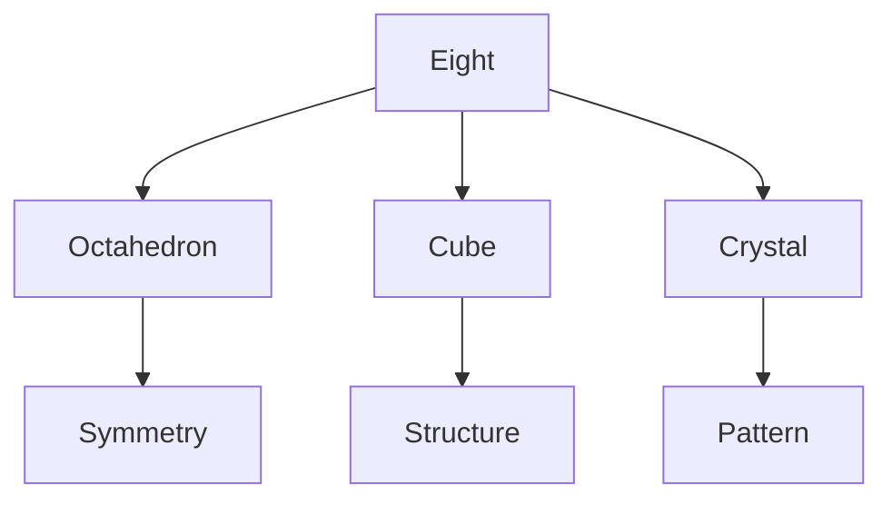
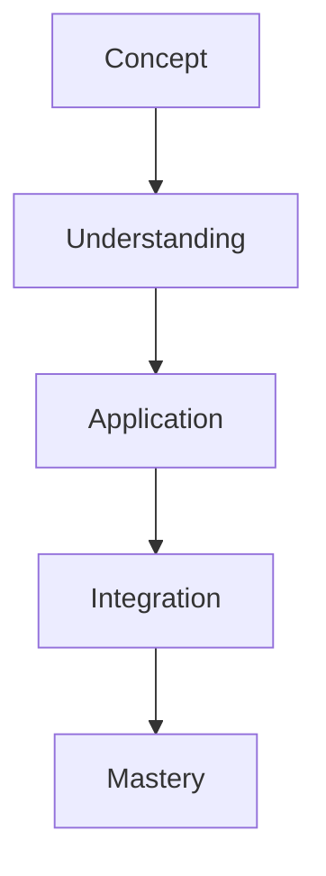

# Eight

In R. Buckminster Fuller's work, Eight represents octahedral symmetry and cubic systems, fundamental to understanding spatial organization and crystalline structures.

## Overview

### Definition
```yaml
number:
  value: 8
  type: integer
  category: structural/symmetry
  significance:
    - Octahedral vertices
    - Cubic corners
    - Crystal systems
    - Spatial organization
  fuller_context:
    - Octahedral geometry
    - Cubic structures
    - Crystal patterns
    - System organization
```

### Key Properties
1. Mathematical Properties
   - First cubic number
   - Octahedral vertices
   - Crystal symmetry
   - Spatial organization

2. Synergetic Properties
   - System structure
   - Pattern formation
   - Spatial coordination
   - Crystal organization

## Mathematical Framework

### Numerical Properties
```mermaid
mindmap
    root((Eight))
        Mathematics
            [[Cubic]]
            [[Octahedral]]
            [[Crystal]]
        Systems
            [[Structure]]
            [[Pattern]]
            [[Organization]]
        Applications
            [[Space]]
            [[Form]]
            [[Design]]
```

### Mathematical Relationships
1. Geometric Properties
   - Cubic form
   - Octahedral symmetry
   - Crystal structure
   - Pattern organization

2. Structural Properties
   - System coordination
   - Spatial arrangement
   - Pattern formation
   - Organization principles

## Synergetic Significance

### System Properties
1. Structural Principles
   - [[Octahedral_System]]
   - [[Cubic_Structure]]
   - [[Crystal_Pattern]]
   - [[Spatial_Organization]]

2. Pattern Applications
   - [[System_Design]]
   - [[Space_Planning]]
   - [[Pattern_Formation]]
   - [[Crystal_Growth]]

### System Framework


## Natural Occurrence

### Physical Systems
1. Natural Patterns
   - [[Crystal Systems]]
   - [[Molecular Structure]]
   - [[Growth Patterns]]
   - [[Natural Forms]]

2. System Organization
   - [[Spatial Structure]]
   - [[Pattern Formation]]
   - [[Crystal Growth]]
   - [[Natural Design]]

### Natural Framework
```mermaid
mindmap
    root((Natural Eight))
        Structure
            [[Octahedral]]
            [[Cubic]]
            [[Crystal]]
        Systems
            [[Organization]]
            [[Pattern]]
            [[Growth]]
```

## Applications

### Implementation Areas
1. Design Systems
   - [[Structural Design]]
   - [[Crystal Engineering]]
   - [[Space Planning]]
   - [[Pattern Development]]

2. Analysis Methods
   - [[Structure Analysis]]
   - [[Pattern Study]]
   - [[Crystal Assessment]]
   - [[Space Evaluation]]

### Application Framework


## Educational Value

### Teaching Methods
1. Conceptual Models
   - Octahedral systems
   - Cubic structures
   - Crystal patterns
   - Spatial organization

2. Learning Tools
   - Physical models
   - Crystal demonstrations
   - Pattern exercises
   - Space studies

### Learning Framework


## Historical Context

### Cultural Significance
1. Historical Understanding
   - Crystal systems
   - Spatial organization
   - Pattern formation
   - Structure design

2. Modern Interpretation
   - System design
   - Crystal engineering
   - Pattern analysis
   - Space organization

### Historical Framework
```mermaid
mindmap
    root((Eight History))
        Traditional
            [[Crystal]]
            [[Structure]]
            [[Pattern]]
        Modern
            [[Engineering]]
            [[Design]]
            [[Systems]]
```

## Resources

### Documentation
- [[Technical Papers]]
- [[Research Studies]]
- [[Design Guides]]
- [[Application Notes]]

### Learning Materials
1. Educational Resources
   - [[Teaching Guides]]
   - [[Model Sets]]
   - [[Visual Aids]]
   - [[Practice Materials]]

2. Technical Resources
   - [[Analysis Tools]]
   - [[Design Software]]
   - [[Crystal Systems]]
   - [[Pattern Tools]]

## References
1. Fuller's Synergetics
2. Crystal studies
3. Structural principles
4. Pattern analysis
5. Space organization

## Notes
- Key to crystal systems
- Fundamental spatial number
- Pattern organization basis
- System structure principle

## Tags
#number #mathematics #octahedral #cubic #synergetics 