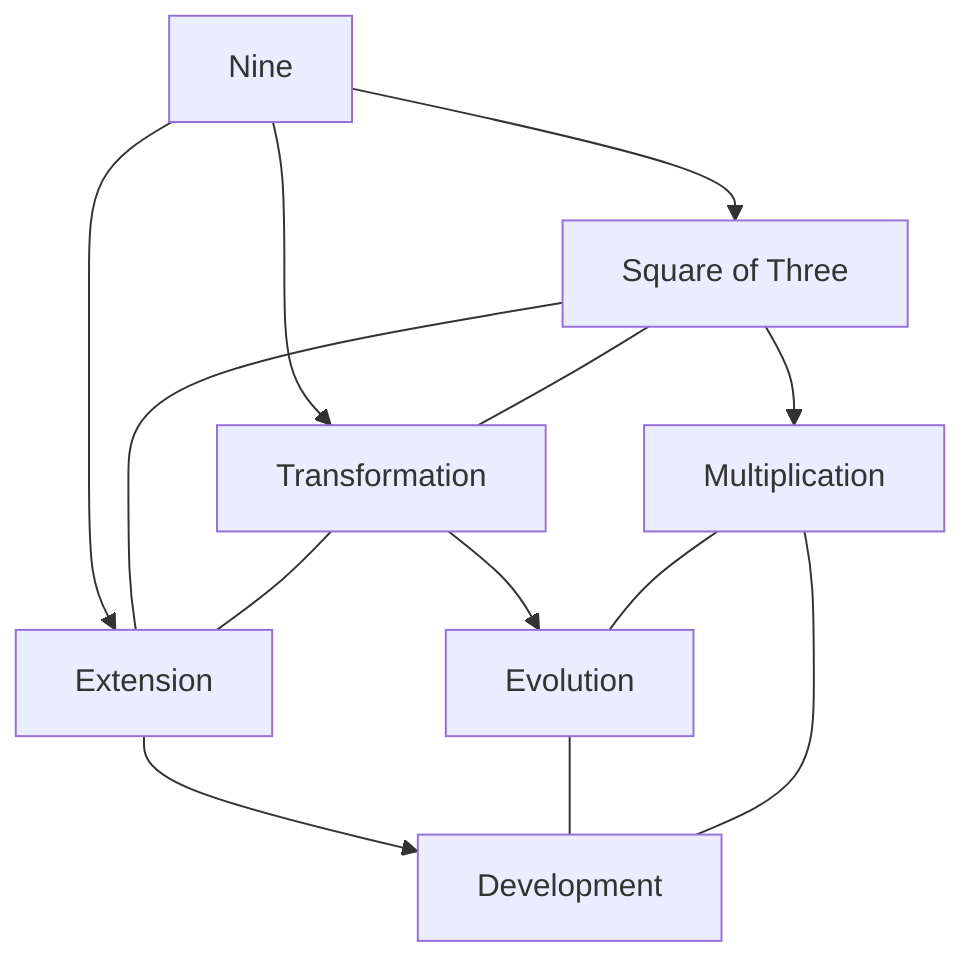
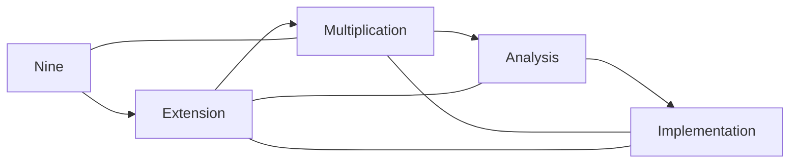
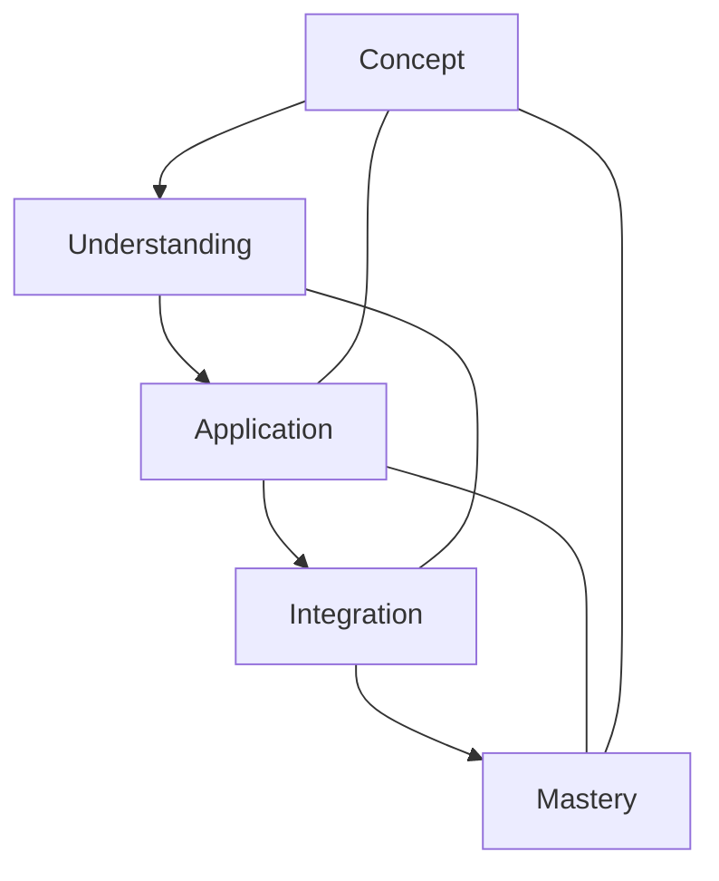

# Nine

In [[Buckminster_Fuller|R. Buckminster Fuller]]'s work, [[9|Nine]] represents significant geometric relationships as the square of [[3|three]], connecting triangulation principles to higher-order structural systems and transformational processes.

## Overview

### Definition
```yaml
number:
  value: 9
  type: integer
  category: structural/transformational
  significance:
    - Square of three
    - Triangulation expansion
    - Structural transitions
    - System multiplication
  fuller_context:
    - Extended triangulation
    - Structural transformations
    - System development
    - Pattern multiplication
```

### Key Properties
1. Mathematical Properties
   - Perfect square (3²)
   - Triangular expansion
   - Pattern multiplication
   - Structural amplification

2. Synergetic Properties
   - Extended triangulation
   - System development
   - Structural transformation
   - Pattern organization

## Mathematical Framework

### Numerical Properties
```mermaid
mindmap
    root((Nine))
        Mathematics
            [[Square_Number]]
            [[Triangular_Extension]]
            [[Multiplication]]
        Systems
            [[Transformation]]
            [[Structure]]
            [[Pattern]]
        Applications
            [[Structural_Systems]]
            [[Pattern_Organization]]
            [[Transformational_Design]]
```

### Mathematical Relationships
1. Geometric Properties
   - Triangular extension (3²)
   - Structural multiplication
   - Pattern amplification
   - System development

2. Structural Properties
   - Extended triangulation
   - System transformation
   - Pattern organization
   - Structural expansion

## Synergetic Significance

### Structural Principles
1. System Properties
   - [[Extended_Triangulation]]
   - [[Structural_Multiplication]]
   - [[Pattern_Amplification]]
   - [[System_Development]]

2. Transformational Properties
   - [[System_Transformation]]
   - [[Pattern_Evolution]]
   - [[Structural_Extension]]
   - [[Development_Process]]

### System Framework


## Natural Occurrence

### Physical Systems
1. Natural Patterns
   - [[Extended_Structures]]
   - [[Triangular_Patterns]]
   - [[Growth_Systems]]
   - [[Natural_Organizations]]

2. System Organization
   - [[Pattern_Development]]
   - [[Structural_Growth]]
   - [[System_Extension]]
   - [[Transformation_Process]]

### Natural Framework
```mermaid
mindmap
    root((Natural Nine))
        Extension
            [[Triangulation]]
            [[Multiplication]]
            [[Growth]]
        Systems
            [[Organization]]
            [[Development]]
            [[Transformation]]
```

## Applications

### Implementation Areas
1. Design Systems
   - [[Extended_Structures]]
   - [[Pattern_Multiplication]]
   - [[System_Development]]
   - [[Transformation_Design]]

2. Analysis Methods
   - [[Extension_Analysis]]
   - [[Pattern_Study]]
   - [[Multiplication_Evaluation]]
   - [[System_Assessment]]

### Application Framework


## Educational Value

### Teaching Methods
1. Conceptual Models
   - Triangular multiplication
   - Structural extension
   - Pattern development
   - System evolution

2. Learning Tools
   - Extension models
   - Multiplication demonstrations
   - Pattern exercises
   - System examples

### Learning Framework


## Historical Context

### Cultural Significance
1. Historical Understanding
   - Nine-fold systems
   - Square completion
   - Extension principles
   - Development patterns

2. Modern Interpretation
   - [[Structural_Extensions]]
   - [[Pattern_Multiplication]]
   - [[System_Development]]
   - [[Transformation_Analysis]]

### Historical Framework
```mermaid
mindmap
    root((Nine History))
        Traditional
            [[Square]]
            [[Extension]]
            [[Multiplication]]
        Modern
            [[Systems]]
            [[Patterns]]
            [[Development]]
```

## Resources

### Documentation
- [[Technical_Papers]]
- [[Research_Studies]]
- [[Extension_Documentation]]
- [[Application_Notes]]

### Learning Materials
1. Educational Resources
   - [[Teaching_Guides]]
   - [[Model_Sets]]
   - [[Visual_Aids]]
   - [[Practice_Materials]]

2. Technical Resources
   - [[Analysis_Tools]]
   - [[Extension_Software]]
   - [[Pattern_Systems]]
   - [[Development_Tools]]

## References
1. [[books/Synergetics|Fuller's Synergetics]]
2. [[Extension_Principles]]
3. [[Multiplication_Studies]]
4. [[Pattern_Development]]
5. [[System_Evolution]]

## Notes
- Square of [[3|three]] (3²), extending triangulation principles
- Critical in transformational processes between structural systems
- Connects to [[Jitterbug_Transformation|jitterbug transformations]] in certain phases
- Appears in frequency systems of geodesic breakdown
- Important in the extension of [[Vector_Equilibrium|vector equilibrium]] transformations
- Bridges triangulation (3) to more complex systems through multiplication
- Ratio relationships to [[3|three]] and [[27|twenty-seven]] (3³) in spatial systems

## Tags
#number #mathematics #square #triangulation #synergetics 