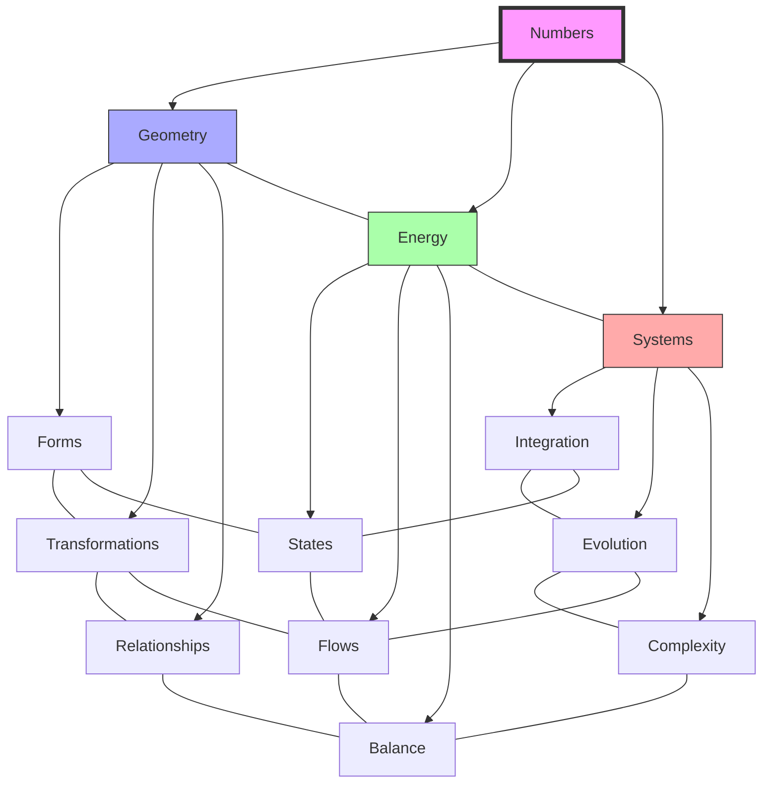

# 🔢 Numbers Index

> Fuller's numerical system and its significance in synergetic geometry

## Fundamental Numbers

### Zero to Four (System Foundation)
- [[0|Zero]] - Void state and [[Vector_Equilibrium|system potential]]
- [[1|One]] - Unity is plural and at minimum two
- [[2|Two]] - Minimum system relationship
- [[3|Three]] - Triangulation and stability
- [[4|Four]] - [[Tetrahedron|Tetrahedral]] system minimum

### Five to Nine (Transformation & Pattern)
- [[5|Five]] - Quanta of structural transformation
- [[6|Six]] - Vector equilibrium coordination
- [[7|Seven]] - Pattern sequences and phase transitions
- [[8|Eight]] - Cube-octahedron symmetry
- [[9|Nine]] - Extended triangulation (3²) and transformational systems

### Ten to Fourteen (System Complexity)
- [[10|Ten]] - Decimal system base
- [[11|Eleven]] - Geodesic frequency and optimization
- [[12|Twelve]] - Vector equilibrium vertices
- [[13|Thirteen]] - Transformation points and system evolution
- [[14|Fourteen]] - Vector equilibrium faces (8 triangular + 6 square)

### Higher Order (Extended Systems)
- [[20|Twenty]] - Icosahedral system

## Number Properties

### Synergetic Significance
```yaml
number_properties:
  unity: 
    base: 1
    principle: "Unity is plural and at minimum two"
  minimum_system:
    base: 4
    principle: "Tetrahedral stability"
  vector_equilibrium:
    vertices: 12
    edges: 24
    faces: 14 (8 triangular + 6 square)
  transformation:
    base: 5
    principle: "Quanta of change"
  patterns:
    base: 7
    principle: "Phase transitions"
  frequency:
    base: 11
    principle: "Geodesic optimization"
```

### Mathematical Relationships
\[
\begin{align*}
0 &\rightarrow \text{Equilibrium state} \\
1 &\rightarrow \text{Unity (plural)} \\
2 &\rightarrow \text{Minimum relationship} \\
3 &\rightarrow \text{Triangular stability} \\
4 &\rightarrow \text{Tetrahedral system} \\
7 &\rightarrow \text{Pattern sequences} \\
9 &\rightarrow \text{Extended triangulation (3²)} \\
11 &\rightarrow \text{Geodesic frequency} \\
12 &\rightarrow \text{Vector equilibrium vertices} \\
13 &\rightarrow \text{Transformation points} \\
14 &\rightarrow \text{Vector equilibrium faces} \\
20 &\rightarrow \text{Icosahedral efficiency}
\end{align*}
\]

## System Integration

### Geometric Relationships


### System Properties
1. Unity and Plurality
   - [[1|One]] implies [[2|two]]
   - [[Minimum_Relationship|Minimum relationships]]
   - [[System_Emergence|System emergence]]
   - [[Pattern_Formation|Pattern formation]]

2. Structural Stability
   - [[3|Triangular]] stability
   - [[4|Tetrahedral]] systems
   - [[12|Vector equilibrium]] vertices
   - [[14|Vector equilibrium]] faces
   - [[20|Icosahedral]] efficiency

3. Patterns and Transformation
   - [[7|Pattern sequences]]
   - [[9|Extended triangulation]]
   - [[11|Geodesic frequency]]
   - [[13|Transformation points]]
   - [[Jitterbug_Transformation|System transformations]]

## Applications

### Geometric Systems
1. Basic Forms
   - [[Tetrahedron]] ([[4]])
   - [[Vector_Equilibrium]] ([[12]] vertices, [[14]] faces)
   - [[Icosahedron]] ([[20]])
   - [[System_Transformations|System transformations]]

2. Complex Systems
   - [[Geodesic_Frequencies|Geodesic frequencies]] ([[11]])
   - [[Jitterbug_Transformation|Jitterbug phases]]
   - [[Tensegrity|Tensegrity structures]]
   - [[Space_Frames|Space frames]]
   - [[Pattern_Sequences|Pattern sequences]] ([[7]])
   - [[Transformation_Points|Transformation points]] ([[13]])

### Mathematical Framework
```mermaid
mindmap
    root((Numbers))
        Foundation
            [[0|Zero]]
            [[1|One]]
            [[2|Two]]
            [[3|Three]]
            [[4|Four]]
        Transformation
            [[5|Five]]
            [[7|Seven]]
            [[9|Nine]]
            [[13|Thirteen]]
        Systems
            [[6|Six]]
            [[8|Eight]]
            [[11|Eleven]]
            [[12|Twelve]]
            [[14|Fourteen]]
            [[20|Twenty]]
```

## References

### Primary Sources
1. [[books/Synergetics|Synergetics: Explorations in the Geometry of Thinking]]
2. [[books/Synergetics_2|Synergetics 2]]
3. [[papers/Number_Systems|Fuller's Number Systems]]

### Technical Resources
1. [[papers/Numerical_Principles|Numerical Principles in Synergetics]]
2. [[papers/Geometric_Numbers|Numbers in Geometric Systems]]
3. [[papers/System_Mathematics|System Mathematics]]
4. [[papers/Pattern_Formation|Pattern Formation and Numbers]]
5. [[papers/Transformation_Mathematics|Transformation Mathematics]]

## Notes
- Numbers represent system relationships
- [[Geometric_Forms|Geometric forms]] emerge from number properties
- System complexity builds from simple numbers
- [[System_Transformation|Transformation]] based on number relationships
- [[0|Zero]] represents the [[Vector_Equilibrium|vector equilibrium]] state
- [[Minimum_System|Minimum system]] requires [[4|Four]] vertices ([[Tetrahedron]])
- [[Pattern_Sequences|Pattern sequences]] appear at [[7|Seven]]
- [[Extended_Triangulation|Extended triangulation]] at [[9|Nine]] (3²)
- [[Geodesic_Frequency|Geodesic frequency]] optimization at [[11|Eleven]]
- [[Transformation_Points|Transformation points]] at [[13|Thirteen]]
- [[Vector_Equilibrium]] has [[12|Twelve]] vertices and [[14|Fourteen]] faces

## Tags
#numbers #mathematics #geometry #systems #synergetics