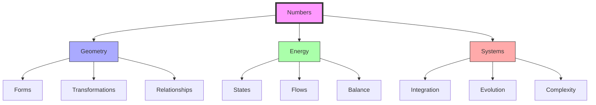
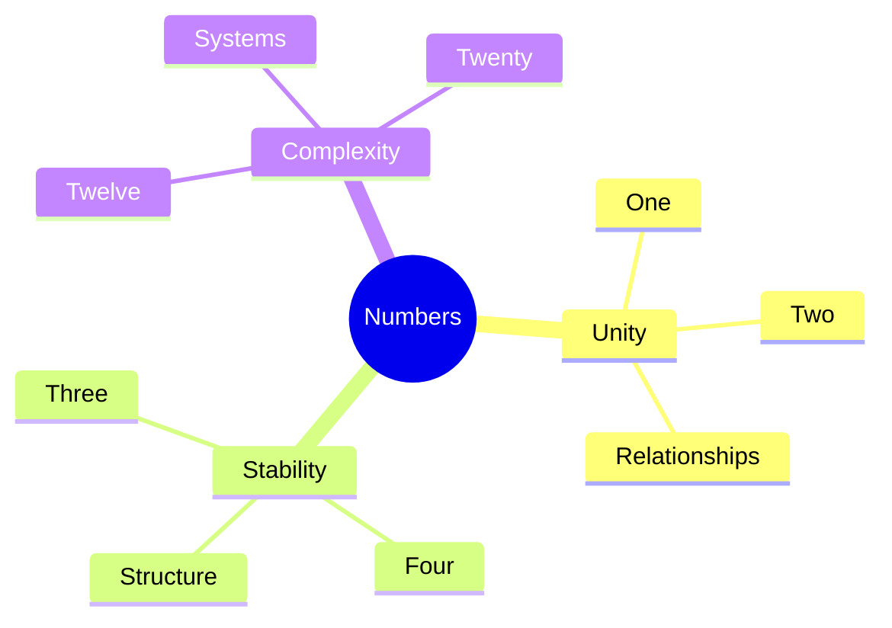

# 🔢 Numbers Index

> Fuller's numerical system and its significance in synergetic geometry

## Fundamental Numbers

### Zero to Four (System Foundation)
- [[0|Zero]] - Void state and system potential
- [[1|One]] - Unity is plural and at minimum two
- [[2|Two]] - Minimum system relationship
- [[3|Three]] - Triangulation and stability
- [[4|Four]] - Tetrahedral system minimum

### Five to Eight (Transformation Base)
- [[5|Five]] - Quanta of structural transformation
- [[6|Six]] - Vector equilibrium coordination
- [[8|Eight]] - Cube-octahedron symmetry

### Ten to Twenty (System Complexity)
- [[10|Ten]] - Decimal system base
- [[12|Twelve]] - Vector equilibrium vertices
- [[20|Twenty]] - Icosahedral system

## Number Properties

### Synergetic Significance
```yaml
number_properties:
  unity: 
    base: 1
    principle: "Unity is plural and at minimum two"
  minimum_system:
    base: 4
    principle: "Tetrahedral stability"
  vector_equilibrium:
    vertices: 12
    edges: 24
    faces: 14
  transformation:
    base: 5
    principle: "Quanta of change"
```

### Mathematical Relationships
\[
\begin{align*}
1 &\rightarrow \text{Unity (plural)} \\
2 &\rightarrow \text{Minimum relationship} \\
3 &\rightarrow \text{Triangular stability} \\
4 &\rightarrow \text{Tetrahedral system} \\
12 &\rightarrow \text{Vector equilibrium} \\
20 &\rightarrow \text{Icosahedral efficiency}
\end{align*}
\]

## System Integration

### Geometric Relationships


### System Properties
1. Unity and Plurality
   - One implies two
   - Minimum relationships
   - System emergence
   - Pattern formation

2. Structural Stability
   - Triangular stability
   - Tetrahedral systems
   - Vector equilibrium
   - Icosahedral efficiency

## Applications

### Geometric Systems
1. Basic Forms
   - Tetrahedron (4)
   - Vector Equilibrium (12)
   - Icosahedron (20)
   - System transformations

2. Complex Systems
   - Geodesic frequencies
   - Jitterbug phases
   - Tensegrity structures
   - Space frames

### Mathematical Framework


## References

### Primary Sources
1. [[books/Synergetics|Synergetics: Explorations in the Geometry of Thinking]]
2. [[books/Synergetics_2|Synergetics 2]]
3. [[papers/Number_Systems|Fuller's Number Systems]]

### Technical Resources
1. [[papers/Numerical_Principles|Numerical Principles in Synergetics]]
2. [[papers/Geometric_Numbers|Numbers in Geometric Systems]]
3. [[papers/System_Mathematics|System Mathematics]]

## Notes
- Numbers represent system relationships
- Geometric forms emerge from number properties
- System complexity builds from simple numbers
- Transformation based on number relationships

## Tags
#numbers #mathematics #geometry #systems #synergetics