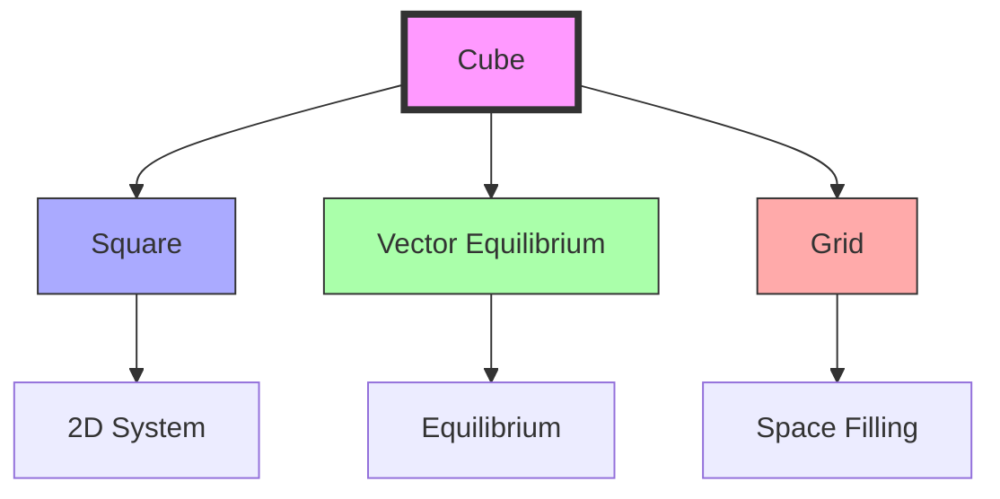
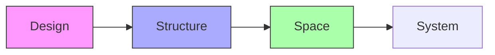

# Cube

The cube (hexahedron) represents the basic unit of the XYZ coordinate system and embodies the principle of [[Six]] in its face count. It is fundamental to conventional geometry but requires internal triangulation for stability in [[Synergetics_Geometry]].

## Geometric Properties

### Basic Characteristics
```yaml
properties:
  vertices: 8
  edges: 12
  faces: 6  # all squares
  symmetry_group: Oh
  dual_polyhedron: octahedron
  regular_polyhedron: true
  requires_triangulation: true  # for stability
```

### Dimensional Relationships
1. Unit Edge Length
```yaml
measurements:
  radius_to_vertex: 0.8660254037844386  # √3/2
  edge_length: 1.0
  volume: 1.0
  surface_area: 6.0
  face_diagonal: 1.4142135623730951  # √2
  body_diagonal: 1.7320508075688772  # √3
```

2. Normalized Ratios
```yaml
ratios:
  volume_to_tetrahedron: 8.485281374238571
  surface_to_volume: 6.0
  edge_to_diagonal: 0.7071067811865476  # 1/√2
  radius_to_edge: 0.8660254037844386  # √3/2
```

## Mathematical Structure

### Numerical Properties
```yaml
numbers:
  vertices: 8
  edges: 12
  faces: 6  # [[Six]]
  euler_characteristic: 2  # V - E + F = 2
  dihedral_angle: 90°
  solid_angle: 0.5235987755982989  # π/6 steradians
```

### Coordinate Systems
1. Cartesian Coordinates (Unit Edge)
```yaml
vertices:
  - [0, 0, 0]
  - [1, 0, 0]
  - [1, 1, 0]
  - [0, 1, 0]
  - [0, 0, 1]
  - [1, 0, 1]
  - [1, 1, 1]
  - [0, 1, 1]
```

2. [[IVM]] Coordinates
```yaml
ivm_coordinates:
  vectors: [
    [±1, ±1, ±1]  # all 8 combinations
  ]
```

## Synergetic Properties

### System Relationships
1. Form Hierarchy
   - Built from [[Square]]
   - Related to [[Tetrahedron]] by volume
   - Component of [[Vector_Equilibrium]]
   - Base for XYZ coordinates

2. Energy Properties
   - Requires internal bracing
   - Orthogonal relationships
   - Space-filling capability
   - Grid formation

### Transformation Framework


## Natural Occurrence

### Physical Systems
1. Natural Examples
   - Crystal systems
   - Salt crystals (NaCl)
   - Pyrite formations
   - Growth patterns

2. System Properties
   - Space-filling
   - Orthogonal growth
   - Crystal formation
   - Pattern development

### Structural Framework
```mermaid
mindmap
    root((Cube))
        Crystal
            [[Cubic]]
            [[Mineral]]
            [[Growth]]
        Structure
            [[Grid]]
            [[Space]]
            [[Pattern]]
```

## Applications

### Structural Uses
1. Engineering Applications
   - Building systems
   - Space frames
   - Container design
   - Modular systems

2. Design Implementation
   - Architecture
   - Storage systems
   - Product design
   - Space organization

### Construction Framework


## Mathematical Analysis

### Volume Calculations
\[
\begin{align*}
V &= a^3 \text{ (edge length a)} \\
V &= \frac{d^3}{3\sqrt{3}} \text{ (diagonal d)} \\
V &= 8.485281374238571V_t \text{ (relative to tetrahedron)}
\end{align*}
\]

### Angular Relationships
\[
\begin{align*}
\theta_{face} &= 90° \\
\theta_{dihedral} &= 90° \\
\theta_{solid} &= \frac{\pi}{6} \text{ steradians}
\end{align*}
\]

## Integration with [[Synergetics_Geometry]]

### Geometric Framework
1. Basic Relationships
   - [[Square]] faces
   - [[Tetrahedron]] volume comparison
   - [[Vector_Equilibrium]] relationship
   - Space-filling properties

2. System Properties
   - Requires triangulation
   - Orthogonal organization
   - Grid formation
   - Space division

## References

### Primary Sources
1. [[Synergetics]] (Fuller, 1975)
2. [[Synergetics_2]] (Fuller, 1979)
3. [[Cubic_Analysis]] (Edmondson, 1987)
4. [[Space_Systems]] (Loeb, 1976)

### Related Terms
- [[Six]] - Face count basis
- [[Square]] - Face component
- [[Tetrahedron]] - Volume comparison
- [[Vector_Equilibrium]] - Complex integration
- [[XYZ_Coordinates]] - Coordinate system

## Notes
- Basic unit of XYZ system
- Requires internal triangulation
- Space-filling capability
- Foundation of conventional geometry

## Tags
#geometry #form #synergetics #structure #polyhedra 

## Actionable Attention

### Priority Actions
```yaml
immediate_actions:
  structural:
    - Document internal triangulation methods
    - Verify relationship with [[Tetrahedron]] volume
    - Complete [[Vector_Equilibrium]] transformation sequences
  documentation:
    - Add stability analysis
    - Include construction guidelines
    - Update space-filling properties

pending_review:
  mathematical:
    - Validate coordinate transformations
    - Check volume relationships
    - Review symmetry operations
  practical:
    - Test triangulation patterns
    - Analyze structural efficiency
    - Document grid formations
```

### Implementation Notes
1. Critical Points
   - Complete internal bracing documentation
   - Verify [[Tetrahedron]] volume ratios
   - Document [[Vector_Equilibrium]] transitions
   - Update crystal system references

2. System Integration
   - Detail grid formation patterns
   - Add space-filling guidelines
   - Include stability requirements
   - Document transformation sequences

### Review Schedule
```yaml
quarterly_review:
  Q1:
    - Triangulation methods
    - Volume relationships
    - Coordinate systems
  Q2:
    - Structural stability
    - Space-filling patterns
    - Grid formations
  Q3:
    - Construction guidelines
    - System integration
    - Transformation sequences
  Q4:
    - Documentation updates
    - Cross-references
    - Implementation standards
``` 