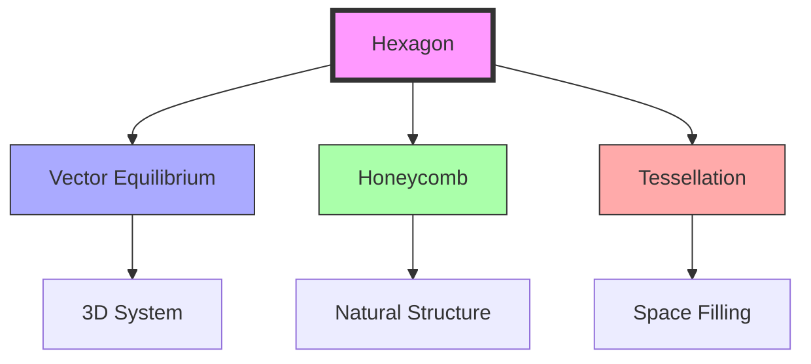
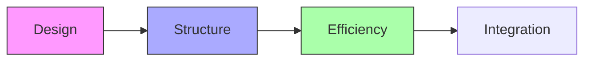

# Hexagon

The hexagon represents a fundamental pattern in nature and [[Synergetics_Geometry]], embodying efficient space-filling properties and close-packing principles. It connects directly to the [[Vector_Equilibrium]] and demonstrates the natural organization of [[Six]] in geometric form.

## Geometric Properties

### Basic Characteristics
```yaml
properties:
  vertices: 6
  edges: 6
  angles: 6
  symmetry_group: D6
  space_filling: true
  regular_polygon: true
```

### Dimensional Relationships
1. Unit Edge Length (Regular)
```yaml
measurements:
  radius_to_vertex: 1.0
  edge_length: 1.0
  area: 2.598076211353316
  height: 1.7320508075688772  # 2 * sin(60°)
  perimeter: 6.0
```

2. Normalized Ratios
```yaml
ratios:
  height_to_edge: 1.7320508075688772  # √3
  area_to_square: 2.598076211353316
  radius_to_edge: 1.0
```

## Mathematical Structure

### Numerical Properties
```yaml
numbers:
  vertices: 6  # [[Six]]
  edges: 6  # [[Six]]
  angles: 720°  # sum
  interior_angle: 120°  # regular
  central_angle: 60°
```

### Coordinate Systems
1. Cartesian Coordinates (Unit Edge)
```yaml
vertices:
  - [1, 0]
  - [0.5, 0.8660254037844386]
  - [-0.5, 0.8660254037844386]
  - [-1, 0]
  - [-0.5, -0.8660254037844386]
  - [0.5, -0.8660254037844386]
```

2. [[IVM]] Projection
```yaml
ivm_projection:
  vectors: [
    [1, 0],
    [0.5, 0.8660254037844386],
    [-0.5, 0.8660254037844386],
    [-1, 0],
    [-0.5, -0.8660254037844386],
    [0.5, -0.8660254037844386]
  ]
```

## Synergetic Properties

### System Relationships
1. Form Hierarchy
   - Face of [[Vector_Equilibrium]]
   - Component of [[Isotropic_Vector_Matrix]]
   - Foundation of [[Honeycomb_Structure]]
   - Basic unit of hexagonal tessellation

2. Energy Properties
   - Optimal space utilization
   - Force distribution
   - Natural packing efficiency
   - Minimal surface energy state

### Transformation Framework


## Natural Occurrence

### Physical Systems
1. Natural Examples
   - Honeycomb cells
   - Graphene structure
   - Basalt columns
   - Snowflakes

2. System Properties
   - Space efficiency
   - Material economy
   - Growth optimization
   - Pattern emergence

### Structural Framework
```mermaid
mindmap
    root((Hexagon))
        Nature
            [[Honeycomb]]
            [[Crystal]]
            [[Growth]]
        Structure
            [[Packing]]
            [[Efficiency]]
            [[Patterns]]
```

## Applications

### Structural Uses
1. Engineering Applications
   - Cellular structures
   - Material design
   - Architectural grids
   - Space-filling systems

2. Design Implementation
   - Modular systems
   - Tessellation
   - Material science
   - Efficient packaging

### Construction Framework


## Mathematical Analysis

### Area Calculations
\[
\begin{align*}
A &= \frac{3\sqrt{3}}{2}a^2 \text{ (edge length a)} \\
A &= 2\sqrt{3}R^2 \text{ (circumradius R)} \\
A &= \frac{3r^2}{\tan(30°)} \text{ (inradius r)}
\end{align*}
\]

### Trigonometric Relationships
\[
\begin{align*}
\sin(60°) &= \frac{\sqrt{3}}{2} \\
\cos(60°) &= \frac{1}{2} \\
\text{height} &= 2a\sin(60°) = a\sqrt{3}
\end{align*}
\]

## Integration with [[Synergetics_Geometry]]

### Geometric Framework
1. Basic Relationships
   - [[Vector_Equilibrium]] faces
   - [[Isotropic_Vector_Matrix]] components
   - [[Honeycomb_Structure]] basis
   - Space-filling properties

2. System Properties
   - Close-packing principle
   - Optimal subdivision
   - Structural efficiency
   - Pattern integration

## References

### Primary Sources
1. [[Synergetics]] (Fuller, 1975)
2. [[Synergetics_2]] (Fuller, 1979)
3. [[Space_Structures]] (Pearce, 1978)
4. [[Natural_Structures]] (Thompson, 1942)

### Related Terms
- [[Six]] - Numerical basis
- [[Triangle]] - Component polygon
- [[Vector_Equilibrium]] - 3D integration
- [[Honeycomb_Structure]] - Natural application
- [[Isotropic_Vector_Matrix]] - System context

### Notes
- Most efficient space-filling polygon
- Natural emergence in physical systems
- Optimal material usage
- Foundation of close-packing

## Tags
#geometry #form #synergetics #structure #polygon #tessellation 