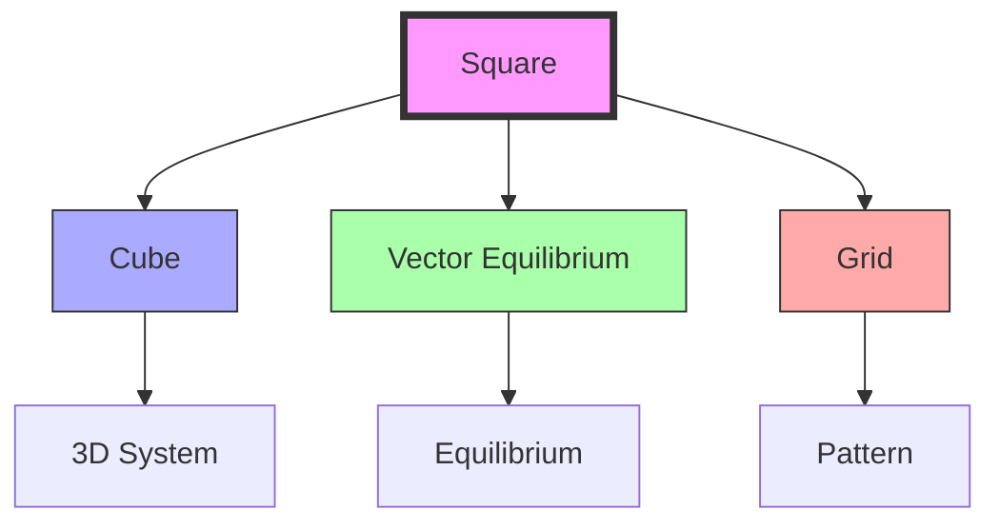

# Square

The square represents the basic face of the XYZ coordinate system and embodies a different aspect of [[Four]] than the [[Tetrahedron]]. It is fundamental to the [[Cube]] and appears in the [[Vector_Equilibrium]].

## Geometric Properties

### Basic Characteristics
```yaml
properties:
  vertices: 4
  edges: 4
  angles: 4
  symmetry_group: D4
  regular_polygon: true
  requires_triangulation: true  # for stability
```

### Dimensional Relationships
1. Unit Edge Length
```yaml
measurements:
  radius_to_vertex: 0.7071067811865476  # √2/2
  edge_length: 1.0
  area: 1.0
  diagonal: 1.4142135623730951  # √2
  perimeter: 4.0
```

2. Normalized Ratios
```yaml
ratios:
  diagonal_to_edge: 1.4142135623730951  # √2
  area_to_triangle: 2.309401076758503
  radius_to_edge: 0.7071067811865476  # √2/2
```

## Mathematical Structure

### Numerical Properties
```yaml
numbers:
  vertices: 4  # [[Four]]
  edges: 4  # [[Four]]
  angles: 360°  # sum
  interior_angle: 90°
  central_angle: 90°
```

### Coordinate Systems
1. Cartesian Coordinates (Unit Edge)
```yaml
vertices:
  - [0, 0]
  - [1, 0]
  - [1, 1]
  - [0, 1]
```

2. [[IVM]] Projection
```yaml
ivm_projection:
  vectors: [
    [1, 0],
    [0, 1],
    [-1, 0],
    [0, -1]
  ]
```

## Synergetic Properties

### System Relationships
1. Form Hierarchy
   - Face of [[Cube]]
   - Component of [[Vector_Equilibrium]]
   - Requires [[Triangle]] stabilization
   - Base for XYZ coordinates

2. Energy Properties
   - Inherent instability
   - Requires diagonal bracing
   - Orthogonal relationships
   - Grid formation

### Transformation Framework


## Natural Occurrence

### Physical Systems
1. Natural Examples
   - Crystal systems
   - Salt crystals (NaCl)
   - Mineral formations
   - Growth patterns

2. System Properties
   - Requires support
   - Grid organization
   - Pattern formation
   - Spatial division

### Structural Framework
```mermaid
mindmap
    root((Square))
        Crystal
            [[Cubic]]
            [[Mineral]]
            [[Growth]]
        Structure
            [[Grid]]
            [[Pattern]]
            [[Division]]
```

## Applications

### Structural Uses
1. Engineering Applications
   - Building systems
   - Grid structures
   - Space division
   - Pattern design

2. Design Implementation
   - Architecture
   - Urban planning
   - Product design
   - System organization

### Construction Framework


## Mathematical Analysis

### Area Calculations
\[
\begin{align*}
A &= a^2 \text{ (edge length a)} \\
A &= \frac{d^2}{2} \text{ (diagonal d)} \\
A &= 4r^2 \text{ (radius r)}
\end{align*}
\]

### Trigonometric Relationships
\[
\begin{align*}
\sin(90°) &= 1 \\
\cos(90°) &= 0 \\
\tan(90°) &= \text{undefined}
\end{align*}
\]

## Integration with [[Synergetics_Geometry]]

### Geometric Framework
1. Basic Relationships
   - [[Cube]] faces
   - [[Vector_Equilibrium]] components
   - XYZ coordinate basis
   - Grid formation

2. System Properties
   - Requires triangulation
   - Orthogonal relationships
   - Space division
   - Pattern organization

## References

### Primary Sources
1. [[Synergetics]] (Fuller, 1975)
2. [[Synergetics_2]] (Fuller, 1979)
3. [[Square_Analysis]] (Edmondson, 1987)
4. [[Geometric_Principles]] (Loeb, 1976)

### Related Terms
- [[Four]] - Numerical basis
- [[Cube]] - 3D extension
- [[Triangle]] - Stabilizing element
- [[Vector_Equilibrium]] - Complex integration
- [[XYZ_Coordinates]] - Coordinate system

### Notes
- Different aspect of [[Four]]

## Tags
#geometry #form #synergetics #structure #polygon 

## Actionable Attention

### Priority Actions
```yaml
immediate_actions:
  structural:
    - Document triangulation requirements
    - Complete stability analysis
    - Update grid system relationships
  documentation:
    - Add construction methods
    - Include stabilization techniques
    - Expand on practical applications

pending_review:
  mathematical:
    - Verify coordinate systems
    - Check area calculations
    - Review symmetry operations
  practical:
    - Test triangulation patterns
    - Analyze grid formations
    - Document system applications
```

### Implementation Notes
1. Critical Points
   - Detail triangulation methods
   - Complete stability analysis
   - Document grid formations
   - Update structural examples

2. System Integration
   - Expand [[Cube]] relationships
   - Add construction guidelines
   - Include practical applications
   - Document pattern systems

### Review Schedule
```yaml
quarterly_review:
  Q1:
    - Triangulation methods
    - Stability analysis
    - Coordinate systems
  Q2:
    - Construction techniques
    - Grid formations
    - System applications
  Q3:
    - Practical examples
    - Integration methods
    - Pattern systems
  Q4:
    - Documentation updates
    - Cross-references
    - Implementation standards
``` 