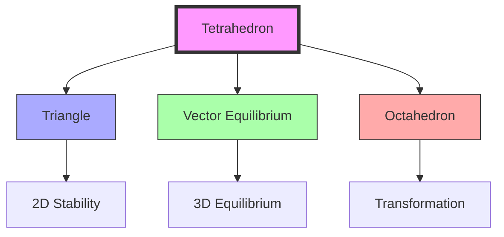
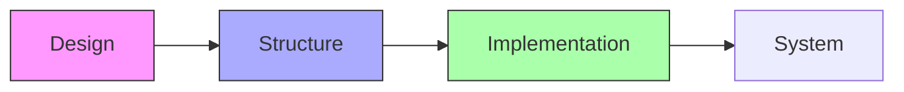

# Tetrahedron

The tetrahedron represents the minimum structural system in Universe, embodying the principle of [[4]] in its most fundamental geometric form. It is the simplest regular polyhedron and the foundation of [[Synergetics_Geometry]].

Basic Properties:
[[Tetrahedron]] has [[4]] [[Plane]].
[[Tetrahedron]] has [[6]] [[Edge]].
[[Tetrahedron]] encloses [[1]] [[Space]]

## Geometric Properties

### Basic Characteristics
```yaml
properties:
  vertices: 4
  edges: 6
  faces: 4  # all equilateral triangles
  symmetry_group: Td
  dual_polyhedron: self-dual
  minimum_system: true
  regular_polyhedron: true
```

### Dimensional Relationships
1. Unit Edge Length
```yaml
measurements:
  radius_to_vertex: 0.6123724356957945
  edge_length: 1.0
  volume: 0.11785113019775792
  surface_area: 1.7320508075688772
  height: 0.8164965809277259
```

2. Normalized Ratios
```yaml
ratios:
  edge_to_radius: 1.6329931618554521
  volume_to_cube: 0.11785113019775792  # 1/8.485281374238571
  area_to_sphere: 0.3023682472324094
  height_to_edge: 0.8164965809277259
```

## Mathematical Structure

### Numerical Properties
```yaml
numbers:
  vertices: 4  # [[Four]]
  edges: 6  # [[Six]]
  faces: 4  # [[Four]]
  euler_characteristic: 2  # V - E + F = 2
  dihedral_angle: 70.52877936550930°
  face_angle: 60°
```

### Coordinate Systems
1. Cartesian Coordinates (Unit Edge)
```yaml
vertices:
  - [0, 0, 0]
  - [1, 0, 0]
  - [0.5, √0.75, 0]
  - [0.5, √0.75/3, √(2/3)]
```

2. [[IVM]] Coordinates
```yaml
ivm_coordinates:
  vectors: [
    [1, 1, 1],
    [-1, -1, 1],
    [1, -1, -1],
    [-1, 1, -1]
  ]
```

## Synergetic Properties

### System Relationships
1. Form Hierarchy
   - Fundamental to [[Triangle]] stability
   - Base unit of [[Vector_Equilibrium]]
   - Component of [[IVM]]
   - Transforms through [[Jitterbug_Transformation]]

2. Energy Properties
   - Most efficient space-enclosing form
   - Optimal force distribution
   - Maximum structural stability
   - Minimum energy state

### Transformation Framework


## Natural Occurrence

### Physical Systems
1. Natural Examples
   - Molecular structures (CH₄)
   - Crystal formations
   - Carbon tetrahedra
   - Protein structures

2. System Properties
   - Inherent stability
   - Natural formation
   - Energy minimization
   - Growth patterns

### Molecular Framework
```mermaid
mindmap
    root((Tetrahedron))
        Molecular
            [[Carbon]]
            [[Methane]]
            [[Silicon]]
        Crystal
            [[Diamond]]
            [[Zinc_Blende]]
            [[Sphalerite]]
```

## Applications

### Structural Uses
1. Engineering Applications
   - Space frame nodes
   - Structural trusses
   - Architectural elements
   - Material design

2. Design Implementation
   - Building systems
   - Geodesic structures
   - Tensegrity systems
   - Nano-engineering

### Construction Framework


## Mathematical Analysis

### Volume Calculations
\[
\begin{align*}
V &= \frac{a^3}{6\sqrt{2}} \text{ (edge length a)} \\
V &= \frac{1}{12}\sqrt{\frac{2}{3}}a^3 \\
V_{relative} &= 1 \text{ (base unit in Synergetics)}
\end{align*}
\]

### Angular Relationships
\[
\begin{align*}
\theta_{face} &= 60° \\
\theta_{dihedral} &= \arccos(\frac{1}{3}) \approx 70.53° \\
\theta_{solid} &= \arccos(\frac{23}{27}) \approx 0.551 \text{ steradians}
\end{align*}
\]

## References

### Primary Sources
1. [[Synergetics]] (Fuller, 1975)
2. [[Synergetics_2]] (Fuller, 1979)
3. [[Minimum_System]] (Edmondson, 1987)
4. [[Tetrahedral_Geometry]] (Loeb, 1976)

### Related Terms
- [[Four]] - Numerical basis
- [[Triangle]] - Face component
- [[Vector_Equilibrium]] - Complex integration
- [[IVM]] - Space-filling system
- [[Closest_Packing_of_Spheres]] - Structural arrangement

### Notes
- Minimum structural system in Universe
- Embodies [[Four]] in geometry
- Most efficient space-enclosing form
- Foundation of synergetic geometry

## Tags
#geometry #form #synergetics #structure #polyhedra 

## Actionable Attention

### Priority Actions
```yaml
immediate_actions:
  structural:
    - Verify volume calculations against [[Synergetics]] standards
    - Document force distribution patterns
    - Update IVM coordinate system references
  documentation:
    - Add detailed construction methods
    - Include practical applications
    - Cross-reference with [[Vector_Equilibrium]] transformations

pending_review:
  mathematical:
    - Validate angular relationships
    - Check coordinate system accuracy
    - Confirm transformation matrices
  practical:
    - Test stability configurations
    - Measure energy distribution
    - Analyze system efficiency
```

### Implementation Notes
1. Critical Points
   - Ensure accurate volume relationships with [[Cube]]
   - Document all [[Jitterbug_Transformation]] states
   - Verify [[IVM]] coordinate mappings
   - Update molecular structure references

2. System Integration
   - Complete [[Vector_Equilibrium]] relationships
   - Document energy transformation patterns
   - Add construction guidelines
   - Include stability analysis

### Review Schedule
```yaml
quarterly_review:
  Q1:
    - Volume calculations
    - Coordinate systems
    - Transformation matrices
  Q2:
    - Force distributions
    - Energy patterns
    - Stability analysis
  Q3:
    - Construction methods
    - Practical applications
    - System integration
  Q4:
    - Documentation updates
    - Cross-references
    - Implementation guidelines
```

## Visualization and Interactive Models

### 3D Model Templates
```yaml
model_formats:
  - format: STL
    purpose: 3D printing
    download: /models/tetrahedron_3d_print.stl
  - format: GLTF
    purpose: web visualization
    download: /models/tetrahedron_web.gltf
  - format: FBX
    purpose: animation
    download: /models/tetrahedron_animate.fbx
```

### Interactive Demonstrations
1. Web-Based Tools
   - Dynamic rotation viewer
   - Cross-section explorer
   - Vertex manipulation
   - Dihedral angle calculator

2. Educational Animations
   - Formation sequence
   - [[Jitterbug_Transformation]] stages
   - Vector relationships
   - Symmetry operations

## Computational Analysis

### Algorithmic Implementation
```python
class Tetrahedron:
    def __init__(self, edge_length=1.0):
        self.edge = edge_length
        self.vertices = self._calculate_vertices()
        
    def _calculate_vertices(self):
        # Regular tetrahedron with unit edge length
        a = self.edge
        h = a * (2/3)**0.5
        return [
            [0, 0, 0],
            [a, 0, 0],
            [a/2, a*(3**0.5)/2, 0],
            [a/2, a/(2*(3**0.5)), h]
        ]
        
    def volume(self):
        return (self.edge**3)/(6*(2**0.5))
```

### Numerical Analysis Tools
1. Finite Element Templates
2. Stress Analysis Models
3. Dynamic Response Calculations
4. Optimization Algorithms

## Educational Resources

### Learning Pathways
1. Beginner Track
   - Basic geometry concepts
   - Physical model building
   - Simple calculations
   
2. Intermediate Track
   - Vector mathematics
   - Transformation principles
   - System relationships
   
3. Advanced Track
   - Synergetic principles
   - Complex transformations
   - Research applications

### Workshop Templates
```yaml
workshop_modules:
  basic:
    - title: "Introduction to Tetrahedral Geometry"
    - duration: "2 hours"
    - materials: ["Paper models", "Compass", "Ruler"]
    
  advanced:
    - title: "Synergetic Transformations"
    - duration: "4 hours"
    - materials: ["3D printed models", "Vector software", "Analysis tools"]
```

## Practical Engineering Applications

### Construction Templates
1. Space Frame Design
```yaml
space_frame:
  node_type: "tetrahedral_vertex"
  connection_method: "bolt_assembly"
  load_capacity: "variable_by_scale"
  material_options:
    - aluminum_alloy
    - carbon_fiber
    - steel_composite
```

2. Material Design Specifications
```yaml
material_specs:
  minimum_strength: "based on scale"
  connection_points: "standardized"
  assembly_sequence: "documented"
  quality_control: "ISO standards"
```

### Industry Applications
1. Aerospace
   - Satellite structures
   - Lightweight frameworks
   - Deployable systems

2. Architecture
   - Load-bearing nodes
   - Modular construction
   - Sustainable design

3. Nanotechnology
   - Molecular frameworks
   - Material science
   - Quantum structures

## Implementation Guidelines

### Best Practices
1. Design Considerations
   - Structural integrity
   - Material efficiency
   - Assembly optimization
   - Scale considerations

2. Quality Control
   - Measurement protocols
   - Testing procedures
   - Validation methods
   - Documentation requirements

### Project Templates
```yaml
project_checklist:
  planning:
    - Requirements analysis
    - Material selection
    - Scale determination
    - Resource allocation
    
  execution:
    - Component fabrication
    - Assembly sequence
    - Quality verification
    - Documentation
    
  validation:
    - Structural testing
    - Performance metrics
    - Compliance checking
    - Final certification
``` 