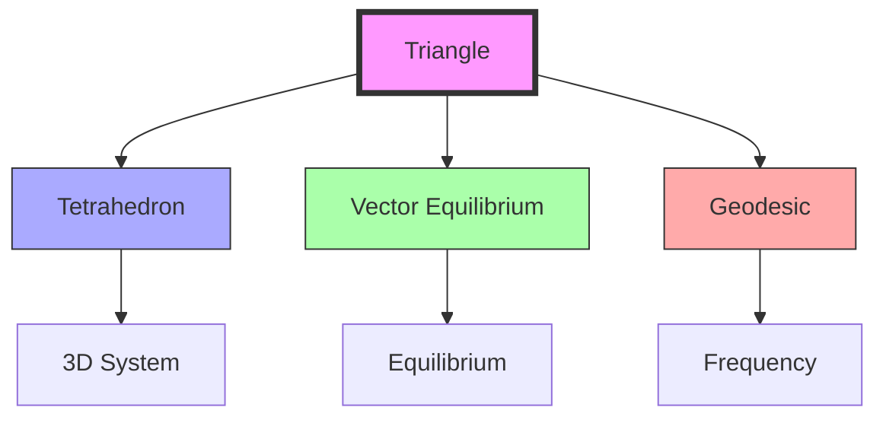
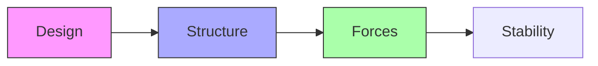

# Triangle

The triangle represents the fundamental stable polygon and the basis of [[Synergetics_Geometry]], embodying the principle of [[Three]] in its most basic geometric form. It is the only inherently stable polygon and the face component of the [[Tetrahedron]].

## Geometric Properties

### Basic Characteristics
```yaml
properties:
  vertices: 3
  edges: 3
  angles: 3
  symmetry_group: D3
  minimum_stable_polygon: true
  regular_polygon: true  # when equilateral
```

### Dimensional Relationships
1. Unit Edge Length (Equilateral)
```yaml
measurements:
  radius_to_vertex: 1.0
  edge_length: 1.0
  area: 0.4330127018922193
  height: 0.8660254037844386
  perimeter: 3.0
```

2. Normalized Ratios
```yaml
ratios:
  height_to_edge: 0.8660254037844386  # √3/2
  area_to_square: 0.4330127018922193
  radius_to_edge: 0.5773502691896257  # 1/√3
```

## Mathematical Structure

### Numerical Properties
```yaml
numbers:
  vertices: 3  # [[Three]]
  edges: 3  # [[Three]]
  angles: 180°  # sum
  interior_angle: 60°  # equilateral
  central_angle: 120°
```

### Coordinate Systems
1. Cartesian Coordinates (Unit Edge)
```yaml
vertices:
  - [0, 0]
  - [1, 0]
  - [0.5, 0.8660254037844386]
```

2. [[IVM]] Projection
```yaml
ivm_projection:
  vectors: [
    [1, 0],
    [-0.5, 0.8660254037844386],
    [-0.5, -0.8660254037844386]
  ]
```

## Synergetic Properties

### System Relationships
1. Form Hierarchy
   - Base of [[Tetrahedron]]
   - Component of [[Vector_Equilibrium]]
   - Foundation of [[Geodesic_Mathematics]]
   - Basic unit of triangulation

2. Energy Properties
   - Inherent stability
   - Force distribution
   - Structural integrity
   - Minimal energy state

### Transformation Framework


## Natural Occurrence

### Physical Systems
1. Natural Examples
   - Crystal faces
   - Molecular bonds
   - Structural forms
   - Growth patterns

2. System Properties
   - Natural stability
   - Force distribution
   - Energy efficiency
   - Pattern formation

### Structural Framework
```mermaid
mindmap
    root((Triangle))
        Nature
            [[Crystal]]
            [[Molecular]]
            [[Growth]]
        Structure
            [[Stability]]
            [[Forces]]
            [[Patterns]]
```

## Applications

### Structural Uses
1. Engineering Applications
   - Truss systems
   - Space frames
   - Structural design
   - Force distribution

2. Design Implementation
   - Architecture
   - Construction
   - Product design
   - System organization

### Construction Framework


## Mathematical Analysis

### Area Calculations
\[
\begin{align*}
A &= \frac{\sqrt{3}}{4}a^2 \text{ (edge length a)} \\
A &= \frac{1}{2}bh \text{ (base × height)} \\
A &= rs \text{ (inradius × semiperimeter)}
\end{align*}
\]

### Trigonometric Relationships
\[
\begin{align*}
\sin(60°) &= \frac{\sqrt{3}}{2} \\
\cos(60°) &= \frac{1}{2} \\
\tan(60°) &= \sqrt{3}
\end{align*}
\]

## Integration with [[Synergetics_Geometry]]

### Geometric Framework
1. Basic Relationships
   - [[Tetrahedron]] faces
   - [[Vector_Equilibrium]] components
   - [[Geodesic_Mathematics]] subdivision
   - Structural stability

2. System Properties
   - Triangulation principle
   - Force distribution
   - Structural integrity
   - Pattern formation

## References

### Primary Sources
1. [[Synergetics]] (Fuller, 1975)
2. [[Synergetics_2]] (Fuller, 1979)
3. [[Triangle_Stability]] (Edmondson, 1987)
4. [[Geometric_Principles]] (Loeb, 1976)

### Related Terms
- [[Three]] - Numerical basis
- [[Tetrahedron]] - 3D extension
- [[Square]] - Comparative polygon
- [[Vector_Equilibrium]] - Complex integration
- [[Geodesic_Mathematics]] - Frequency systems

### Notes
- Only inherently stable polygon
- Basis of all structural systems
- Embodies [[Three]] in geometry
- Foundation of triangulation

## Tags
#geometry #form #synergetics #structure #polygon 