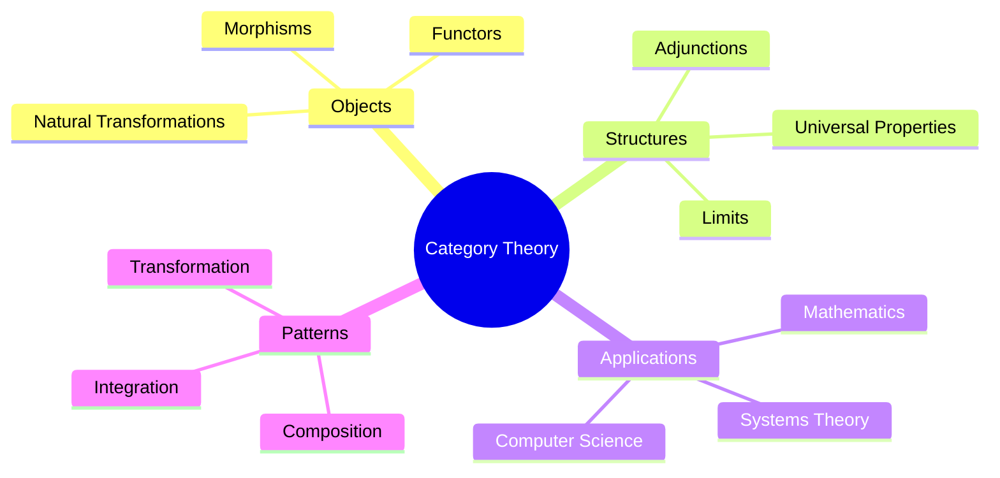
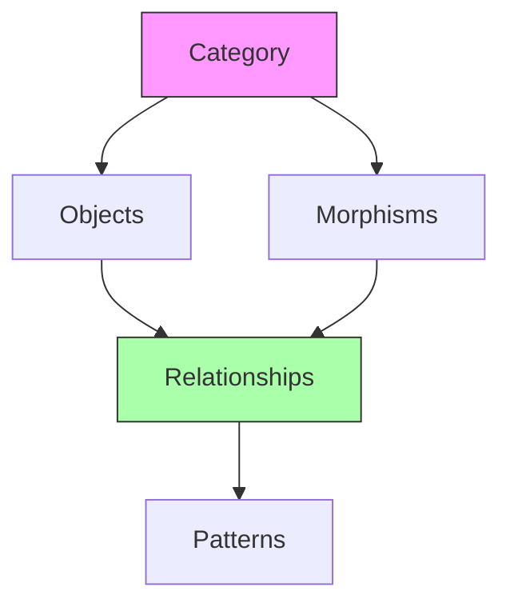
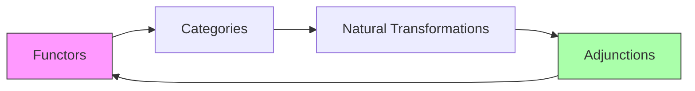
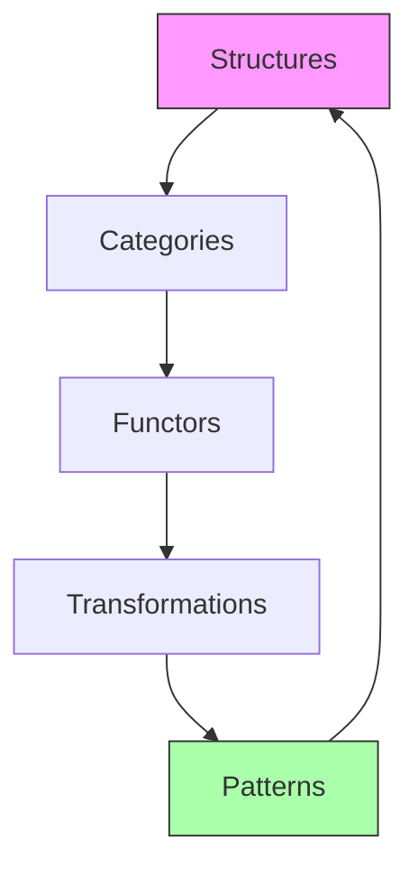
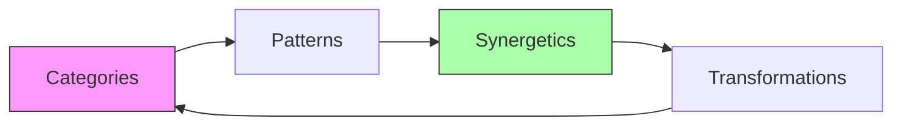
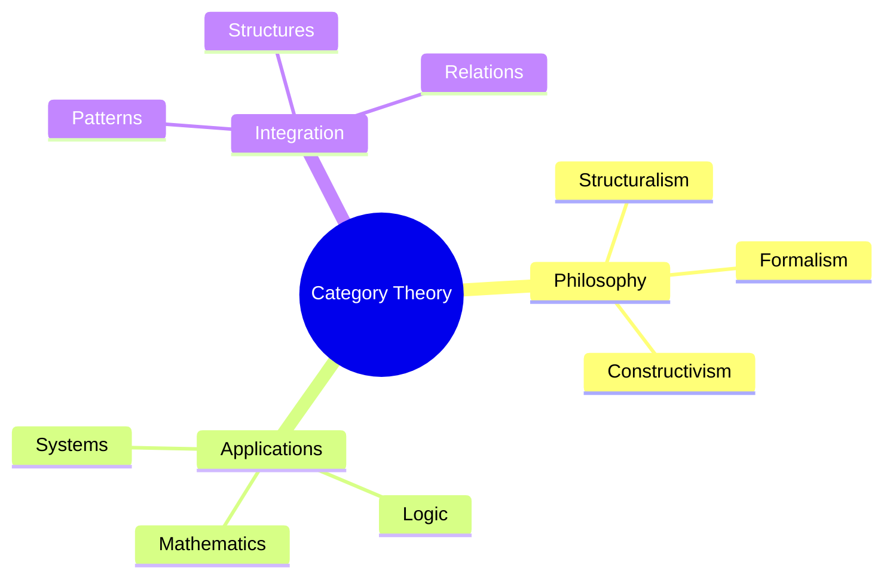

# Category Theory

[[Category_Theory]] provides a unified language for describing mathematical structures and their relationships. This abstract framework aligns with [[Buckminster_Fuller]]'s emphasis on [[pattern_integrity]] and [[system_relationships]] in [[Synergetics]].

## Fundamental Concepts

### Categories
1. Basic Definitions
   - Objects
   - Morphisms
   - Composition: \( g \circ f \)
   - Identity: \( id_X \)

2. Properties
   - Associativity
   - Unit laws
   - Commutative diagrams

### Structure Map

## Advanced Concepts

### Functors
1. [[Functor_Theory]]
   - \[ F: \mathcal{C} \to \mathcal{D} \]
   - Structure preservation
   - Natural transformations

2. [[Universal_Properties]]
   - Initial objects
   - Terminal objects
   - Universal constructions

### Abstract Structures

## Synergetic Connections

### Pattern Systems
- [[Pattern_Categories]]
- [[Structural_Functors]]
- [[System_Transformations]]

### Geometric Applications
- [[Categorical_Geometry]]
- [[Structural_Patterns]]
- [[Form_Categories]]

## Mathematical Framework

### Category Types
1. [[Concrete_Categories]]
   - Sets and functions
   - Groups and homomorphisms
   - Topological spaces

2. [[Abstract_Categories]]
   - Abelian categories
   - Monoidal categories
   - Higher categories

### Structural Relations

## Applications

### Mathematical Systems
- [[Algebraic_Structures]]
- [[Topological_Spaces]]
- [[Geometric_Objects]]
- [[Logical_Systems]]

### Computer Science
- [[Type_Theory]]
- [[Programming_Languages]]
- [[Database_Theory]]
- [[Functional_Programming]]

### Systems Theory
- [[Category_Systems]]
- [[Pattern_Languages]]
- [[Structure_Theory]]
- [[Integration_Methods]]

## Connection to Fuller's Work

### Synergetic Principles

### Key Applications
- [[System_Integration]]
- [[Pattern_Recognition]]
- [[Structure_Analysis]]
- [[Transformation_Theory]]

## Mathematical Tools

### Category Operations
1. Universal Constructions:
   - Limits: \[ \varprojlim F \]
   - Colimits: \[ \varinjlim F \]
   - Adjunctions: \[ F \dashv G \]

2. Natural Transformations:
   \[ \eta: F \Rightarrow G \]

### Advanced Structures
- [[Monad_Theory]]
- [[Topos_Theory]]
- [[Higher_Categories]]
- [[Enriched_Categories]]

## Modern Applications

### Theoretical Physics
- [[TQFT]]
- [[String_Theory]]
- [[Quantum_Categories]]

### Computer Science
- [[Categorical_Logic]]
- [[Type_Systems]]
- [[Program_Semantics]]

### Systems Design
- [[Category_Architecture]]
- [[Pattern_Systems]]
- [[Structure_Design]]

## Philosophical Aspects

### Conceptual Frameworks

### Key Concepts
- [[Universal_Abstraction]]
- [[Structural_Relations]]
- [[Pattern_Integration]]
- [[System_Unity]]

## References
- Mac Lane, S. (1998). "Categories for the Working Mathematician"
- Awodey, S. (2010). "Category Theory"
- Spivak, D. I. (2014). "Category Theory for Scientists"

## Related Topics
- [[Abstract_Algebra]]
- [[Topos_Theory]]
- [[Pattern_Theory]]
- [[Systems_Theory]]

## Notes
Category Theory provides a powerful framework for understanding abstract patterns and relationships, complementing Fuller's vision of integrated systems and universal principles. 