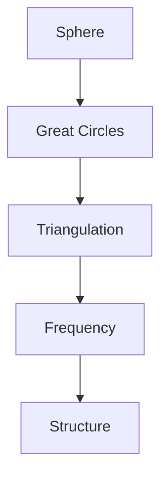
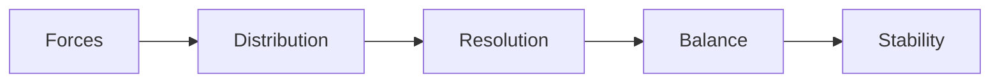
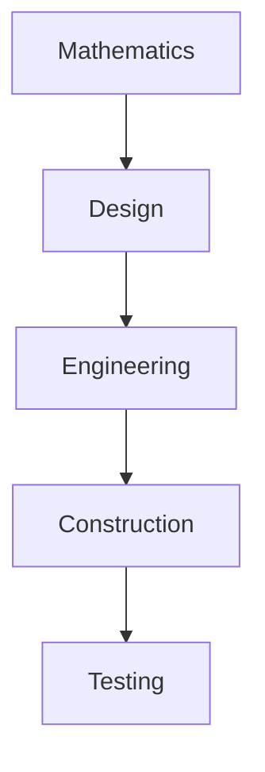
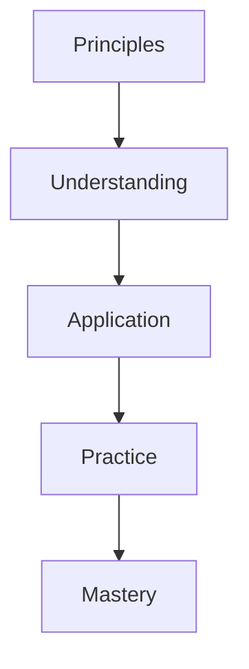

# Geodesic Mathematics

Geodesic Mathematics encompasses the mathematical principles and calculations underlying the design and construction of geodesic structures, developed and systematized by R. Buckminster Fuller.

## Overview

### Definition
```yaml
geodesic_mathematics:
  creator: R. Buckminster Fuller
  field: Geometric mathematics
  applications: Structural design
  core_principles:
    - Great circle paths
    - Spherical subdivision
    - Frequency patterns
    - Structural optimization
  key_concepts:
    - Geodesic lines
    - Polyhedra
    - Triangulation
    - Frequency
```

### Fundamental Principles
1. Geometric Foundations
   - Great circles
   - Spherical geometry
   - Polyhedral systems
   - Triangulation methods

2. Mathematical Properties
   - Structural efficiency
   - Force distribution
   - Frequency relationships
   - Optimization principles

## Mathematical Framework

### Core Mathematics
```mermaid
mindmap
    root((Geodesic Math))
        Geometry
            [[Spherical Geometry]]
            [[Great Circles]]
            [[Polyhedra]]
        Calculations
            [[Frequency]]
            [[Chord Factors]]
            [[Strut Lengths]]
        Analysis
            [[Forces]]
            [[Stability]]
            [[Efficiency]]
```

### Key Formulas
1. Basic Calculations
   - Spherical coordinates
   - Chord factors
   - Strut lengths
   - Vertex positions

2. Advanced Analysis
   - Force distribution
   - Structural stability
   - Efficiency metrics
   - Optimization functions

## Geometric Principles

### Structural Elements
1. Basic Components
   - Great circle arcs
   - Triangular faces
   - Vertex points
   - Strut connections

2. System Properties
   - Symmetry patterns
   - Frequency relationships
   - Distribution rules
   - Assembly logic

### Geometric Framework


## Frequency Analysis

### Mathematical Basis
1. Frequency Principles
   - Division patterns
   - Relationship rules
   - Scaling laws
   - Optimization methods

2. Calculation Methods
   - Frequency determination
   - Strut calculations
   - Force analysis
   - Stability assessment

### Analysis Framework
```mermaid
mindmap
    root((Frequency))
        Division
            [[Patterns]]
            [[Rules]]
            [[Methods]]
        Calculation
            [[Struts]]
            [[Forces]]
            [[Stability]]
```

## Structural Analysis

### Force Distribution
1. Load Analysis
   - Force vectors
   - Stress patterns
   - Distribution paths
   - Balance points

2. Stability Calculations
   - Structural integrity
   - Force resolution
   - Balance equations
   - Safety factors

### Analysis Methods


## Optimization Principles

### Efficiency Factors
1. Material Use
   - Volume optimization
   - Weight reduction
   - Material distribution
   - Resource efficiency

2. Structural Performance
   - Load capacity
   - Stability factors
   - Resilience measures
   - Durability metrics

### Optimization Framework
```mermaid
mindmap
    root((Optimization))
        Materials
            [[Volume]]
            [[Weight]]
            [[Distribution]]
        Performance
            [[Load]]
            [[Stability]]
            [[Durability]]
```

## Applications

### Implementation Areas
1. Structural Design
   - [[Geodesic Domes]]
   - [[Space Frames]]
   - [[Tensegrity Systems]]
   - [[Building Structures]]

2. Engineering Systems
   - [[Construction Methods]]
   - [[Analysis Tools]]
   - [[Design Software]]
   - [[Testing Protocols]]

### Application Framework


## Computational Methods

### Calculation Tools
1. Design Software
   - CAD systems
   - Analysis programs
   - Optimization tools
   - Visualization software

2. Analysis Methods
   - Finite element analysis
   - Force calculations
   - Stability assessment
   - Performance modeling

### Computational Framework
```mermaid
mindmap
    root((Computation))
        Design
            [[CAD]]
            [[Modeling]]
            [[Analysis]]
        Tools
            [[Software]]
            [[Methods]]
            [[Assessment]]
```

## Educational Value

### Learning Applications
1. Mathematical Education
   - Geometric principles
   - Structural analysis
   - Force dynamics
   - Optimization methods

2. Engineering Education
   - Design principles
   - Construction methods
   - Analysis techniques
   - Testing procedures

### Educational Framework


## Research Areas

### Current Studies
1. Mathematical Research
   - Advanced geometry
   - Optimization methods
   - Force analysis
   - Stability studies

2. Engineering Research
   - Construction techniques
   - Material systems
   - Performance analysis
   - Testing methods

### Research Framework
```mermaid
mindmap
    root((Research))
        Mathematics
            [[Geometry]]
            [[Analysis]]
            [[Optimization]]
        Engineering
            [[Construction]]
            [[Materials]]
            [[Testing]]
```

## Resources

### Documentation
1. Technical Materials
   - [[Mathematical Papers]]
   - [[Engineering Documents]]
   - [[Design Guides]]
   - [[Analysis Methods]]

2. Educational Resources
   - [[Teaching Materials]]
   - [[Learning Guides]]
   - [[Practice Problems]]
   - [[Case Studies]]

### Reference Tools
```mermaid
mindmap
    root((Resources))
        Technical
            [[Papers]]
            [[Documents]]
            [[Guides]]
        Educational
            [[Materials]]
            [[Problems]]
            [[Studies]]
```

## References
1. Fuller's writings
2. Mathematical papers
3. Engineering studies
4. Application guides
5. Research documents

## Notes
- Fundamental to geodesic structures
- Wide engineering applications
- Continuing research relevance
- Educational importance

## Tags
#mathematics #geometry #structure #synergetics #geodesics 