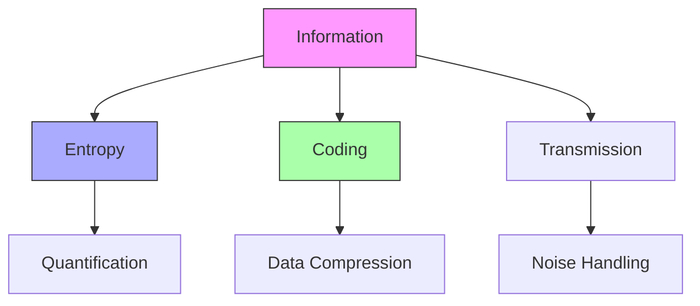
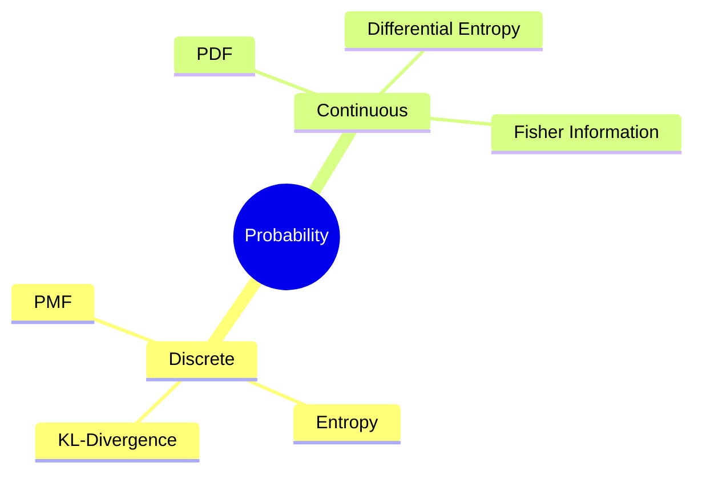

# Information Theory

[[Information_Theory]] provides the mathematical framework for quantifying, storing, and communicating information. Developed by [[Claude_Shannon]] in 1948, it connects with [[Buckminster_Fuller]]'s concepts of [[Synergetics]] through patterns of information organization and [[energy_efficiency]].

## Core Concepts

### Information Entropy
- [[Shannon_Entropy]] \( H(X) = -\sum_{i} p(x_i) \log_2 p(x_i) \)
- [[Kullback-Leibler_Divergence]]
- [[Mutual_Information]]
- Connection to [[thermodynamic_entropy]]

### Coding Theory
- [[Source_Coding_Theorem]]
- [[Channel_Coding_Theorem]]
- [[Error_Correction]]
- [[Data_Compression]]

### Channel Capacity
- [[Noisy_Channel_Coding]]
- [[Channel_Capacity_Theorem]]
- [[Information_Rate]]
- [[Bandwidth_Efficiency]]

## Mathematical Foundations

### Probability Theory

### Key Theorems
1. [[Source_Coding_Theorem]]
   - \[ R \geq H(X) \]
   - Minimum bits per symbol
   - Lossless compression limits

2. [[Channel_Coding_Theorem]]
   - \[ C = \max_{p(x)} I(X;Y) \]
   - Maximum transmission rate
   - Error probability bounds

## Applications

### Communication Systems
- [[Digital_Communication]]
- [[Error_Control_Coding]]
- [[Data_Compression]]
- [[Cryptography]]

### Complex Systems
- [[Network_Information]]
- [[Biological_Information]]
- [[Quantum_Information]]
- [[Social_Networks]]

### Synergetic Applications
- [[Information_Geometry]]
- [[Pattern_Recognition]]
- [[System_Complexity]]
- [[Network_Efficiency]]

## Modern Extensions

### Quantum Information
- [[Quantum_Entropy]]
- [[Quantum_Channels]]
- [[Quantum_Coding]]

### Network Information
- [[Network_Coding]]
- [[Distributed_Information]]
- [[Information_Flow]]

### Machine Learning
- [[Information_Bottleneck]]
- [[Maximum_Entropy_Models]]
- [[Neural_Information]]

## Connections to Fuller's Work

### Synergetic Principles
- [[Information_Packaging]]
- [[Efficient_Communication]]
- [[System_Integration]]

### Design Applications
- [[Information_Architecture]]
- [[System_Optimization]]
- [[Network_Design]]

## Mathematical Tools

### Key Measures
1. Entropy:
   \[ H(X) = -\sum_{i} p(x_i) \log_2 p(x_i) \]

2. Mutual Information:
   \[ I(X;Y) = \sum_{x,y} p(x,y) \log_2 \frac{p(x,y)}{p(x)p(y)} \]

3. Channel Capacity:
   \[ C = \max_{p(x)} I(X;Y) \]

### Advanced Concepts
- [[Rate_Distortion_Theory]]
- [[Information_Geometry]]
- [[Maximum_Entropy_Principle]]

## References
- Shannon, C. E. (1948). "A Mathematical Theory of Communication"
- Cover, T. M., & Thomas, J. A. (2006). "Elements of Information Theory"
- MacKay, D. J. C. (2003). "Information Theory, Inference, and Learning Algorithms"

## Related Topics
- [[Complexity_Theory]]
- [[Statistical_Learning]]
- [[Symbolic_Coherence]]
- [[Network_Theory]]

## Notes
Information Theory provides fundamental insights into the nature of communication and complexity, aligning with Fuller's vision of efficient system design and organization. 