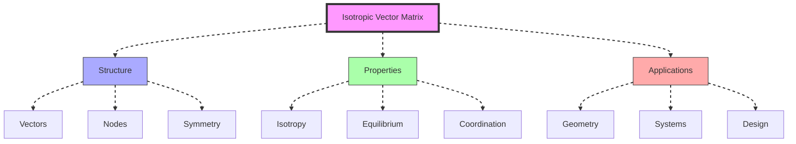
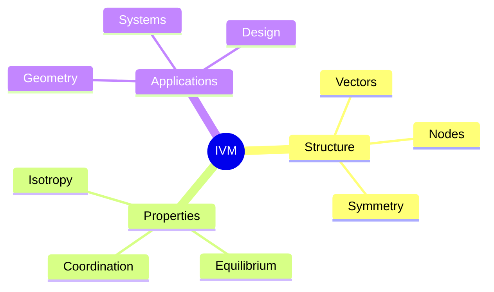
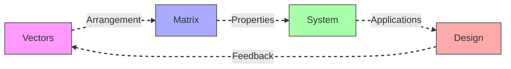
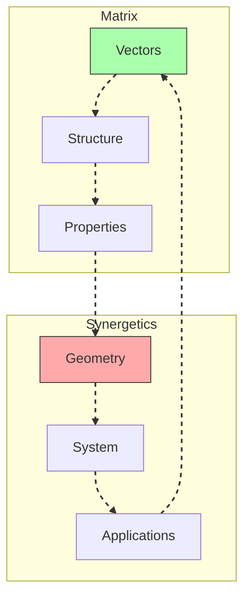
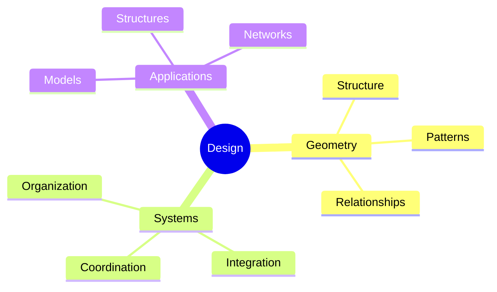
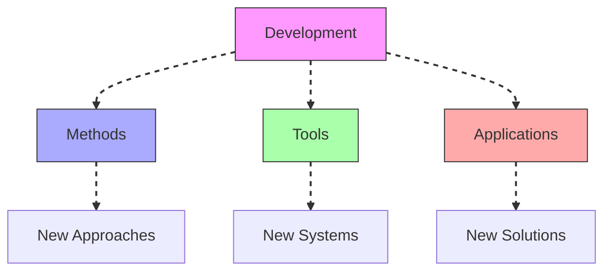

# Isotropic Vector Matrix

The Isotropic Vector Matrix (IVM) represents Fuller's universal coordinate system, based on the [[mathematics/Vector_Equilibrium|vector equilibrium]] and [[mathematics/Closest_Packing_of_Spheres|closest packing of spheres]], providing the geometric foundation for [[concepts/Synergetics|synergetic mathematics]].

## System Overview

## Core Components

### Matrix Framework

### Key Elements
1. [[mathematics/Matrix_Structure|Matrix Structure]]
   - Vector relationships
   - Node positions
   - Symmetry patterns
   - System organization

2. [[mathematics/Matrix_Properties|Matrix Properties]]
   - Isotropic nature
   - Equilibrium state
   - Coordination numbers
   - Transformation rules

## Mathematical Framework

### Vector Organization

### Implementation Strategy
1. [[mathematics/Matrix_Analysis|Matrix Analysis]]
   - Vector mapping
   - Node coordination
   - Symmetry analysis
   - System validation

2. [[mathematics/Matrix_Applications|Matrix Applications]]
   - Geometric design
   - System modeling
   - Structure analysis
   - Pattern implementation

## Integration with Synergetics

### Geometric Framework

### Application Areas
1. [[mathematics/Vector_Equilibrium|Vector Equilibrium]]
   - Matrix center
   - System stability
   - Force balance
   - Geometric relationships

2. [[mathematics/Closest_Packing|Closest Packing]]
   - Spatial efficiency
   - Node relationships
   - System organization
   - Structure design

## Geometric Applications

### System Design

### Development Process
1. [[mathematics/Geometric_Design|Geometric Design]]
   - Matrix utilization
   - System organization
   - Structure planning
   - Pattern implementation

2. [[mathematics/System_Integration|System Integration]]
   - Vector coordination
   - Node relationships
   - Structure analysis
   - Pattern validation

## Future Development

### Innovation Areas

### Implementation Path
1. [[mathematics/Matrix_Innovation|Matrix Innovation]]
   - Method development
   - Tool creation
   - System design
   - Validation frameworks

2. [[mathematics/Synergetic_Applications|Synergetic Applications]]
   - Matrix utilization
   - System design
   - Structure integration
   - Pattern implementation

## References

### Primary Sources
1. [[books/Synergetics_Book|Synergetics]]
2. [[books/Synergetics_2|Synergetics 2]]
3. [[books/Vector_Geometry|Vector Geometry and IVM]]

### Related Resources
1. [[papers/Matrix_Analysis|IVM Analysis Methods]]
2. [[papers/Vector_Systems|Vector System Design]]
3. [[papers/Geometric_Applications|Geometric Applications]]

## Notes
- Fundamental to synergetic geometry
- Key to understanding vector relationships
- Foundation for system design
- Critical for structural analysis

## Tags
#mathematics #geometry #vectors #synergetics #vector-equilibrium 