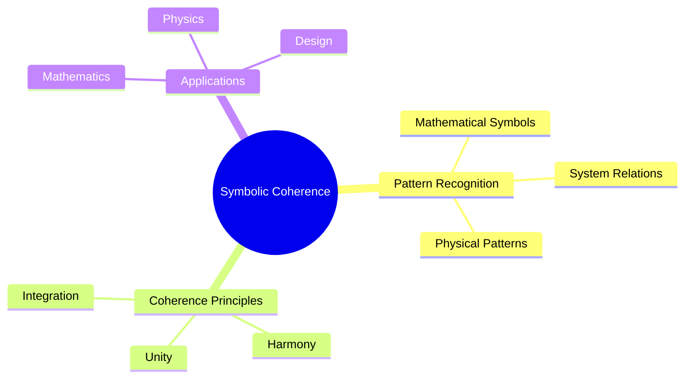
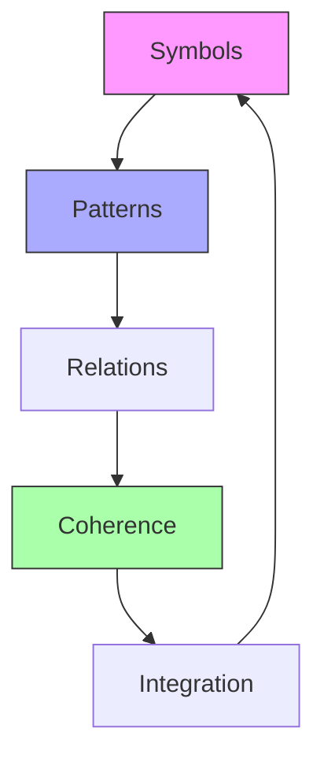
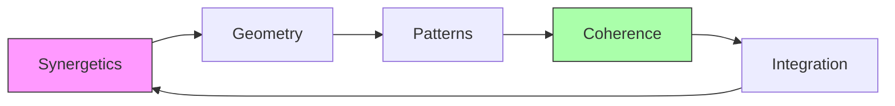
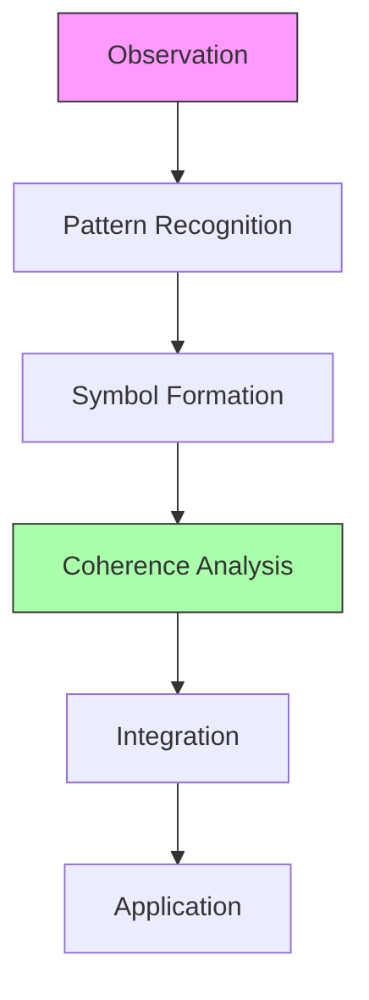

# Symbolic Coherence

[[Symbolic_Coherence]] represents the study of meaningful patterns and relationships between symbolic representations across mathematical and physical systems. This concept bridges [[Buckminster_Fuller]]'s [[Synergetics]] with modern mathematical frameworks of [[Pattern_Recognition]] and [[Information_Theory]].

## Core Principles

### Pattern Unity
- [[Universal_Patterns]]
- [[Symbol_Systems]]
- [[Pattern_Languages]]
- [[Coherence_Metrics]]

### Mathematical Foundations

### Synergetic Integration
- [[Pattern_Integrity]]
- [[System_Coherence]]
- [[Symbolic_Transformation]]
- [[Geometric_Logic]]

## Mathematical Framework

### Symbol Systems
1. [[Formal_Systems]]
   - Axioms and rules
   - Symbol manipulation
   - Logical consistency

2. [[Pattern_Mathematics]]
   - Geometric patterns
   - Numeric sequences
   - Structural relations

### Coherence Measures
1. Information-theoretic:
   \[ C(x,y) = \frac{I(X;Y)}{\sqrt{H(X)H(Y)}} \]

2. Structural:
   \[ S = \frac{\text{Pattern Matches}}{\text{Total Patterns}} \]

## Applications

### Mathematical Applications
- [[Symbol_Recognition]]
- [[Pattern_Matching]]
- [[Structure_Analysis]]
- [[Coherence_Detection]]

### Physical Systems
- [[Crystal_Patterns]]
- [[Molecular_Symmetry]]
- [[Natural_Forms]]
- [[Growth_Patterns]]

### Design Principles
- [[Geometric_Design]]
- [[System_Integration]]
- [[Pattern_Language]]
- [[Coherent_Structures]]

## Synergetic Connections

### Fuller's Principles

### Key Concepts
- [[Geometric_Thought]]
- [[Pattern_Thinking]]
- [[System_Synthesis]]
- [[Coherent_Design]]

## Modern Applications

### Pattern Recognition
- [[Machine_Learning]]
- [[Neural_Networks]]
- [[Computer_Vision]]
- [[Pattern_Mining]]

### System Design
- [[Architecture]]
- [[Engineering]]
- [[Network_Design]]
- [[Information_Systems]]

### Scientific Research
- [[Data_Analysis]]
- [[Theory_Building]]
- [[Model_Development]]
- [[Pattern_Discovery]]

## Mathematical Tools

### Analysis Methods
1. Pattern Detection:
   \[ P(x) = \sum_{i} w_i f_i(x) \]

2. Coherence Measurement:
   \[ H = -\sum_{i} p_i \log(p_i) \]

### Integration Techniques
- [[Pattern_Integration]]
- [[Symbol_Mapping]]
- [[Coherence_Analysis]]

## Practical Applications

### Design Process

### Implementation Areas
- [[System_Design]]
- [[Pattern_Language]]
- [[Coherent_Structures]]
- [[Integrated_Systems]]

## References
- Fuller, R. B. (1975). "Synergetics"
- Alexander, C. (1977). "A Pattern Language"
- Bohm, D. (1980). "Wholeness and the Implicate Order"

## Related Topics
- [[Pattern_Recognition]]
- [[Information_Theory]]
- [[System_Theory]]
- [[Geometric_Mathematics]]

## Notes
Symbolic Coherence provides a framework for understanding and applying pattern recognition across disciplines, integrating Fuller's synergetic principles with modern mathematical methods. 