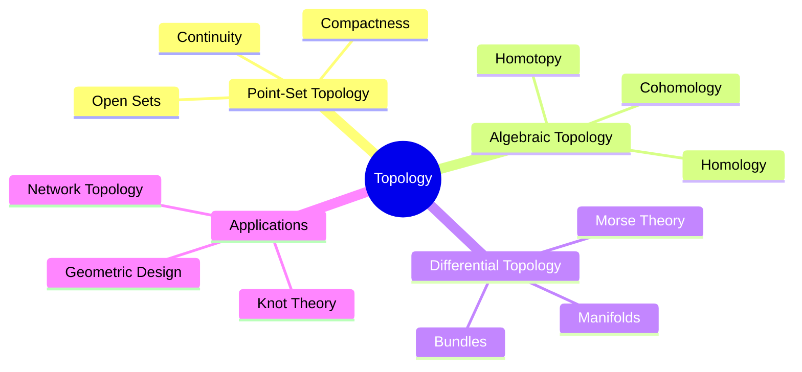
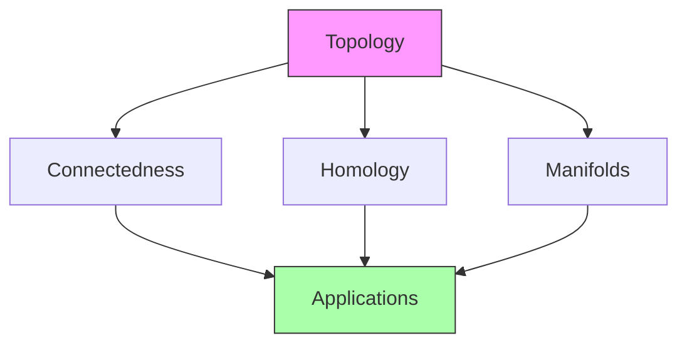
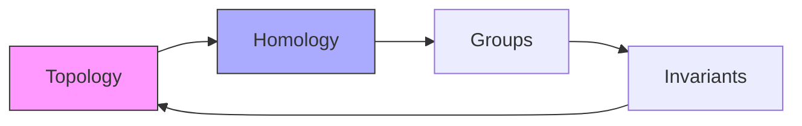
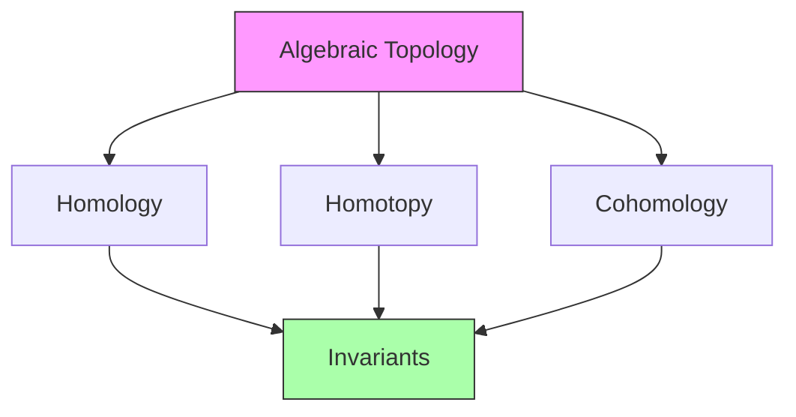
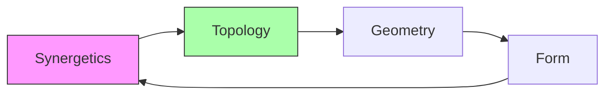

# Topological Mathematics

[[Topological_Mathematics]] studies properties of geometric objects that remain unchanged under continuous deformations. This field connects deeply with [[Buckminster_Fuller]]'s [[Synergetics]] through concepts of [[structural_integrity]] and [[geometric_transformation]].

## Fundamental Concepts

### Topological Spaces
- [[Point_Set_Topology]]
- [[Continuous_Functions]]
- [[Homeomorphisms]]
- [[Topological_Invariants]]

### Structural Properties

## Mathematical Framework

### Basic Topology
1. [[Open_Sets]] and [[Closed_Sets]]
   - \[ X = \text{int}(X) \cup \partial X \]
   - Boundary operations
   - Interior and closure

2. [[Continuous_Mappings]]
   - \[ f: X \to Y \text{ continuous} \]
   - Preservation properties
   - Homeomorphisms

### Algebraic Structures

## Synergetic Applications

### Geometric Transformations
- [[Jitterbug_Transformation]]
- [[Vector_Equilibrium]]
- [[Geodesic_Structures]]

### Structural Integrity
- [[Tensegrity]]
- [[Minimal_Surfaces]]
- [[Structural_Stability]]

## Advanced Topics

### Differential Topology
1. [[Manifold_Theory]]
   - Smooth structures
   - Tangent spaces
   - Vector fields

2. [[Morse_Theory]]
   - Critical points
   - Handle decomposition
   - Energy landscapes

### Algebraic Topology

## Applications

### Physical Systems
- [[Network_Topology]]
- [[Material_Structure]]
- [[Phase_Transitions]]
- [[Quantum_Topology]]

### Design Applications
- [[Architectural_Topology]]
- [[Structural_Design]]
- [[Space_Planning]]
- [[Form_Finding]]

### Computational Methods
- [[Topological_Data_Analysis]]
- [[Persistent_Homology]]
- [[Network_Analysis]]
- [[Shape_Recognition]]

## Connection to Fuller's Work

### Synergetic Principles

### Key Applications
- [[Geodesic_Domes]]
- [[Tensegrity_Structures]]
- [[Structural_Systems]]
- [[Space_Frames]]

## Mathematical Tools

### Topological Invariants
1. Euler Characteristic:
   \[ \chi = V - E + F \]

2. Betti Numbers:
   \[ b_k = \text{rank}(H_k) \]

### Advanced Concepts
- [[Homology_Groups]]
- [[Homotopy_Theory]]
- [[Fiber_Bundles]]

## Modern Applications

### Data Science
- [[TDA]]
- [[Machine_Learning]]
- [[Pattern_Recognition]]

### Physics
- [[Quantum_Topology]]
- [[String_Theory]]
- [[Condensed_Matter]]

### Engineering
- [[Structural_Analysis]]
- [[Material_Design]]
- [[Network_Optimization]]

## References
- Munkres, J. R. (2000). "Topology"
- Hatcher, A. (2002). "Algebraic Topology"
- Fuller, R. B. (1975). "Synergetics"

## Related Topics
- [[Differential_Geometry]]
- [[Algebraic_Topology]]
- [[Vector_Mathematics]]
- [[Geometric_Design]]

## Notes
Topological Mathematics provides fundamental insights into structure and form, essential for understanding Fuller's geometric principles and modern applications in design and science. 