# Vector Equilibrium

The Vector Equilibrium (VE) represents nature's only geometric form where all vectors are equal in length and angular relationships. It is fundamental to [[concepts/Synergetics|Fuller's synergetic geometry]] and provides the foundation for understanding energetic systems.

## System Overview

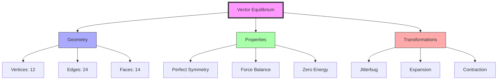

## Definition

### Formal Definition
The Vector Equilibrium is a [[mathematics/Cuboctahedron|cuboctahedron]] where:
- All edges are equal in length
- All vertices are equidistant from center
- All faces are regular polygons
- All vertex angles are equal

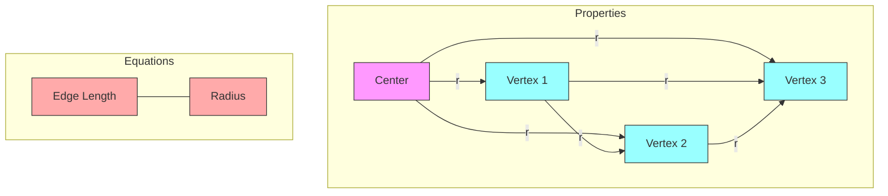

### Mathematical Expression
\[
\text{Edge length} = \text{Radius from center to vertex}
\]

## Core Properties

### Geometric Structure
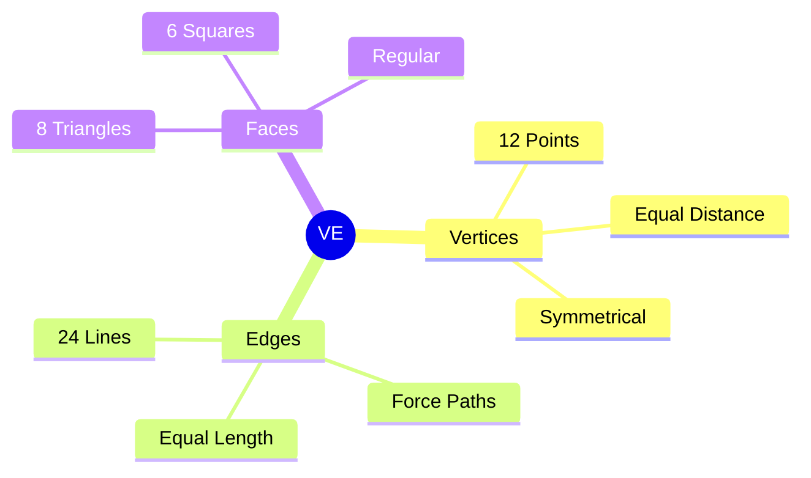

### Force Distribution
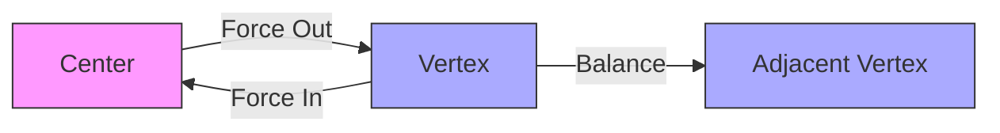

## Transformations

### Jitterbug Sequence
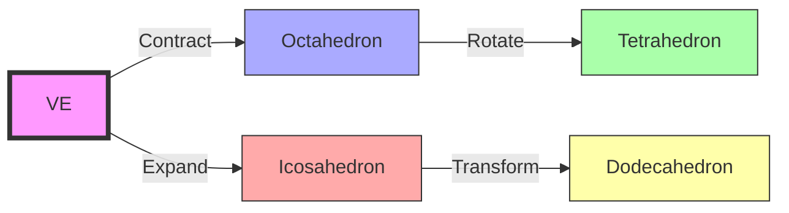

### Dynamic States
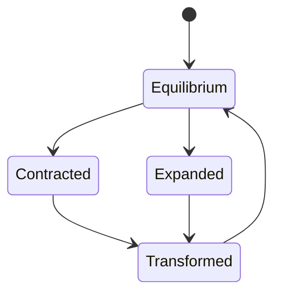

## Applications

### Structural Systems
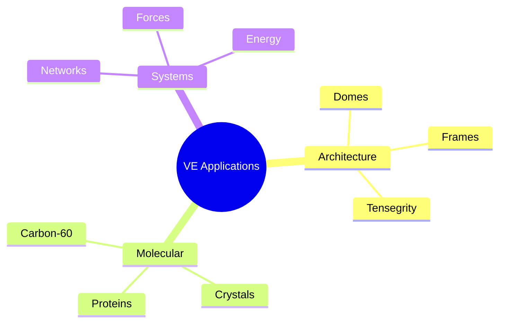

### Implementation Flow
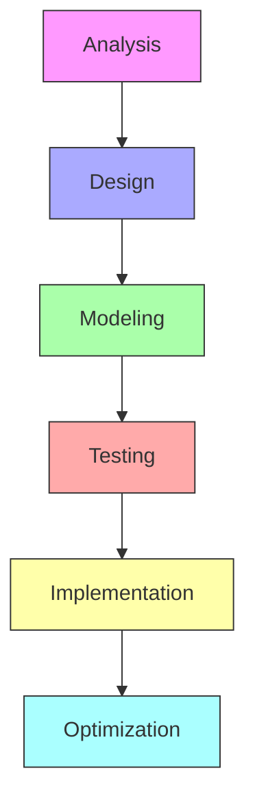

## Mathematical Framework

### Vector Analysis
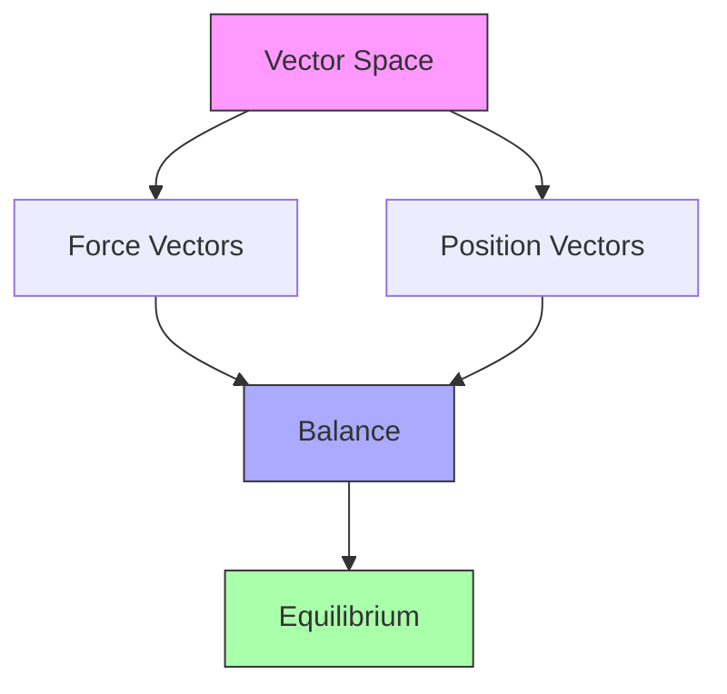

### Symmetry Groups
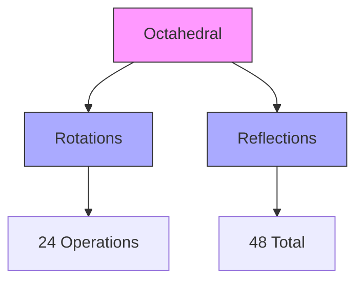

## References

### Primary Sources
1. [[books/Synergetics_Book|Synergetics]] (pp. 223-276)
2. [[books/Geometric_Analysis|Geometric Analysis of the VE]]
3. [[papers/VE_Mathematics|Mathematics of the Vector Equilibrium]]

### Applications
1. [[papers/Carbon_60_Structure|Carbon-60 and the VE]]
2. [[papers/Architectural_Applications|VE in Architecture]]
3. [[papers/System_Theory|VE in System Theory]]

## Related Concepts Map
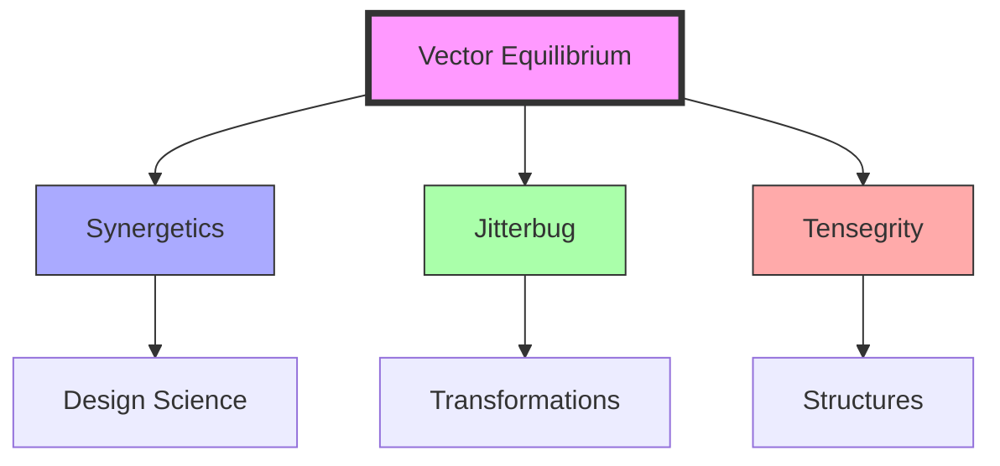

## Notes
- VE represents perfect equilibrium but is never found in nature
- Critical for understanding energy systems and transformations
- Foundation for many of Fuller's geometric insights
- Key to understanding natural structure organization

## Tags
#mathematics #geometry #synergetics #polyhedra #symmetry 