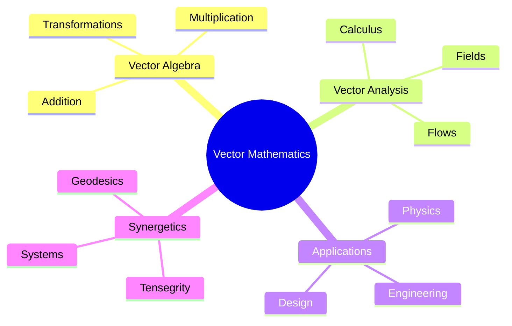
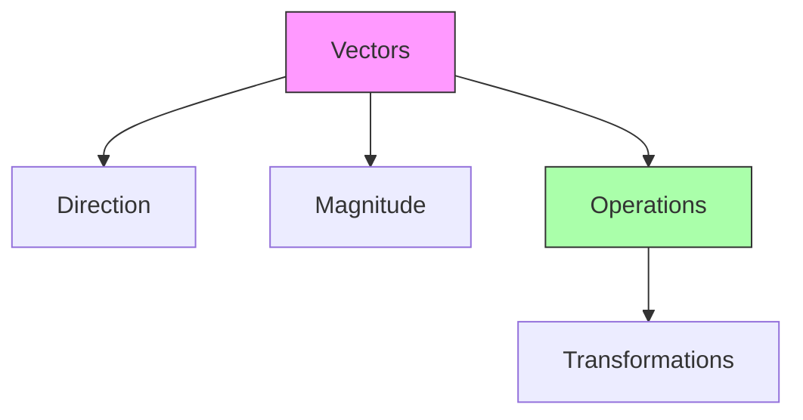
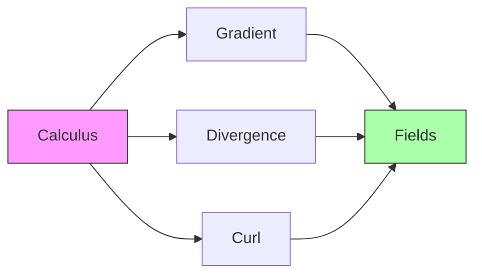
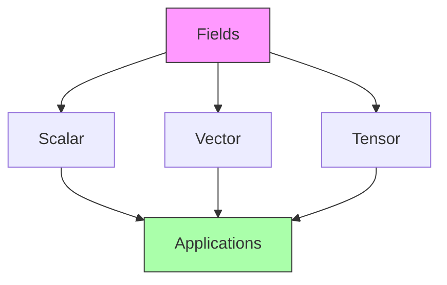
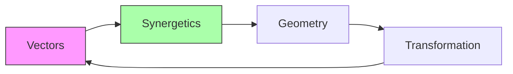

# Vector Mathematics

[[Vector_Mathematics]] forms the foundation for understanding geometric relationships and physical forces in space. This field is central to [[Buckminster_Fuller]]'s [[Synergetics]] and modern approaches to [[structural_design]] and [[system_dynamics]].

## Fundamental Concepts

### Vector Operations
1. Basic Operations
   - Vector addition: \(\vec{a} + \vec{b}\)
   - Scalar multiplication: \(c\vec{a}\)
   - Dot product: \(\vec{a} \cdot \vec{b}\)
   - Cross product: \(\vec{a} \times \vec{b}\)

2. Vector Spaces
   - Linear independence
   - Basis vectors
   - Dimensionality

### Geometric Interpretations

## Vector Analysis

### Differential Operations
1. Vector Fields
   - Gradient: \(\nabla f\)
   - Divergence: \(\nabla \cdot \vec{F}\)
   - Curl: \(\nabla \times \vec{F}\)

2. Integration
   - Line integrals
   - Surface integrals
   - Volume integrals

### Vector Calculus

## Synergetic Applications

### Geometric Systems
- [[Vector_Equilibrium]]
- [[Isotropic_Vector_Matrix]]
- [[Geodesic_Structures]]

### Force Analysis
- [[Tensegrity_Forces]]
- [[Structural_Vectors]]
- [[Dynamic_Equilibrium]]

## Advanced Topics

### Tensor Relations
1. [[Vector_Tensors]]
   - Tensor products
   - Multilinear maps
   - Coordinate transformations

2. [[Differential_Forms]]
   - Exterior algebra
   - Wedge products
   - Integration theory

### Vector Fields

## Applications

### Physical Systems
- [[Force_Vectors]]
- [[Velocity_Fields]]
- [[Electromagnetic_Fields]]
- [[Gravitational_Fields]]

### Engineering Design
- [[Structural_Analysis]]
- [[Force_Distribution]]
- [[System_Dynamics]]
- [[Material_Stress]]

### Computational Methods
- [[Finite_Element_Analysis]]
- [[Computational_Fluid_Dynamics]]
- [[Numerical_Methods]]
- [[Vector_Graphics]]

## Connection to Fuller's Work

### Synergetic Geometry

### Key Applications
- [[Geodesic_Mathematics]]
- [[Tensegrity_Systems]]
- [[Vector_Equilibrium]]
- [[Jitterbug_Transformation]]

## Mathematical Tools

### Vector Algebra
1. Basic Operations:
   \[ \vec{c} = \vec{a} + \vec{b} \]
   \[ d = \vec{a} \cdot \vec{b} = |a||b|\cos\theta \]
   \[ \vec{c} = \vec{a} \times \vec{b} = |a||b|\sin\theta\hat{n} \]

2. Vector Spaces:
   \[ \vec{v} = \sum_{i=1}^n c_i\vec{e}_i \]

### Vector Analysis
- [[Gradient_Operations]]
- [[Divergence_Theorems]]
- [[Curl_Analysis]]
- [[Field_Theory]]

## Modern Applications

### Scientific Computing
- [[Numerical_Analysis]]
- [[Scientific_Visualization]]
- [[Computational_Geometry]]

### Engineering
- [[Structural_Engineering]]
- [[Mechanical_Systems]]
- [[Electrical_Systems]]

### Design
- [[CAD_Systems]]
- [[Geometric_Modeling]]
- [[Form_Finding]]

## References
- Arfken, G. B. (2012). "Mathematical Methods for Physicists"
- Fuller, R. B. (1975). "Synergetics"
- Marsden, J. E. & Tromba, A. (2003). "Vector Calculus"

## Related Topics
- [[Tensor_Analysis]]
- [[Differential_Geometry]]
- [[Linear_Algebra]]
- [[Synergetic_Geometry]]

## Notes
Vector Mathematics provides the mathematical foundation for understanding physical systems and geometric relationships, essential in Fuller's work and modern engineering applications. 