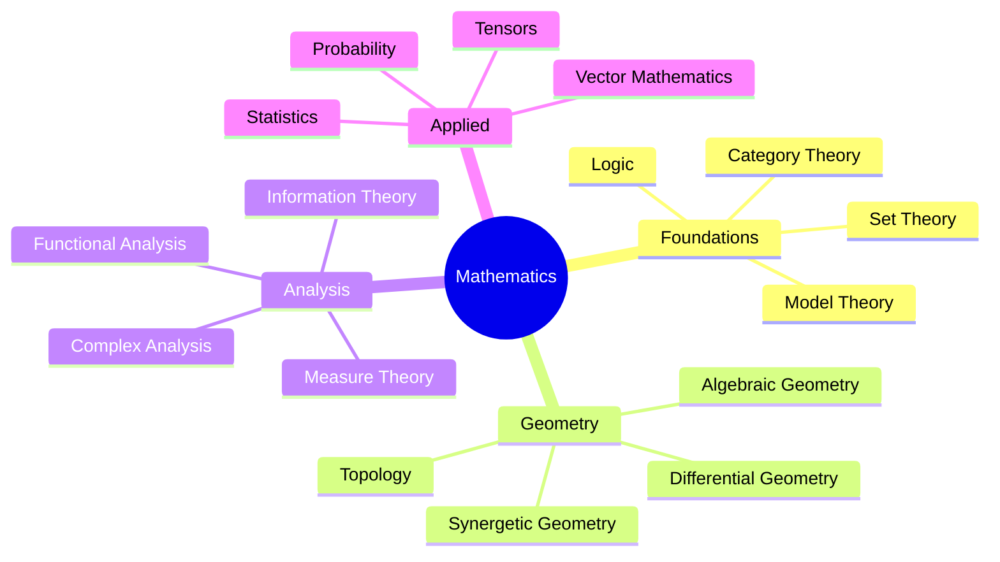

# 🔢 Mathematics Index

> Mathematical concepts and applications in Fuller's work and modern interpretations

## Core Areas

### Foundational Mathematics
- [[Set_Theory]] - Foundations of mathematical structures
- [[Mathematical_Logic]] - Formal reasoning systems
- [[Category_Theory]] - Abstract structural relationships
- [[Model_Theory]] - Mathematical structure theory
- [[Proof_Theory]] - Formal verification methods

### Geometric Studies
- [[Geodesic_Mathematics]] - Spherical geometry applications
- [[Synergetic_Geometry]] - Fuller's geometric principles
- [[Differential_Geometry]] - Curved space mathematics
- [[Algebraic_Geometry]] - Geometric structures through algebra
- [[Topological_Mathematics]] - Shape and structure properties
- [[Isotropic_Vector_Matrix]] - Vector equilibrium patterns
- [[Vector_Equilibrium]] - Jitterbug transformations

### Analysis and Measure
- [[Measure_Theory]] - Mathematical foundations of measurement
- [[Functional_Analysis]] - Infinite-dimensional spaces
- [[Complex_Analysis]] - Complex function theory
- [[Real_Analysis]] - Continuous mathematics foundations
- [[Harmonic_Analysis]] - Wave and frequency mathematics

### Information and Computation
- [[Information_Theory]] - Mathematical communication theory
- [[Computational_Mathematics]] - Algorithmic approaches
- [[Symbolic_Mathematics]] - Abstract symbol manipulation
- [[Quantum_Mathematics]] - Quantum mechanical foundations
- [[Statistical_Learning]] - Data-driven mathematics

### Applied Mathematics
- [[Vector_Mathematics]] - Vector operations and applications
- [[Tensor_Analysis]] - Multi-dimensional mathematics
- [[Probability_Theory]] - Uncertainty quantification
- [[Statistical_Methods]] - Data analysis techniques
- [[Optimization_Theory]] - Mathematical optimization

### Integrative Concepts
- [[Symbolic_Coherence]] - Pattern recognition in mathematics
- [[Mathematical_Modeling]] - System representation
- [[Dynamical_Systems]] - Time-evolving systems
- [[Network_Theory]] - Connection and relationship mathematics
- [[Complexity_Theory]] - System complexity analysis

## Key Applications

### Physical Sciences
- [[Mathematical_Physics]]
- [[Quantum_Mathematics]]
- [[Statistical_Mechanics]]

### Information Sciences
- [[Coding_Theory]]
- [[Cryptography]]
- [[Signal_Processing]]

### Biological Sciences
- [[Mathematical_Biology]]
- [[Network_Biology]]
- [[Population_Dynamics]]

### Social Sciences
- [[Economic_Mathematics]]
- [[Social_Network_Analysis]]
- [[Game_Theory]]

## Related Concepts
- [[Design_Science]] - Mathematical principles in design
- [[Systems_Theory]] - Mathematical system analysis
- [[Synergetics]] - Fuller's mathematical framework

## References
- [[Mathematics_Bibliography]]
- [[Mathematical_Notation]]
- [[History_of_Mathematics]]

## Notes
This index serves as a central reference for mathematical concepts in Fuller's work and modern extensions. Each linked article provides detailed technical content while maintaining connections to practical applications and synergetic principles.