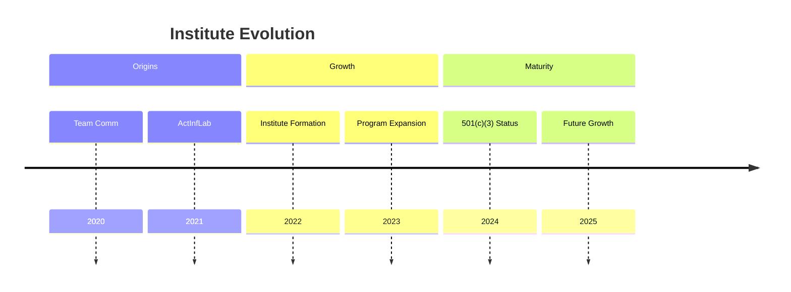
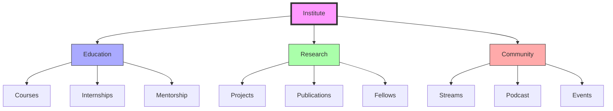
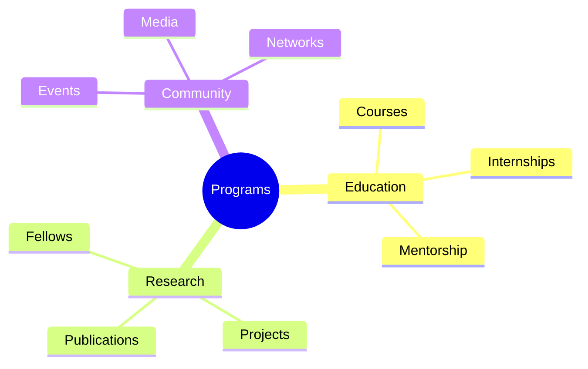
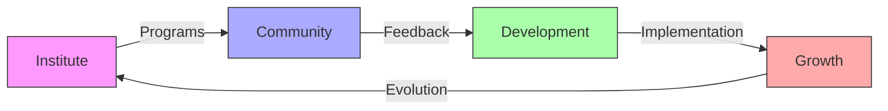
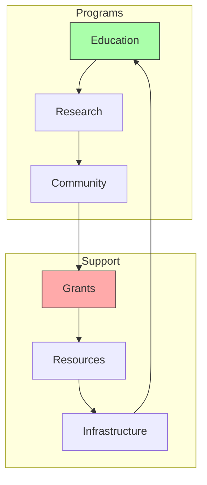

# Active Inference Institute

The Active Inference Institute is a non-profit research and educational organization based in [[places/Crescent_City|Crescent City]], California, founded by [[people/Daniel_Ari_Friedman|Daniel Ari Friedman]] and team, dedicated to advancing the understanding and application of Active Inference theory.

## Organizational Overview

### Core Structure
```yaml
active_inference_institute:
  type: 501(c)(3) non-profit
  founded: 2022 (evolved from ActInfLab)
  location: Crescent City, California
  organizational_units:
    - Administrative
    - EduActive (Education)
    - ReInference (Research)
  governance:
    - Board of Directors
    - Scientific Advisory Board
    - Executive Leadership
```

### Historical Development


## Core Programs

### Educational Initiatives
1. Structured Programs
   - Physics Course
   - Social Science Course
   - Textbook Group (7 cohorts)
   - Internship Program

2. Community Learning
   - Guest Streams
   - Model Streams
   - Paper Streams
   - Active Inference Insights Podcast

### Research Framework


## Program Development

### Key Initiatives
1. Educational Programs
   - Course development
   - Internship support
   - Mentorship program
   - Learning resources

2. Research Activities
   - Research Fellows program
   - Scientific Advisory Board
   - Project collaborations
   - Publication support

### Program Structure


## Community Engagement

### Engagement Methods
1. Digital Platforms
   - YouTube livestreams
   - Podcast episodes
   - Online courses
   - Community forums

2. Physical Events
   - Quarterly roundtables
   - Symposiums
   - Workshops
   - Meetups

### Network Structure


## Future Development

### Growth Areas
1. Program Expansion
   - New course offerings
   - Research initiatives
   - Fellowship programs
   - Global outreach

2. Organizational Development
   - Grant applications
   - Philanthropy growth
   - Resource development
   - Infrastructure enhancement

### Development Framework


## References

### Primary Sources
1. [[papers/Active_Inference_Teams|Active Inference & Behavior Engineering for Teams]] (2020)
2. [[books/Active_Inference_Textbook|Active Inference Textbook]] (2022)
3. [[papers/Institute_Development|Institute Development Reports]]

### Media Resources
1. [[media/ActInf_Livestreams|ActInf Livestream Archives]]
2. [[media/Quarterly_Roundtables|Quarterly Roundtable Recordings]]
3. [[media/Active_Inference_Insights|Podcast Episodes]]

## Notes
- Rapid evolution from team to institute
- Strong educational focus
- Growing research network
- Community-driven development

## Tags
#research-institute #active-inference #systems-science #education #non-profit 