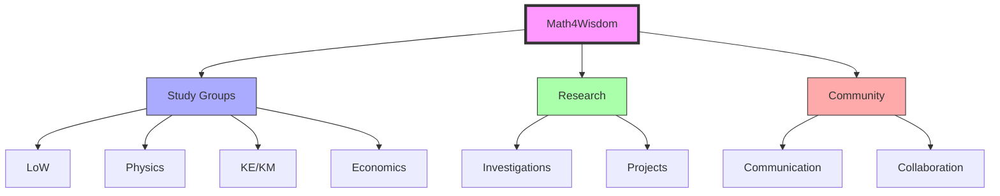

# Math4Wisdom

Math4Wisdom (M4W) is an investigatory community for absolute truth led by [[people/Andrius_Kulikauskas|Andrius Kulikauskas]], combining mathematical education with systems thinking, [[concepts/Design_Science|Design Science]] principles, and knowledge engineering.

## Core Structure

### Leadership & Community
```yaml
organization:
  founder: [[people/Andrius_Kulikauskas|Andrius Kulikauskas]]
  study_group_leaders:
    - [[people/Jere_Northrop|Jere Northrop]]: Language of Wisdom
    - [[people/John_Harland|John Harland]]: Physics
    - [[people/Daniel_Ari_Friedman|Daniel Ari Friedman]]: Knowledge Engineering/Knowledge Math
    - [[people/Marcus_Petz|Marcus Petz]]: Economics
  regular_contributors:
    - [[people/Kirby_Urner|Kirby Urner]]
    - Additional community members
```

### Study Groups

1. Language of Wisdom (LoW)
   - Led by [[people/Jere_Northrop|Jere Northrop]]
   - Relational Symmetry Paradigm
   - Ecotechnology
   - Ecological Intelligence

2. Physics Group
   - Led by [[people/John_Harland|John Harland]]
   - Ontological foundations
   - Quantum mechanics
   - Mathematical physics

3. Knowledge Engineering/Math (KE/KM)
   - Led by [[people/Daniel_Ari_Friedman|Daniel Ari Friedman]]
   - [[concepts/Active_Inference|Active Inference]]
   - [[concepts/Cognitive_Security|Cognitive Security]]
   - Systems integration

4. Economics Group
   - Led by [[people/Marcus_Petz|Marcus Petz]]
   - Community currency
   - Rural renaissance
   - Syntropic finance

## Research Program

### Core Investigations
1. Wondrous Wisdom Development
   - Cognitive frameworks
   - Mathematical foundations
   - Philosophical integration
   - Practical applications

2. Mathematical Foundations
   - Algebraic topology
   - Category theory
   - Complex geometry
   - Quantum physics

### Featured Projects
1. Current Research
   - Triangle centers manifestation
   - Bott periodicity modeling
   - Economic analysis methods
   - [[concepts/Active_Inference|Active Inference]] integration

2. Ongoing Projects
   - Econet development
   - Theory Translator
   - Math4Wisdom Coda
   - Knowledge integration

## Community Engagement

### Communication Channels
1. Primary Platforms
   - Email Group
   - YouTube channel
   - Research notes
   - Documentation

2. Social Networks
   - BlueSky
   - Mathstodon
   - Patreon
   - Academic networks

### Collaborative Framework


## Research Integration

### Knowledge Areas
1. Theoretical Foundations
   - Mathematical frameworks
   - Cognitive systems
   - Philosophical foundations
   - Systems integration

2. Practical Applications
   - Educational tools
   - Research methods
   - Community development
   - Knowledge sharing

### Partner Organizations
- [[organizations/Active_Inference_Institute|Active Inference Institute]]
- [[organizations/Buckminster_Fuller_Institute|BFI]]
- [[organizations/Design_Science_Studios|Design Science Studios]]
- [[organizations/Trimtab_Reading_Group|Trimtab Reading Group]]

## Resources

### Educational Materials
1. Study Resources
   - Research documentation
   - Video content
   - Discussion archives
   - Project materials

2. Community Tools
   - Online platforms
   - Collaboration spaces
   - Documentation systems
   - Communication channels

## References

### Primary Sources
1. Math4Wisdom website
2. Study group materials
3. Research documentation
4. Community archives

### Related Resources
- [[organizations/Active_Inference_Institute|Active Inference Institute]] materials
- Research publications
- Educational content
- Community contributions

## Notes
- Founded by Andrius Kulikauskas
- Focus on absolute truth investigation
- Strong mathematical foundations
- Active community engagement

## Tags
#education #mathematics #systems-thinking #design-science #knowledge-engineering #fuller-studies 