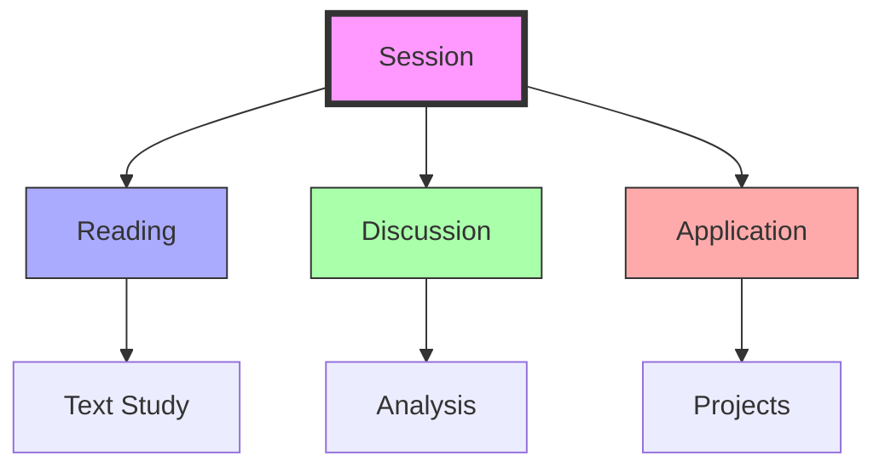

# Trimtab Reading Group

The Trimtab Reading Group is a collaborative learning community focused on studying and discussing [[concepts/Design_Science|Design Science]], [[concepts/Synergetics|Synergetics]], and the works of R. Buckminster Fuller, facilitated by [[people/Curt_McNamara|Curt McNamara]] with regular participation from [[people/Daniel_Ari_Friedman|Daniel Ari Friedman]] and [[people/Kirby_Urner|Kirby Urner]].

## Group Structure

### Leadership
```yaml
organization:
  facilitator: [[people/Curt_McNamara|Curt McNamara]]
  core_members:
    - [[people/Daniel_Ari_Friedman|Daniel Ari Friedman]]
    - [[people/Kirby_Urner|Kirby Urner]]
  affiliations:
    - [[organizations/Buckminster_Fuller_Institute|BFI]]
    - [[organizations/Math4Wisdom|Math4Wisdom]]
    - [[organizations/Design_Science_Studios|Design Science Studios]]
```

### Reading Focus
1. Primary Texts
   - [[Buckminster_Fuller]]'s major works
   - [[concepts/Design_Science|Design Science]] literature
   - [[concepts/Synergetics|Synergetics]] materials
   - Contemporary applications
	   - [[CJ_Fearnley]]
	   - Other authors

2. Discussion Areas
   - Theoretical foundations
   - Practical applications
   - Modern relevance
   - Integration strategies

## Study Program

### Reading Structure
```mermaid
mindmap
    root((Trimtab))
        Fuller Works
            [[Synergetics]]
            [[Operating Manual]]
            [[Critical Path]]
        Applications
            [[Design Science]]
            [[World Game]]
            [[Modern Uses]]
        Integration
            [[Theory]]
            [[Practice]]
            [[Innovation]]
```

### Discussion Format
1. Text Analysis
   - Close reading
   - Group discussion
   - Contemporary context
   - Practical applications

2. Knowledge Integration
   - Cross-referencing
   - Modern applications
   - Project development
   - Resource creation

## Collaborative Network

### Partner Organizations
- [[organizations/Buckminster_Fuller_Institute|BFI]]
- [[organizations/Math4Wisdom|Math4Wisdom]]
- [[organizations/Design_Science_Studios|Design Science Studios]]
- [[organizations/Active_Inference_Institute|Active Inference Institute]]

### Resource Development
1. Study Materials
   - Reading guides
   - Discussion notes
   - Application examples
   - Project documentation

2. Educational Tools
   - Online resources
   - Reference materials
   - Project frameworks
   - Learning aids

## Session Structure

### Meeting Format


### Content Areas
1. Primary Focus
   - Text examination
   - Concept analysis
   - Application discussion
   - Project development

2. Integration Work
   - Theory connection
   - Practice application
   - Resource development
   - Knowledge sharing

## Project Development

### Current Initiatives
1. Study Programs
   - Reading curriculum
   - Discussion guides
   - Application frameworks
   - Resource development

2. Practical Applications
   - Project implementation
   - Design solutions
   - Educational tools
   - Community engagement

## Community Engagement

### Outreach Activities
1. Educational Events
   - Reading sessions
   - Discussion groups
   - Workshops
   - Project presentations

2. Resource Sharing
   - Study materials
   - Discussion notes
   - Project documentation
   - Learning resources

## References

### Primary Sources
1. Fuller's works
2. Group discussion notes
3. Project documentation
4. Resource materials

### Related Materials
- [[organizations/BFI|BFI]] archives
- [[organizations/Math4Wisdom|Math4Wisdom]] resources
- [[organizations/Design_Science_Studios|Design Science Studios]] projects
- Group documentation

## Notes
- Regular reading sessions
- Facilitated discussions
- Practical applications
- Resource development

## Tags
#education #fuller-studies #reading-group #design-science 