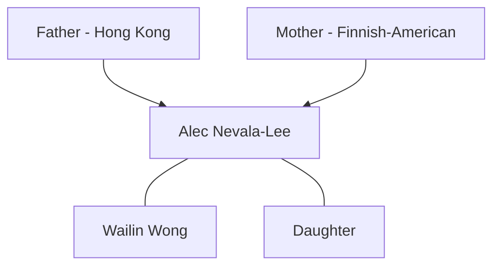
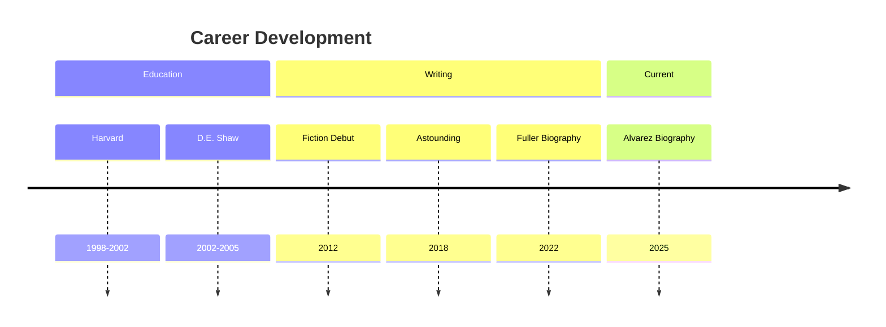
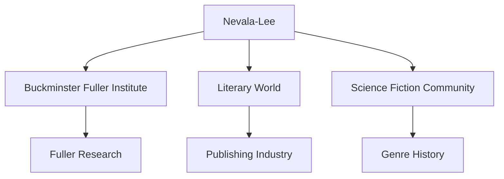
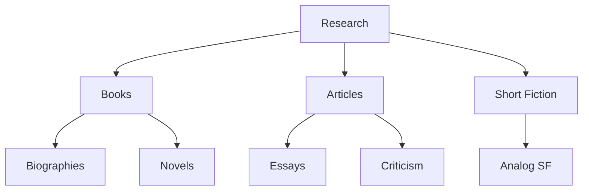
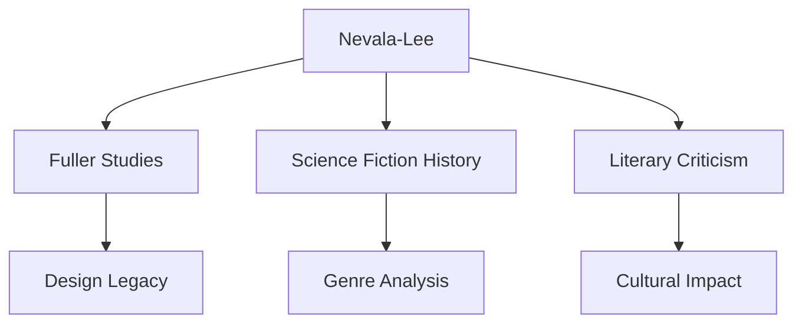

# Alec Nevala-Lee

Alec Nevala-Lee is an American biographer, novelist, and journalist known for his comprehensive biography of R. Buckminster Fuller and his work on the history of science fiction. His meticulous research and narrative skill have earned him recognition as a leading chronicler of influential figures in futurism and science fiction.

## Quick Facts

```yaml
personal:
  birth: 1980-05-31
  birthplace: Castro Valley, California
  nationality: American
  heritage: Chinese-Finnish-Estonian
  education:
    - [[Harvard University]] (BA Classics)
  occupation: [Author, Biographer, Journalist]
  known_for:
    - Fuller biography
    - Science fiction history
    - Literary criticism
  current_role: 
    - Independent Author
    - BFI Consultant
  awards:
    - Hugo Award Finalist
    - Locus Award Finalist
    - Sloan Foundation Grant ($40,000)
```

## Biography

### Family Tree


### Life Timeline


### Professional Network


## Fuller Scholarship

### Research Contributions
1. [[Inventor of the Future]]
   - First comprehensive Fuller biography
   - Extensive Chronofile research
   - New historical insights

2. Legacy Analysis
   - Design philosophy examination
   - Collaboration revelations
   - Educational impact assessment

### Impact Map
```mermaid
mindmap
    root((Fuller Research))
        Archives
            [[Stanford Collections]]
            [[Chronofile Analysis]]
            [[Personal Interviews]]
        Insights
            [[Design Philosophy]]
            [[Collaboration Networks]]
            [[Educational Impact]]
        Legacy
            [[Silicon Valley Influence]]
            [[Think Tank Model]]
            [[Modern Applications]]
```

## Professional Work

### Major Publications
1. Fiction
   - [[The Icon Thief]]
   - [[City of Exiles]]
   - [[Eternal Empire]]
   - [[Syndromes]] (Audio Collection)

2. Non-Fiction
   - [[Astounding: John W. Campbell...]]
   - [[Inventor of the Future]]
   - [[Collisions]] (Upcoming)

### Research Areas
```mermaid
mindmap
    root((Research))
        Biography
            [[Fuller Studies]]
            [[Science Fiction History]]
            [[Physics History]]
        Journalism
            [[Literary Criticism]]
            [[Historical Investigation]]
            [[Cultural Analysis]]
        Fiction
            [[Science Fiction]]
            [[Thrillers]]
            [[Short Stories]]
```

## Writing and Scholarship

### Methodological Approach
1. Archival Research
   - Primary source focus
   - Comprehensive documentation
   - Interview integration

2. Historical Analysis
   - Context examination
   - Myth debunking
   - Pattern recognition

### Publication Network


## Current Projects

### Research Focus
- Luis Alvarez biography
- Physics history
- Science fiction analysis
- Historical investigations

### Initiatives
1. [[Pulitzer Prize Jury]]
   - Biography category
   - Literary evaluation
   - Cultural impact assessment

2. [[Analog Magazine]]
   - "Unknowns" puzzle feature
   - Science fiction contributions
   - Genre analysis

## Legacy

### Impact Areas


### Knowledge Transfer


## Resources

### Archives
- [[Stanford Special Collections]]
- [[Science Fiction Archives]]
- [[Fuller Documentation]]

### Media
- [[Author Interviews]]
- [[Public Lectures]]
- [[BFI Presentations]]
- [[Literary Events]]

## References
1. Wikipedia profile
2. Personal blog
3. Published works
4. Media interviews
5. Academic citations

## Notes
- Pioneering Fuller research methodology
- Integration of multiple cultural perspectives
- Balance of academic and popular writing
- Commitment to historical accuracy

## Tags
#person #author #biographer #fuller-scholar #science-fiction-writer #journalist 