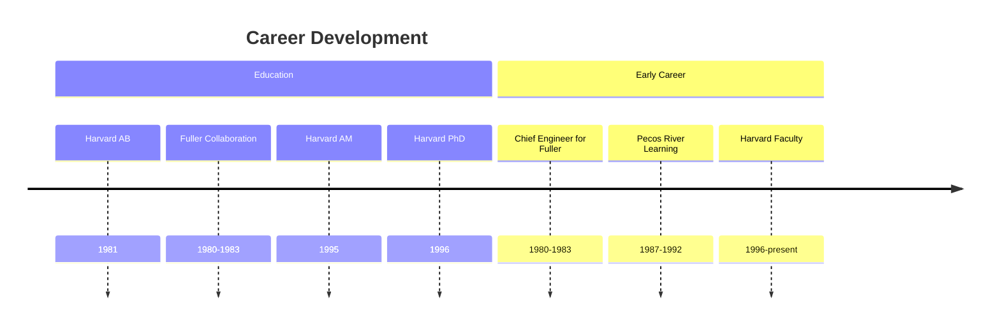
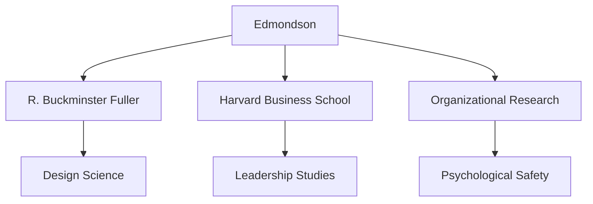
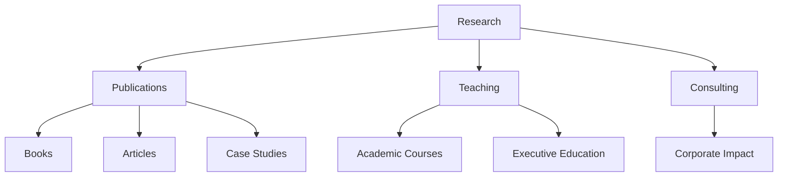
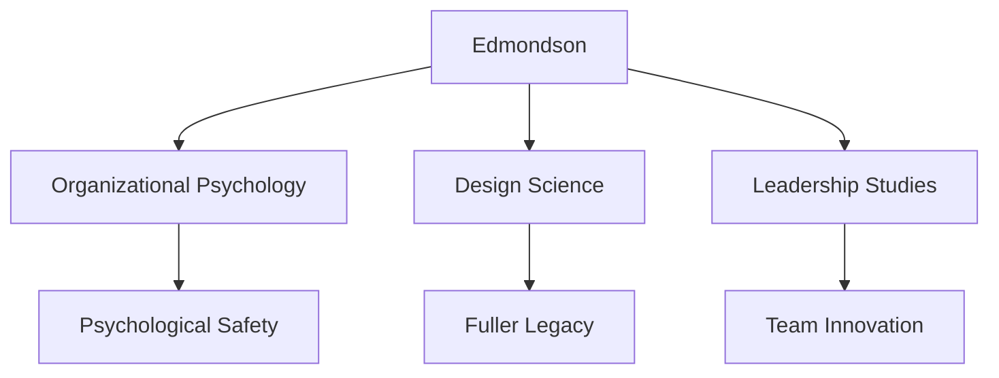

# Amy C. Edmondson

Amy C. Edmondson is an American scholar, author, and the Novartis Professor of Leadership and Management at Harvard Business School. She is known for her groundbreaking work on psychological safety, teaming, and organizational learning, as well as her early collaboration with R. Buckminster Fuller.

## Quick Facts

```yaml
personal:
  nationality: American
  education:
    - [[Harvard University]] (AB Engineering and Design, 1981)
    - [[Harvard University]] (AM Psychology, 1995)
    - [[Harvard University]] (PhD Organizational Behavior, 1996)
  occupation: [Professor, Author, Researcher]
  known_for:
    - Psychological Safety theory
    - Teaming methodology
    - Fuller collaboration
    - Organizational learning
  current_role: Novartis Professor at Harvard Business School
  awards:
    - Thinkers50 #1 Management Thinker (2021, 2023)
    - HR Magazine Most Influential Thinker (2017)
```

## Biography

### Early Career Path


### Professional Network


## Fuller Connection

### Collaboration Period
1. Chief Engineer (1980-1983)
   - Direct work with Fuller
   - Design science applications
   - Synergetics research

2. Legacy Preservation
   - [[A Fuller Explanation]] book
   - Fuller professorship establishment
   - Design science promotion

### Impact Map
```mermaid
mindmap
    root((Fuller Impact))
        Design Science
            [[Synergetics Understanding]]
            [[Geometric Principles]]
            [[Systems Thinking]]
        Academic Legacy
            [[Fuller Professorship]]
            [[Design Education]]
            [[Innovation Studies]]
        Publications
            [[A Fuller Explanation]]
            [[Synergetics Papers]]
            [[Educational Materials]]
```

## Academic Contributions

### Major Works
1. [[The Fearless Organization]]
   - Psychological safety framework
   - Organizational learning
   - Innovation enablement

2. [[Teaming]]
   - Dynamic collaboration
   - Knowledge economy
   - Learning organizations

3. [[Right Kind of Wrong]]
   - Failure analysis
   - Learning from mistakes
   - Innovation processes

### Research Areas
```mermaid
mindmap
    root((Research))
        Psychological Safety
            [[Team Dynamics]]
            [[Innovation Culture]]
            [[Learning Environment]]
        Organizational Learning
            [[Knowledge Transfer]]
            [[Failure Analysis]]
            [[Adaptive Systems]]
        Leadership
            [[Team Management]]
            [[Change Leadership]]
            [[Innovation Strategy]]
```

## Teaching and Impact

### Educational Leadership
1. Harvard Business School
   - Leadership courses
   - Organizational behavior
   - Innovation studies

2. Executive Education
   - Corporate programs
   - Leadership development
   - Organizational change

### Knowledge Dissemination


## Legacy

### Impact Areas


### Influence Network
```mermaid
mindmap
    root((Influence))
        Academic
            [[Harvard Business School]]
            [[Management Studies]]
            [[Psychology Research]]
        Practice
            [[Corporate Leadership]]
            [[Team Development]]
            [[Innovation Management]]
        Legacy
            [[Fuller Studies]]
            [[Design Science]]
            [[Systems Thinking]]
```

## Publications

### Books
1. Academic Works
   - [[A Fuller Explanation]] (1987)
   - [[Teaming]] (2012)
   - [[The Fearless Organization]] (2019)
   - [[Right Kind of Wrong]] (2023)

2. Articles and Papers
   - Over 70 published works
   - Harvard Business Review articles
   - Academic journal contributions

## Current Work

### Research Focus
- Psychological safety in organizations
- Team dynamics in complex environments
- Innovation and learning systems
- Design science applications

### Initiatives
1. [[Fuller Professorship at Harvard GSD]]
   - Establishment and support
   - Design science promotion
   - Educational innovation

2. [[Organizational Learning Research]]
   - Psychological safety studies
   - Team effectiveness
   - Innovation processes

## Resources

### Archives
- [[Harvard Business School Archives]]
- [[Fuller Archives]]
- [[Organizational Behavior Research]]

### Media
- [[Academic Presentations]]
- [[Leadership Talks]]
- [[Innovation Workshops]]
- [[Design Science Lectures]]

## References
1. Harvard Business School profile
2. Thinkers50 biography
3. Published works
4. Academic citations
5. Media interviews

## Notes
- Pioneered psychological safety research
- Bridged Fuller's work with modern management
- Top-ranked management thinker globally
- Continues Fuller's legacy through education

## Tags
#person #scholar #author #professor #fuller-collaborator #organizational-psychologist 