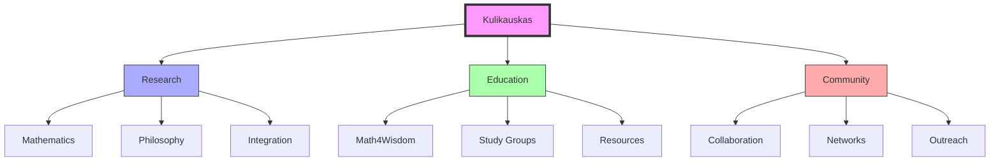

# Andrius Kulikauskas

Andrius Kulikauskas is a Lithuanian-American mathematician, philosopher, and educator known for founding [[organizations/Math4Wisdom|Math4Wisdom]] and developing the Wondrous Wisdom framework for investigating absolute truth through mathematical and cognitive frameworks.

## Research Focus

### Core Investigations
1. Wondrous Wisdom Development
   - Cognitive frameworks (since 1982)
   - Mathematical foundations
   - Philosophical integration
   - Truth investigation

2. Mathematical Research
   - Algebraic topology
   - Category theory
   - Complex geometry
   - Quantum physics applications

### Philosophical Framework
1. [[Language_of_Wisdom]]
   - Bottom-up documentation
   - Cognitive frameworks
   - Experiential perspectives
   - Consciousness studies

2. Logos: God as Theory
   - Theological investigations
   - Philosophical foundations
   - Ethical frameworks
   - Spiritual integration

## Academic Work

### Research Areas
```yaml
specializations:
  mathematics:
    - Algebraic topology
    - Bott periodicity
    - Category theory
    - Complex geometry
  philosophy:
    - Cognitive frameworks
    - Systems thinking
    - Truth investigation
    - Consciousness studies
  integration:
    - Mathematical foundations
    - Philosophical systems
    - Educational methods
    - Knowledge engineering
```

### Educational Leadership
1. Math4Wisdom Community
   - Founder and leader
   - Research program development
   - Study group coordination
   - Community building

2. Educational Innovation
   - Mathematical education
   - Systems thinking
   - Knowledge integration
   - Truth investigation

## Current Projects

### Research Initiatives
1. Mathematical Investigations
   - Triangle centers study
   - Bott periodicity research
   - Category theory applications
   - Quantum physics integration

2. Educational Development
   - Wondrous Wisdom framework
   - Study group coordination
   - Resource development
   - Community building

### Collaborative Work


## Knowledge Integration

### Theoretical Framework
1. Mathematical Foundations
   - Advanced mathematics
   - Cognitive frameworks
   - Systems integration
   - Truth investigation
   - Works past and present include collaboration with [[Daniel_Ari_Friedman]], [[Kirby_Urner]], and many more ,

2. Philosophical Integration
   - Consciousness studies
   - Knowledge systems
   - Ethical frameworks
   - Spiritual dimensions

### Practical Applications
1. Educational Methods
   - Study group development
   - Resource creation
   - Knowledge sharing
   - Community building

2. Research Implementation
   - Mathematical investigation
   - Framework development
   - System integration
   - Practical application

## Community Leadership

### Organization Development
1. Math4Wisdom
   - Program development
   - Study group coordination
   - Resource creation
   - Community building

2. Collaborative Networks
   - Research partnerships
   - Educational connections
   - Community engagement
   - Knowledge sharing

## Publications & Resources

### Online Presence
1. Digital Platforms
   - Math4Wisdom website
   - YouTube channel
   - Research documentation
   - Educational resources

2. Research Documentation
   - Mathematical investigations
   - Philosophical frameworks
   - Educational materials
   - Community resources

## Contact Information
```yaml
contact:
  email: math4wisdom@gmail.com
  phone: +370 607 27 665
  location: Eičiūnų km, Alytaus raj, Lithuania
  platforms:
    - Math4Wisdom website
    - YouTube channel
    - Email group
    - Academic networks
```

## References

### Primary Sources
1. Math4Wisdom documentation
2. Research publications
3. Educational materials
4. Community resources

### Related Materials
- [[organizations/Math4Wisdom|Math4Wisdom]] resources
- Research documentation
- Educational materials
- Community contributions

## Notes
- Founded Math4Wisdom
- Developed Wondrous Wisdom framework
- Active in mathematical research
- Community leader and educator

## Tags
#mathematician #philosopher #researcher #educator #systems-thinker 