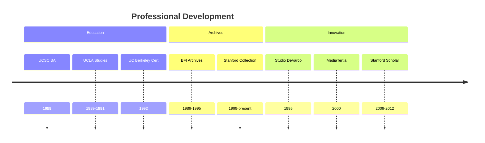
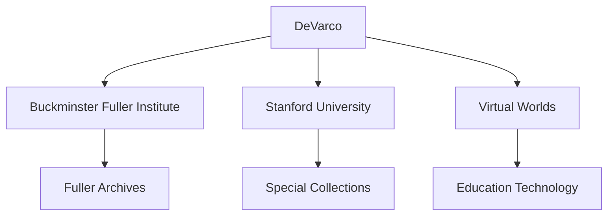
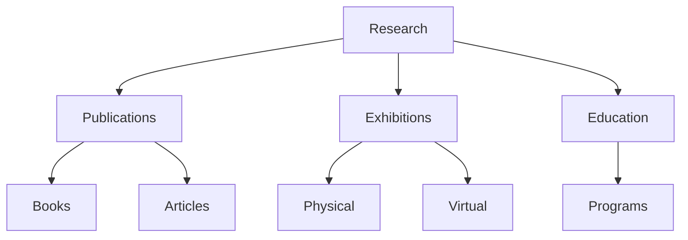
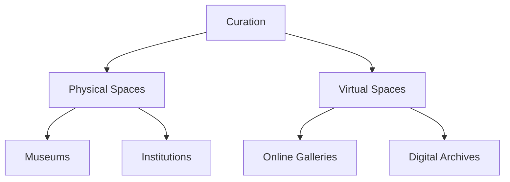

# Bonnie DeVarco

Bonnie DeVarco is an American interdisciplinary researcher, archivist, and curator known for her significant contributions to preserving and advancing R. Buckminster Fuller's legacy through archival work, Design Science education, and virtual world innovations.

## Quick Facts

```yaml
personal:
  nationality: American
  education:
    - [[University of California, Santa Cruz]] (BA Cultural Anthropology, 1989)
    - [[University of California, Los Angeles]] (Graduate Studies, Dance Ethnology, 1989-1991)
    - [[University of California, Berkeley]] (Archives Management Certification, 1992)
  occupation: [Archivist, Researcher, Curator, Consultant]
  known_for:
    - Fuller Archives management
    - Design Science education
    - Virtual worlds development
    - Information visualization
  current_roles:
    - Independent Researcher
    - Fellow of Royal Society for Arts (FRSA)
    - BFI Advisor
```

## Biography

### Career Timeline


### Professional Network


## Fuller Legacy Contributions

### Archival Work
1. BFI Chief Archivist (1989-1995)
   - Archive management
   - Collection preservation
   - Research support

2. Stanford Collaboration
   - Fuller Collection expert
   - Conservation projects
   - Research initiatives

### Impact Map
```mermaid
mindmap
    root((Fuller Legacy))
        Archives
            [[BFI Archives]]
            [[Stanford Collection]]
            [[Digital Preservation]]
        Education
            [[Design Science]]
            [[Synergetics]]
            [[Virtual Learning]]
        Research
            [[Invisible Architecture]]
            [[Shape of Thought]]
            [[Visual Language]]
```

## Professional Work

### Major Projects
1. [[Buckminster Fuller Challenge]]
   - Founding advisory committee
   - Program development
   - Innovation assessment

2. [[Dymaxion Study Center]]
   - Co-curator
   - Research director
   - Exhibition design

3. [[Virtual Exhibitions]]
   - 3D Online Galleries
   - Digital curation
   - Interactive experiences

### Research Areas
```mermaid
mindmap
    root((Research))
        Design Science
            [[Synergetics]]
            [[Visual Language]]
            [[Systems Thinking]]
        Technology
            [[Virtual Worlds]]
            [[Information Visualization]]
            [[Geospatial Web]]
        Culture
            [[Anthropoiesis]]
            [[Quantum Consciousness]]
            [[Global Brain]]
```

## Publications and Scholarship

### Books
1. In Progress
   - [[Invisible Architecture II]]
   - [[Shape of Thought]]
   - [[Ludic Cartographies]]

2. Published
   - [[Way of Time]]
   - Various articles and papers

### Knowledge Dissemination


## Curatorial Work

### Exhibition Portfolio
1. Physical Exhibitions
   - [[Dymaxion Study Center]]
   - [[AIANY Exhibitions]]
   - [[BFI Traveling Exhibits]]

2. Virtual Galleries
   - [[Way of Time Book Gallery]]
   - [[Women Inventors Gallery]]
   - [[Spirited Nature]]

### Exhibition Network


## Current Work

### Research Focus
- Design Science applications
- Virtual world development
- Information visualization
- Archive digitization

### Initiatives
1. [[Places & Spaces Exhibition]]
   - Advisory board member
   - Exhibition development
   - Research integration

2. [[Virtual Learning Environments]]
   - Educational technology
   - Distance learning
   - Media enhancement

## Resources

### Archives
- [[BFI Digital Archives]]
- [[Stanford Special Collections]]
- [[Virtual World Archives]]

### Media
- [[Lectures and Presentations]]
- [[Exhibition Documentation]]
- [[Digital Projects]]
- [[Virtual Galleries]]

## References
1. BFI profiles and documentation
2. Stanford University records
3. Published works and exhibitions
4. Professional portfolios
5. Academic citations

## Notes
- Pioneer in virtual world education
- Expert in Fuller's work and legacy
- Innovator in digital preservation
- Bridge between physical and virtual archives

## Tags
#person #archivist #researcher #curator #fuller-scholar #design-science-educator 