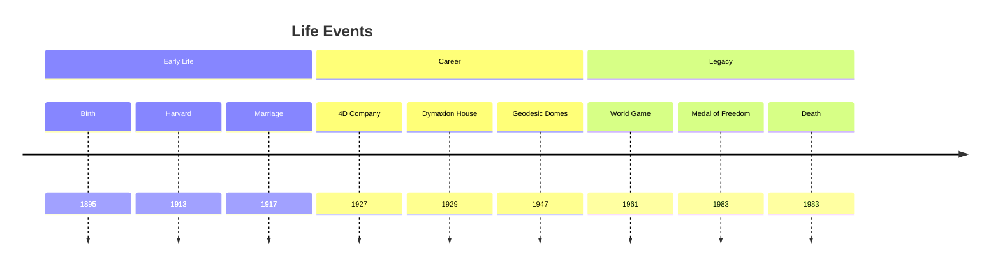
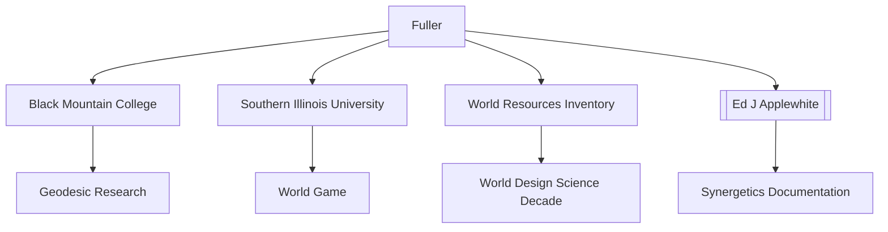
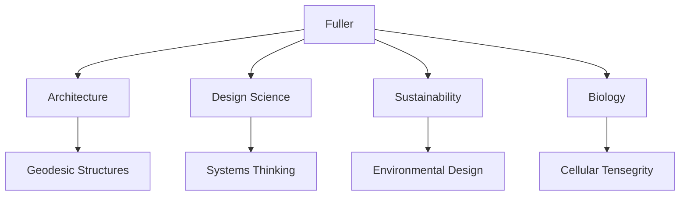
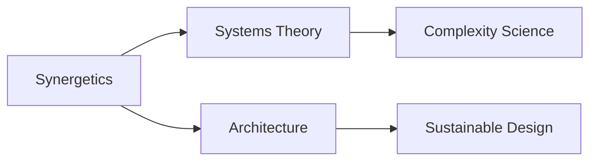
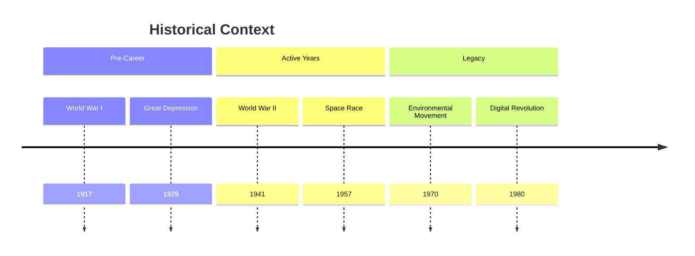

# R. Buckminster Fuller

Richard Buckminster Fuller was an American architect, systems theorist, author, designer, inventor, and futurist. He was a pioneering advocate of design science and sustainability in architecture and technology.

## Quick Facts

```yaml
personal:
  birth: 1895-07-12
  death: 1983-07-01
  nationality: American
  education: 
    - [[Harvard University]] (expelled twice)
    - [[U.S. Naval Academy]] (training)
  occupation: [Architect, Inventor, Philosopher]
  known_for: 
    - Geodesic dome
    - Dymaxion concepts
    - World Game
    - Synergetics
  awards:
    - Presidential Medal of Freedom (1983)
    - 47 honorary doctorate degrees
  key_collaborators:
    - [[Ed J Applewhite]] - Synergetics documentation
    - [[Kenneth Snelson]] - Tensegrity development
    - [[Shoji Sadao]] - Architectural projects
    - [[Amy C Edmondson]] - Chief Engineer, Synergetics interpretation
```

## Biography

### Family Tree


### Life Timeline


### Geographic Movement


## Professional Life

### Career Progression


### Influence Network
```mermaid
mindmap
    root((Fuller))
        Mentors
            [[Frank Lloyd Wright]]
            [[Albert Einstein]]
        Collaborators
            [[Ed J Applewhite]]
            [[Kenneth Snelson]]
            [[Shoji Sadao]]
            [[Amy C Edmondson]]
        Students
            [[Norman Foster]]
            [[Buckminster Fuller Institute]]
        Influenced
            [[Stewart Brand]]
            [[John Cage]]
            [[Donald E Ingber]]
```

### Professional Network


## Contributions

### Major Works
1. [[Geodesic Dome]]
   - Revolutionary architectural design
   - Maximum efficiency with minimal material
   - Over 300,000 built worldwide

2. [[Operating Manual for Spaceship Earth]]
   - Key philosophical work
   - Concept of [[Spaceship_Earth]]
   - Sustainability principles

3. [[Synergetics: Explorations in the Geometry of Thinking]]
   - Co-authored with [[Ed_J_Applewhite|Edgar Jarratt Applewhite Jr.]]
   - Comprehensive geometric theory
   - Foundation of design science
   - Further explained by [[Amy_Edmondson|Amy Catherine Edmondson]] in [[A Fuller Explanation]]

### Innovation Map
```mermaid
mindmap
    root((Innovations))
        Theory
            [[Synergetics]]
            [[Tensegrity]]
            [[Systems Thinking]]
        Practice
            [[Dymaxion House]]
            [[Geodesic Dome]]
            [[World Game]]
        Impact
            [[Sustainable Design]]
            [[Cellular Biology]]
            [[Modern Architecture]]
```

### Publication Timeline


## Legacy

### Impact Areas


### Citation Network


### Historical Context


### Contemporary Applications
1. Architecture and Design
   - Geodesic structures
   - Sustainable buildings
   - Efficient systems

2. Scientific Applications
   - [[Cellular_Tensegrity]]
   - Biomechanical applications
   - Molecular structures
   - Medical innovations

3. Environmental Impact
   - Resource efficiency
   - Sustainable design
   - Global solutions

### Modern Interpretations
1. Architectural Legacy
   - Building innovations
   - Structural efficiency
   - Sustainable design

2. Scientific Impact
   - [[Donald_Ingber|Donald Eugene Ingber]]'s cellular tensegrity
   - Biomechanical applications
   - Medical technology
   - Drug development

3. Cultural Influence
   - Environmental awareness
   - Systems thinking
   - Innovation methodology

### Historical Analysis
```mermaid
mindmap
    root((Fuller Legacy))
        Documentation
            [[Chronofile]]
            [[Stanford Archives]]
            [[BFI Collections]]
        Interpretation
            [[A Fuller Explanation]]
            [[Inventor of the Future]]
            [[Critical Studies]]
        Impact
            [[Design Science]]
            [[Silicon Valley]]
            [[Modern Innovation]]
```

## Resources

### Archives
- [[Stanford University Special Collections]] - Primary archive
- [[Buckminster Fuller Institute]] - Digital archive
- [[Southern Illinois University]] - Papers and artifacts
- [[Chronofile]] - Personal documentation

### Bibliography
1. Primary Sources
   - [[Operating Manual for Spaceship Earth]]
   - [[Synergetics]]
   - [[Critical Path]]

2. Secondary Sources
   - [[Inventor of the Future]] - Nevala-Lee's comprehensive biography
   - [[A Fuller Explanation]] - Edmondson's Synergetics analysis
   - [[Buckminster Fuller's Universe]] - Sieden's perspective

### Media
- [[Buckminster Fuller: Thinking Out Loud]] (Documentary)
- [[Everything I Know]] (Video lectures)
- [[The Fuller Collection]] (Photographs)
- [[World Resources Inventory]] (Publications)

## References

### Citations
1. Sieden, Lloyd Steven. "Buckminster Fuller's Universe"
2. [[Amy_Edmondson]]. "A Fuller Explanation"
3. Ward, James. "The Artifacts of R. Buckminster Fuller"

### Further Reading
- [[Nine Chains to the Moon]]
- [[Ideas and Integrities]]
- [[Utopia or Oblivion]]

## Notes
- Coined term "Spaceship Earth"
- Developed concept of "Design Science Revolution"
- Advocated for "doing more with less"

## Tags
#person #architect #inventor #philosopher #sustainability #design-science 