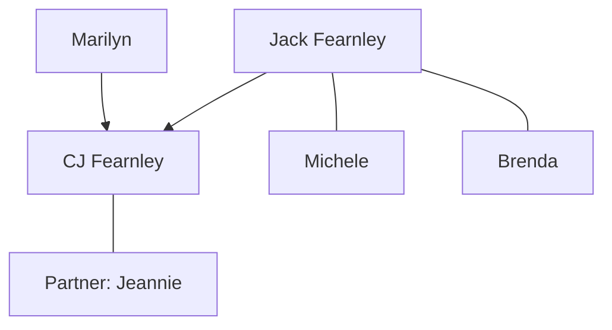
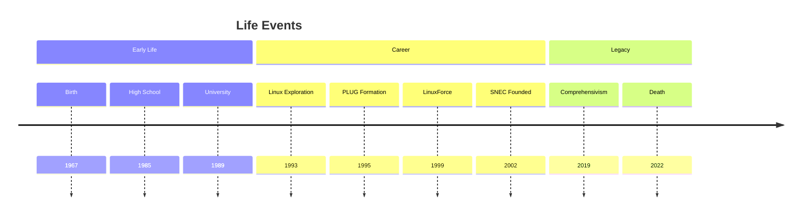
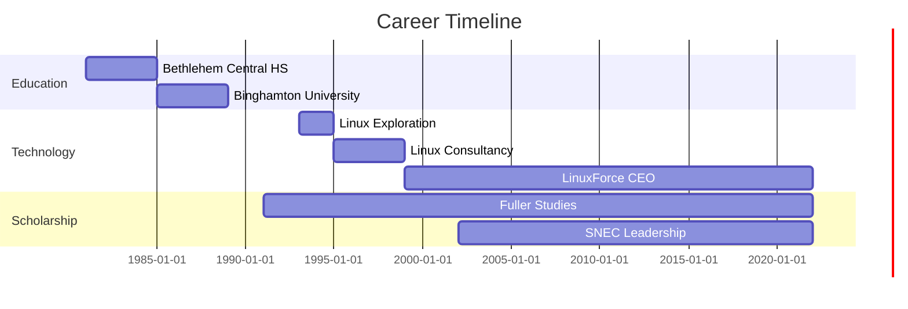
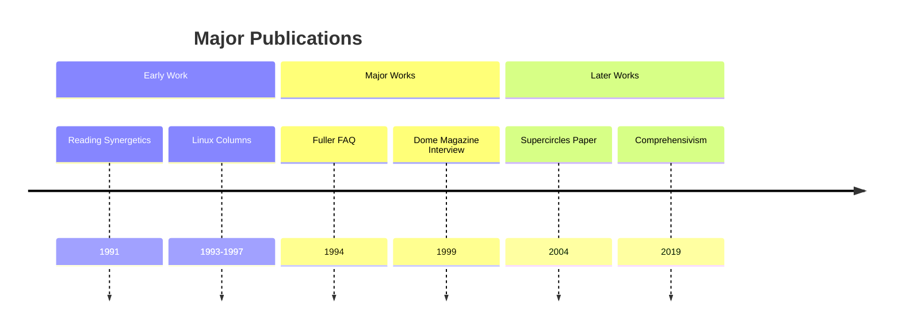
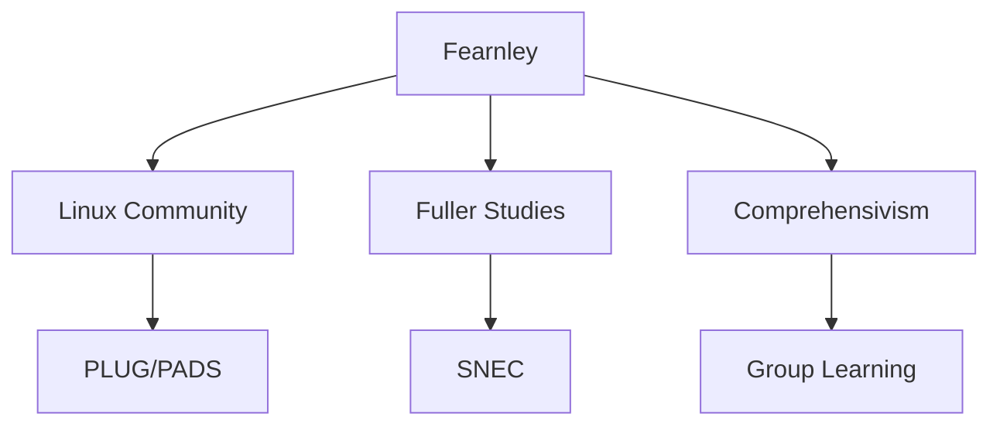
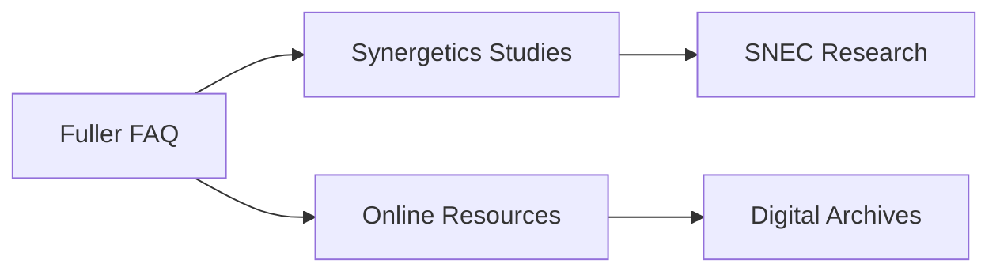

# CJ Fearnley

Christopher "CJ" John Fearnley (1967-2022) was an American technologist, philosopher, and Buckminster Fuller scholar who pioneered Linux adoption in Philadelphia and advanced Fuller's work through the Synergetics Collaborative (SNEC).

## Quick Facts

```yaml
personal:
  birth: 1967
  death: 2022-12-08
  birthplace: Troy, NY
  deathplace: Philadelphia area
  nationality: American
  education: 
    - [[Binghamton University]] (BA Mathematical Sciences and Philosophy, 1989)
  occupation: [CEO, Linux Consultant, Fuller Scholar, Philosopher]
  known_for: 
    - Linux adoption pioneer
    - Synergetics scholarship
    - SNEC founding
    - Comprehensivism advocacy
  cause_of_death: Aggressive cancer
```

## Biography

### Family Tree


### Life Timeline


### Geographic Movement


## Professional Life

### Career Progression


### Influence Network
```mermaid
mindmap
    root((Fearnley))
        Technology
            [[Linux Community]]
            [[PLUG]]
            [[PADS]]
        Scholarship
            [[R. Buckminster Fuller]]
            [[SNEC]]
            [[Synergetics]]
        Philosophy
            [[Comprehensivism]]
            [[Systems Thinking]]
```

## Contributions

### Major Works
1. [[The R. Buckminster Fuller FAQ]]
   - Created in 1994
   - Maintained online resource
   - Comprehensive Fuller reference

2. [[Reading Synergetics: Some Tips]]
   - Published 1991
   - Guide for Fuller students
   - Published in Trimtab

3. [[Collaborating for Comprehensivity]]
   - Launched 2019
   - Group learning initiative
   - Continuing legacy project

### Innovation Map
```mermaid
mindmap
    root((Innovations))
        Technology
            [[Linux Adoption]]
            [[PLUG Formation]]
            [[LinuxForce]]
        Scholarship
            [[Synergetics Studies]]
            [[Fuller FAQ]]
            [[SNEC]]
        Philosophy
            [[Comprehensivism]]
            [[Group Learning]]
```

### Publication Timeline


## Legacy

### Impact Areas


### Citation Network


## Resources

### Archives
- [[LinuxForce Archives]] - Technical writings and presentations
- [[SNEC Archives]] - Synergetics research and papers
- [[Comprehensivism Resources]] - Learning materials and recordings

### Bibliography
1. Primary Sources
   - [[Reading Synergetics: Some Tips]]
   - [[The R. Buckminster Fuller FAQ]]
   - [[Supercircles Paper]]

2. Secondary Sources
   - [[Dome Magazine Interview]]
   - [[BU Alumni Connect Profile]]
   - [[Philadelphia Business Journal]]

### Media
- [[SNEC Presentations]]
- [[Linux Tutorials]]
- [[Comprehensivism Sessions]]
- [[Memorial Tributes]]

## References
1. LinkedIn Profile
2. LinuxForce Biography
3. LinuxForce Blog
4. Buckminster Fuller Institute Tribute
5. Everloved Memorial

## Notes
- Donated corneas after death
- Environmental advocate who never owned a car
- Arranged for Comprehensivism initiative to continue
- Created 29 Linux/Unix columns for The Databus

## Tags
#person #technologist #philosopher #fuller-scholar #linux-pioneer #comprehensivist 