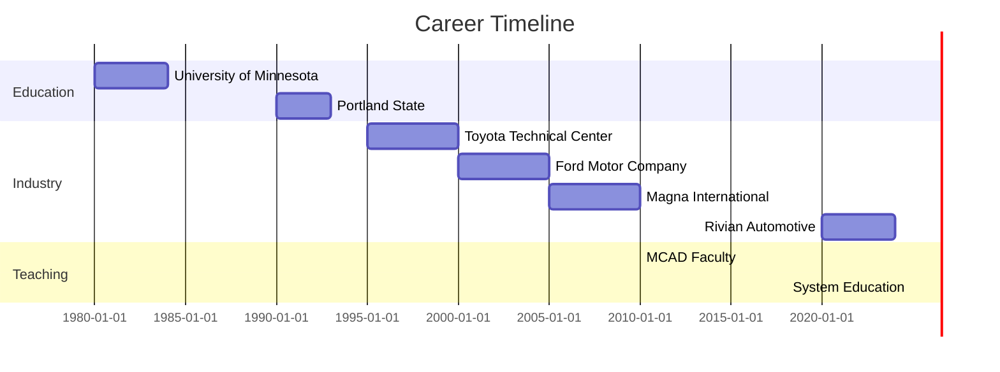
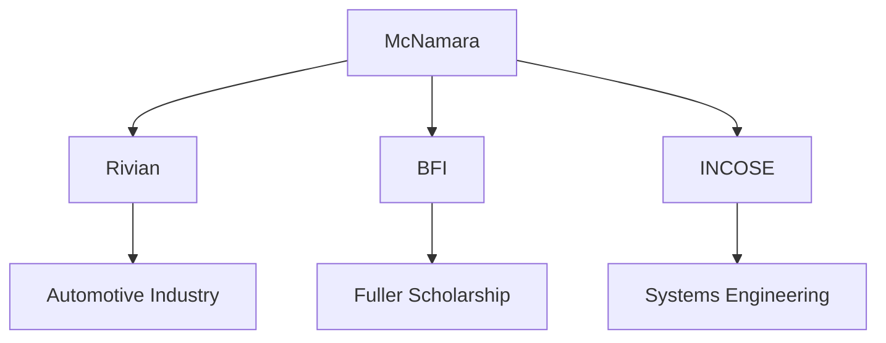
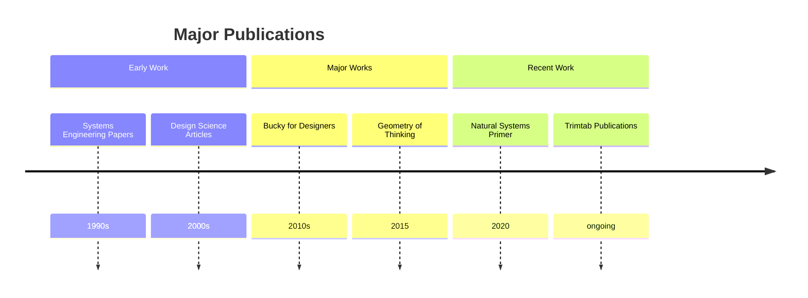
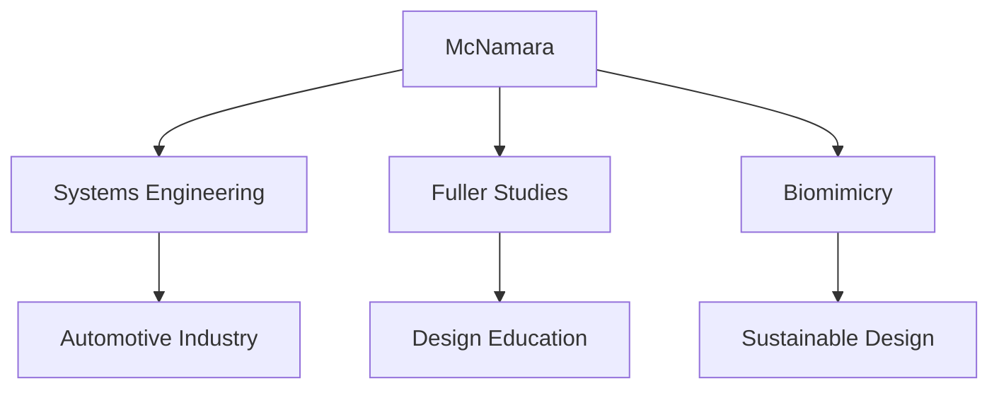

# Curt McNamara

Curt McNamara is an American systems engineer, educator, and Buckminster Fuller scholar who bridges engineering practice with biomimicry and systems thinking. He is known for his work in sustainable design and his contributions to Fuller scholarship.

## Quick Facts

```yaml
personal:
  nationality: American
  education:
    - [[Portland State University]] (MS Systems Engineering)
    - [[University of Minnesota]] (BS Electrical Engineering)
  occupation: [Systems Engineer, Educator, Author, Biomimicry Fellow]
  known_for:
    - Systems Engineering expertise
    - Biomimicry education
    - Fuller scholarship
    - Sustainable design
  current_role: Exterior Systems Engineer at Rivian Automotive
```

## Professional Life

### Career Progression


### Influence Network
```mermaid
mindmap
    root((McNamara))
        Engineering
            [[Automotive Industry]]
            [[Systems Engineering]]
            [[Sustainable Design]]
        Education
            [[MCAD]]
            [[System Education]]
            [[Biomimicry Institute]]
        Scholarship
            [[R. Buckminster Fuller]]
            [[BFI]]
            [[Trimtab]]
```

### Professional Network


## Contributions

### Major Works
1. [[Bucky for Designers]]
   - Book exploring Fuller's design principles
   - Focus on practical applications
   - Universal design approach

2. [[The Geometry of Thinking]]
   - Analysis of Fuller's spatial concepts
   - Cognitive implications
   - Structural understanding

3. [[Design Science Strategies]]
   - Fuller's problem-solving methods
   - Contemporary applications
   - Systems integration

### Innovation Map
```mermaid
mindmap
    root((Innovations))
        Engineering
            [[Exterior Systems]]
            [[Sustainable Design]]
            [[Systems Integration]]
        Education
            [[Biomimicry Curriculum]]
            [[Systems Thinking]]
            [[Design Education]]
        Research
            [[Fuller Studies]]
            [[Natural Systems]]
            [[Design Science]]
```

### Publication Timeline


## Teaching and Research

### Educational Roles
- Adjunct Faculty at [[Minneapolis College of Art and Design]]
- Mentor at [[System Education]]
- Biomimicry Education Fellow at [[The Biomimicry Institute]]

### Research Areas
1. Systems Engineering
   - Natural systems integration
   - Biomimetic approaches
   - Sustainable design

2. Fuller Studies
   - Design science
   - Comprehensive thinking
   - Problem-solving methods

## Current Projects

### Initiatives
1. [[Trimtab Book Club]]
   - Coordinator
   - Fuller work discussions
   - Community engagement

2. [[Natural Systems Working Group]]
   - INCOSE co-founder
   - Systems engineering
   - Nature-inspired design

### Ongoing Research
- Fuller's tools for design
- Systems change methodology
- Biomimicry applications

## Legacy

### Impact Areas


### Knowledge Transfer


## Resources

### Archives
- [[BFI Archives]] - Fuller scholarship contributions
- [[INCOSE Publications]] - Systems engineering work
- [[MCAD Resources]] - Educational materials

### Bibliography
1. Primary Works
   - [[Bucky for Designers]]
   - [[The Geometry of Thinking]]
   - [[Natural Systems Primer]]

2. Educational Resources
   - [[Biomimicry Curriculum]]
   - [[Systems Thinking Guides]]
   - [[Design Science Materials]]

### Media
- [[BFI Presentations]]
- [[Educational Webinars]]
- [[Systems Engineering Talks]]
- [[Trimtab Discussions]]

## References
1. BFI Website
2. Clay.Earth Profile
3. Spaceship Earth Mission Log
4. Biomimicry NYC
5. INCOSE Publications

## Notes
- Active in bridging engineering and natural systems
- Continues Fuller's legacy through education
- Integrates biomimicry with systems thinking
- Develops practical applications of Fuller's work

## Tags
#person #engineer #educator #fuller-scholar #biomimicry-expert #systems-thinker 