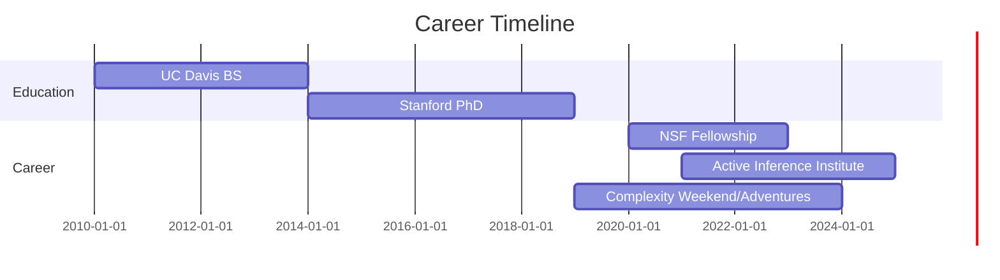
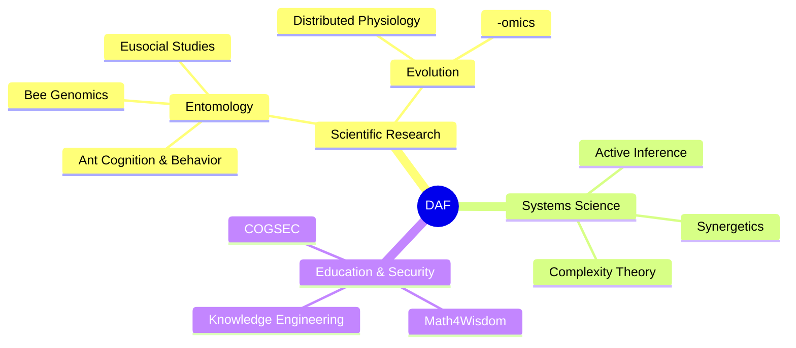
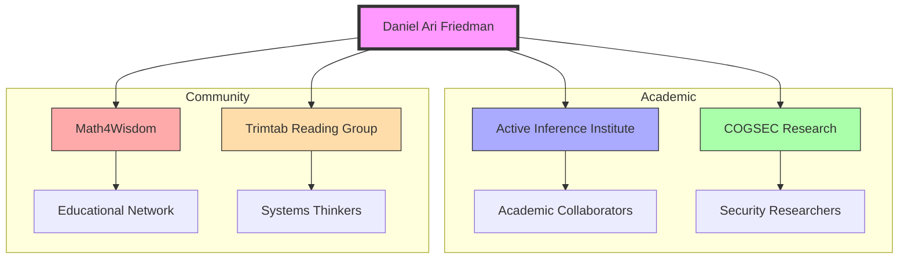
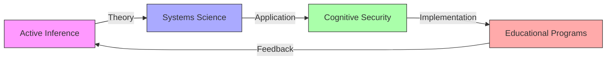
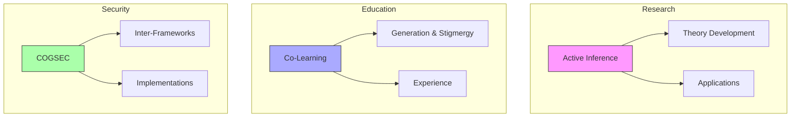

# Daniel Ari Friedman

Daniel Ari Friedman is an American researcher, scientist, and systems thinker known for his interdisciplinary work spanning entomology, systems science, [[concepts/Synergetics|Synergetics]], and [[concepts/Active_Inference|Active Inference]], based in [[places/Crescent_City|Crescent City]], California. As founder and president of the [[organizations/Active_Inference_Institute|Active Inference Institute]], he leads research initiatives in [[concepts/Active_Inference|Active Inference]] and [[concepts/Cognitive_Security|Cognitive Security]].

## Quick Facts

```yaml
personal:
  location: Crescent City, California
  birth_year: ~1992
  education:
    - PhD: Stanford University (Biology, 2014-2019)
    - BS: UC Davis (2010-2014)
  positions:
    current:
      - President, Active Inference Institute
      - COGSEC Researcher
      - Investigator, Math4Wisdom
      - Member, Trimtab Reading Group
    previous:
      - NSF Postdoctoral Fellow (2020-2023)
  research_areas:
    - Entomology
    - Systems Science
    - Synergetics
    - Active Inference
    - Cognitive Security
```

## Academic and Research Career



### Research Areas



## Key People

### Academic Mentors & Collaborators
- [[people/Brian_Johnson|Brian Johnson]] (UC Davis) - Bee Biology
- [[people/Tim_Linksvayer|Tim Linksvayer]] (ASU) - Social Evolution
- [[people/Deborah_Gordon|Deborah Gordon]] (Stanford) - Ant Behavior
- [[people/Artyom_Kopp|Artyom Kopp]] (UC Davis) - Evolutionary Biology
- [[people/Kirby_Urner|Kirby Urner]] - Knowledge Engineering, and [[Synergetics]]]
- [[Andrius_Kulikauskas]] -- [[Math4Wisdom]]
- [[RJ Cordes]] ([[Cognitive_Security]])

### Research Network


## Places

### Academic Institutions
- [[places/UC_Davis|UC Davis]] (2010-2014)
- [[places/Stanford_University|Stanford University]] (2014-2019)
	-One time, visited:  [[places/Stanford_Special_Collections|Stanford Special Collections]] - for [[Chronofile]] research

### Current Location
- [[places/Crescent_City|Crescent City]], California 
- [[Active_Inference_Institute]] - Primary research location

## Key Ideas & Concepts

### Research Frameworks


### Core Concepts
1. [[concepts/Active_Inference|Active Inference]]
   - Theoretical framework
   - Practical applications
   - Educational implementation

2. [[concepts/Synergetics|Synergetics]]
   - Systems thinking
   - Fuller's principles
   - Modern applications

3. [[concepts/Cognitive_Security|Cognitive Security]]
   - Framework development
   - Implementation strategies
   - Educational programs

## Organizations

### Leadership Roles
1. [[organizations/Active_Inference_Institute|Active Inference Institute]]
   - Founder and President
   - Research direction
   - Community building
   - Educational programs

2. [[organizations/Math4Wisdom|Math4Wisdom]]
   - Participant
   - Educational development
   - Systems integration

### Affiliations
- [[organizations/Trimtab_Reading_Group|Trimtab Reading Group]] - Core member
- [[organizations/Design_Science_Studios|Design Science Studios]] - Collaborator
- [[organizations/Buckminster_Fuller_Institute|BFI]] - Network member

## Current Projects



## References

### Academic Publications
1. Stanford University Research
   - Ant behavior studies
   - Evolutionary biology
   - [[Chronofile]] research (2024)

2. UC Davis Contributions
   - Bee genomics
   - Behavioral studies
   - Evolutionary research

### Online Presence
- [[organizations/Active_Inference_Institute|Active Inference Institute]] website
- Arr
- Academic publications
- Professional profiles

## Notes
- ...

## Tags
#researcher #scientist #synergetics #systems-science #entomologist #educator #active-inference #cognitive-security #complexity-theory #evolutionary-biology 