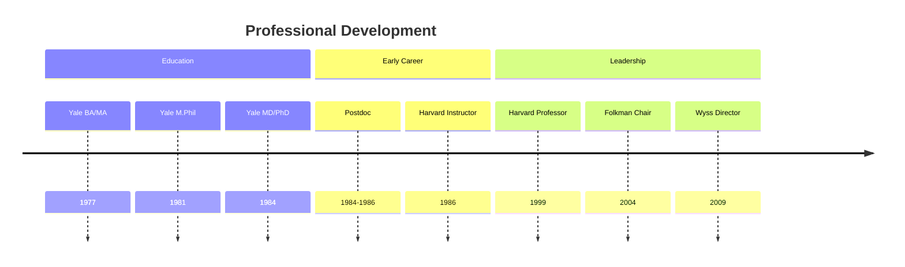
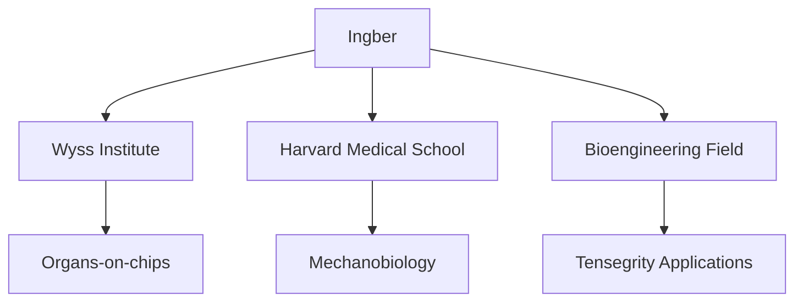
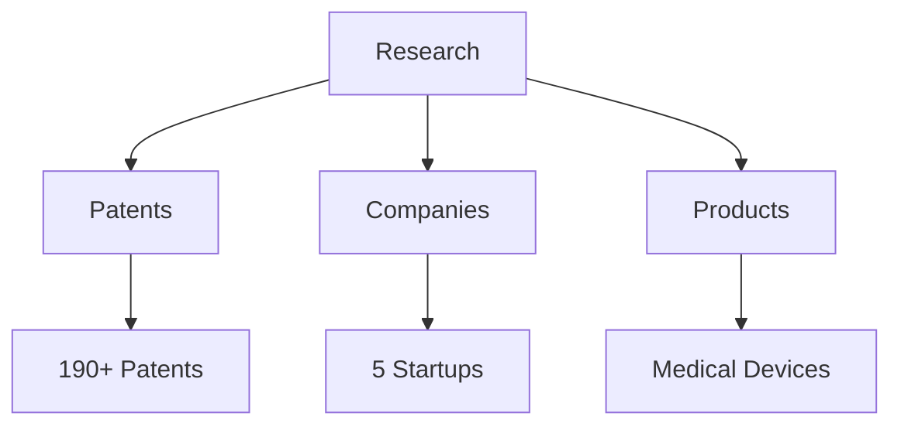
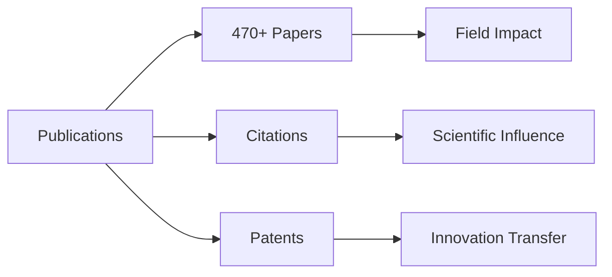
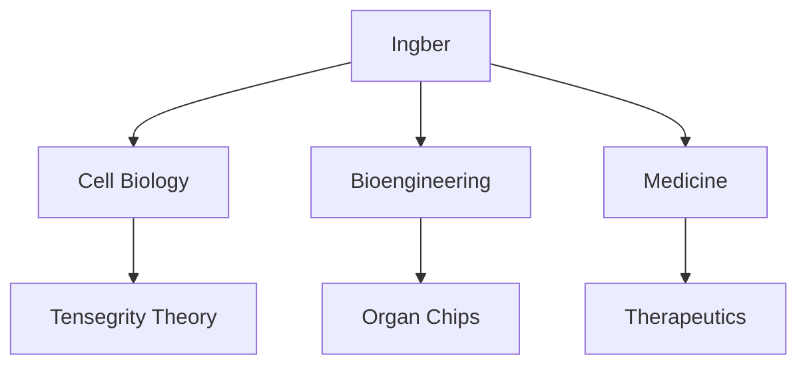

# Donald E. Ingber

Donald E. Ingber is an American bioengineer and cell biologist known for discovering and applying tensegrity principles to cellular architecture and mechanobiology. He serves as the founding director of the Wyss Institute for Biologically Inspired Engineering at Harvard University.

## Quick Facts

```yaml
personal:
  birth: 1956
  birthplace: East Meadow, New York
  nationality: American
  education:
    - [[Yale University]] (BA/MA Molecular Biophysics and Biochemistry, 1977)
    - [[Yale University]] (M.Phil. Cell Biology, 1981)
    - [[Yale University]] (MD/PhD, 1984)
  occupation: [Bioengineer, Cell Biologist, Professor, Institute Director]
  known_for:
    - Cellular tensegrity theory
    - Organs-on-chips technology
    - Mechanobiology advances
    - Biologically inspired engineering
  current_roles:
    - Founding Director, [[Wyss Institute]]
    - Judah Folkman Professor, Harvard Medical School
    - Professor of Bioengineering, Harvard SEAS
  awards:
    - Member, National Academy of Engineering
    - Member, National Academy of Medicine
    - Member, American Academy of Arts and Sciences
```

## Biography

### Career Timeline


### Professional Network


## Fuller Connection

### Tensegrity Development
1. Initial Exposure
   - Yale sculpture class discovery
   - Fuller's architectural principles
   - Cellular application insights

2. Theory Development
   - Cellular tensegrity model
   - Mechanical force studies
   - Biological architecture

### Impact Map
```mermaid
mindmap
    root((Tensegrity Impact))
        Biology
            [[Cell Structure]]
            [[Mechanobiology]]
            [[Tissue Engineering]]
        Engineering
            [[Medical Devices]]
            [[Biomimetic Design]]
            [[Organs-on-chips]]
        Theory
            [[Fuller Principles]]
            [[Biological Architecture]]
            [[Systems Design]]
```

## Scientific Contributions

### Major Discoveries
1. Cellular Architecture
   - Tensegrity principles
   - Mechanotransduction
   - Cytoskeletal dynamics

2. Bioengineering Innovations
   - Organs-on-chips
   - Biomimetic materials
   - Medical devices

### Research Areas
```mermaid
mindmap
    root((Research))
        Mechanobiology
            [[Cell Mechanics]]
            [[Force Transduction]]
            [[Tissue Development]]
        Engineering
            [[Organ Chips]]
            [[Medical Devices]]
            [[Biomaterials]]
        Applications
            [[Cancer Therapy]]
            [[Drug Development]]
            [[Tissue Engineering]]
```

## Innovation and Entrepreneurship

### Companies Founded
1. [[Emulate, Inc.]]
   - Organs-on-chips technology
   - Drug development
   - Commercial applications

2. [[Boa Biomedical]]
   - Sepsis treatment
   - Medical devices
   - Healthcare innovation

### Technology Development


## Academic Leadership

### Institutional Roles
1. [[Wyss Institute]]
   - Founding Director
   - Research leadership
   - Innovation translation

2. [[Harvard Medical School]]
   - Folkman Professor
   - Research programs
   - Medical education

### Research Impact


## Legacy

### Impact Areas


### Knowledge Transfer
```mermaid
mindmap
    root((Legacy))
        Scientific
            [[Cell Biology]]
            [[Mechanobiology]]
            [[Systems Design]]
        Engineering
            [[Medical Devices]]
            [[Biomimetics]]
            [[Organ Chips]]
        Commercial
            [[Startups]]
            [[Patents]]
            [[Products]]
```

## Resources

### Archives
- [[Wyss Institute Archives]]
- [[Harvard Medical School Records]]
- [[Patent Documentation]]

### Publications
1. Scientific Papers
   - 470+ peer-reviewed articles
   - Book chapters
   - Reviews

2. Patents
   - 190+ issued patents
   - Medical devices
   - Therapeutic applications

### Media
- [[Scientific Presentations]]
- [[Interviews]]
- [[Lectures]]
- [[Conference Proceedings]]

## References
1. Wikipedia profile
2. Wyss Institute biography
3. Scientific publications
4. Patent documents
5. Media interviews

## Notes
- Pioneered cellular tensegrity theory
- Transformed understanding of cell mechanics
- Bridged architecture and biology
- Advanced biologically inspired engineering

## Tags
#person #scientist #bioengineer #tensegrity-pioneer #entrepreneur #educator 