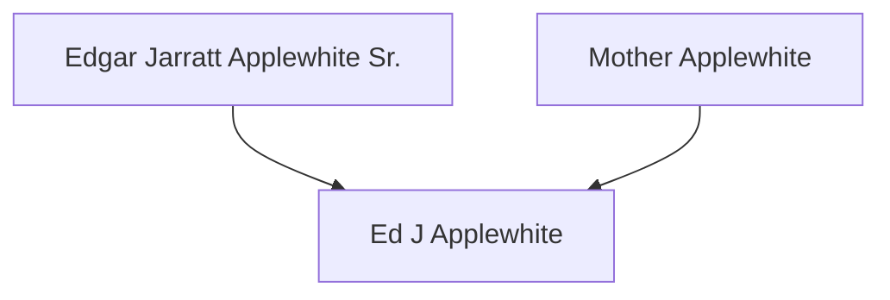
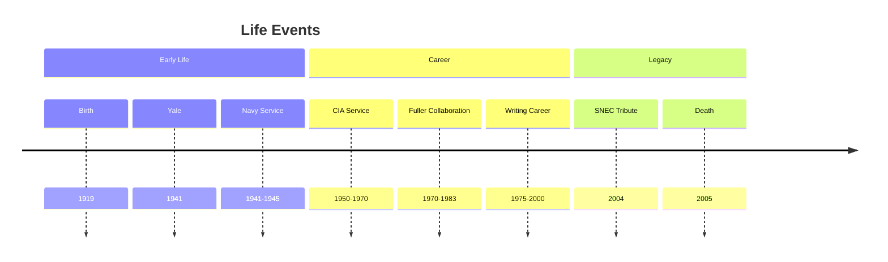
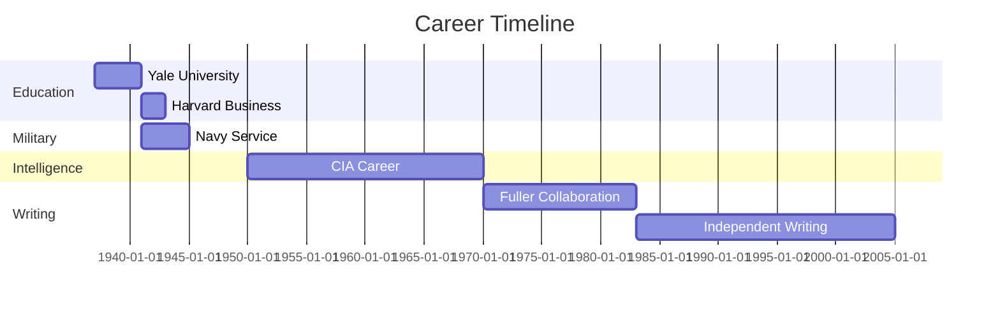
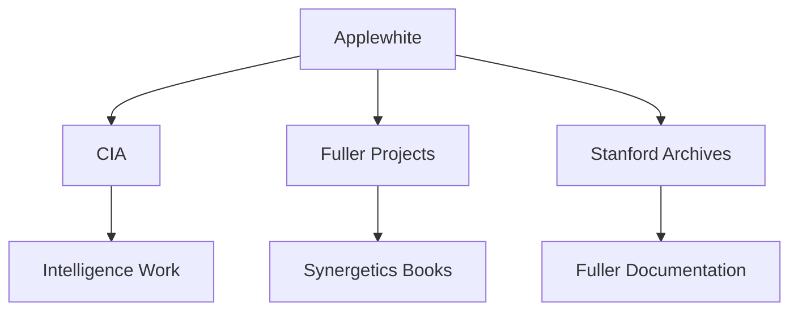
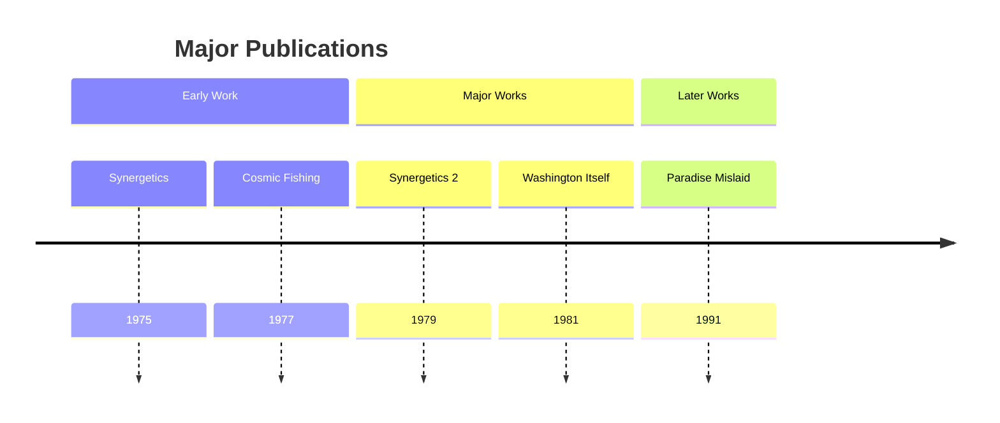
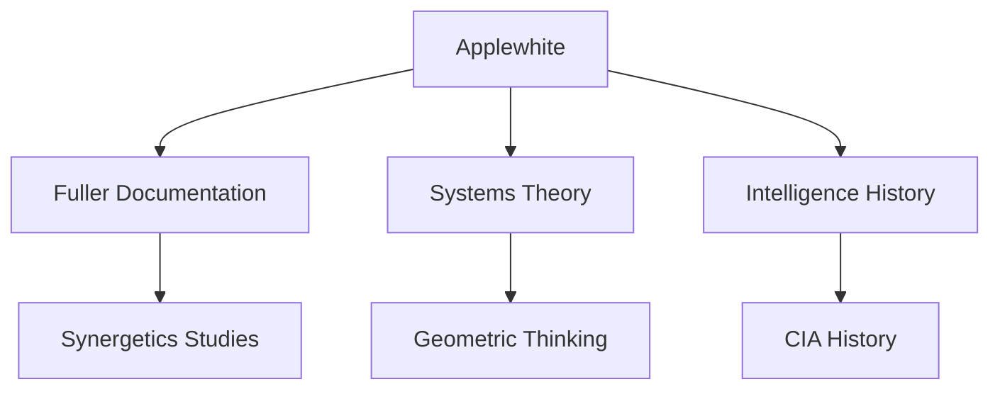
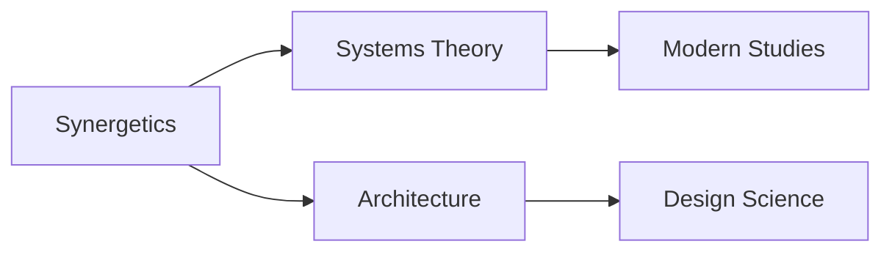
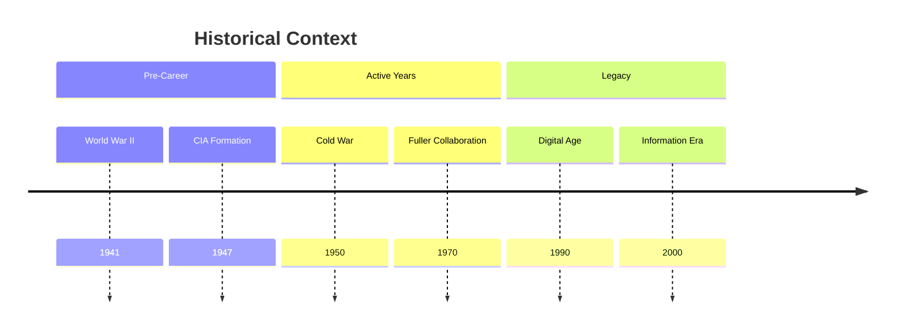

# Ed J Applewhite

Edgar Jarratt Applewhite Jr. was an American intelligence officer, writer, and philosopher best known for his extensive collaboration with R. Buckminster Fuller in documenting and organizing Fuller's complex theories, particularly in the field of Synergetics.

## Quick Facts

```yaml
personal:
  birth: 1919-04-24
  death: 2005-02-10
  birthplace: Newport News, Virginia
  deathplace: Washington, DC
  nationality: American
  education:
    - [[Yale University]] (B.A., 1941)
    - [[Harvard Business School]]
  occupation: [Intelligence Officer, Writer, Philosopher]
  known_for:
    - Collaboration with [[R. Buckminster Fuller]]
    - Synergetics Dictionary compilation
    - CIA deputy inspector general
  cause_of_death: Multiple myeloma
```

## Biography

### Family Tree


### Life Timeline


### Geographic Movement


## Professional Life

### Career Progression


### Influence Network
```mermaid
mindmap
    root((Applewhite))
        Collaborators
            [[R. Buckminster Fuller]]
            [[CIA Colleagues]]
        Associates
            [[Stanford University]]
            [[Buckminster Fuller Institute]]
        Influenced By
            [[Systems Theory]]
            [[Geometric Thinking]]
        Legacy
            [[Synergetics Studies]]
            [[Fuller Archives]]
```

### Professional Network


## Contributions

### Major Works
1. [[Synergetics: Explorations in the Geometry of Thinking]]
   - Co-authored with Fuller
   - Published 1975
   - Fundamental work on geometric thinking

2. [[Cosmic Fishing: An Account of Writing Synergetics with Buckminster Fuller]]
   - Personal account of collaboration
   - Published 1977
   - Behind-the-scenes insights

### Innovation Map
```mermaid
mindmap
    root((Contributions))
        Documentation
            [[Synergetics Dictionary]]
            [[Fuller Archives]]
        Publications
            [[Synergetics Books]]
            [[Washington Itself]]
        Legacy
            [[Fuller Studies]]
            [[Systems Theory]]
```

### Publication Timeline


## Legacy

### Impact Areas


### Citation Network


### Historical Context


## Resources

### Archives
- [[Stanford University Special Collections]] - Primary archive of Fuller-Applewhite materials
- [[CIA Historical Records]] - Intelligence career documentation
- [[Buckminster Fuller Institute]] - Collaborative work archives

### Bibliography
1. Primary Sources
   - [[Synergetics: Explorations in the Geometry of Thinking]]
   - [[Synergetics 2]]
   - [[Cosmic Fishing]]

2. Secondary Sources
   - [[Fuller's Synergetics Dictionary]]
   - [[Paradise Mislaid]]
   - [[Washington Itself]]

### Media
- [[SNEC Tribute 2004]] (Video)
- [[Applewhite-Fuller Correspondence]]
- [[Synergetics Archive Photos]]
- [[CIA Service Records]]

## References

### Citations
1. Encyclopedia.com - Applewhite biography
2. Buckminster Fuller Institute - Collaboration history
3. Washington Post - Obituary (2005)

### Further Reading
- [[The Synergetics Dictionary]]
- [[Fuller's Philosophy]]
- [[CIA Cold War History]]

## Notes
- Created 22,000-card Synergetics Dictionary
- Described himself as "a layman" despite expertise
- Key figure in preserving Fuller's ideas

## Tags
#person #writer #intelligence #philosopher #fuller-collaborator 