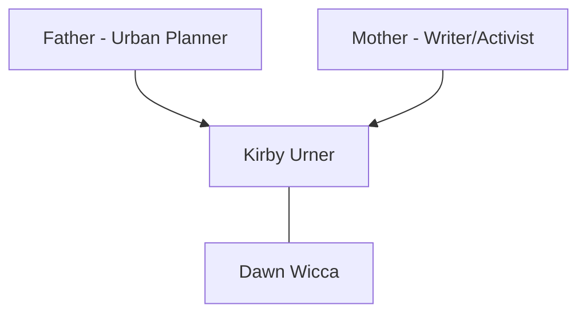
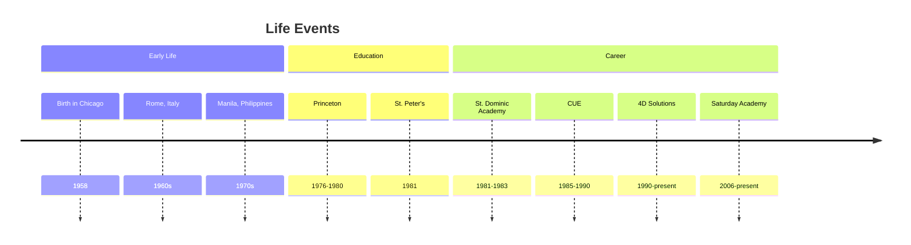
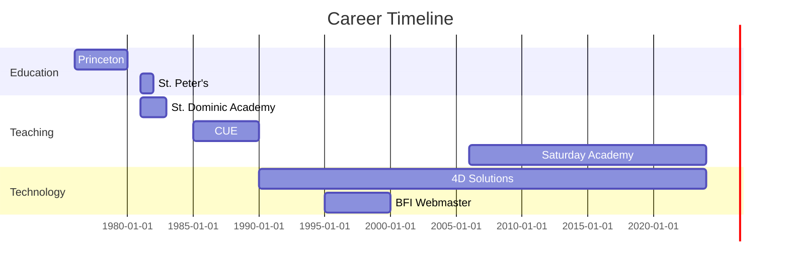
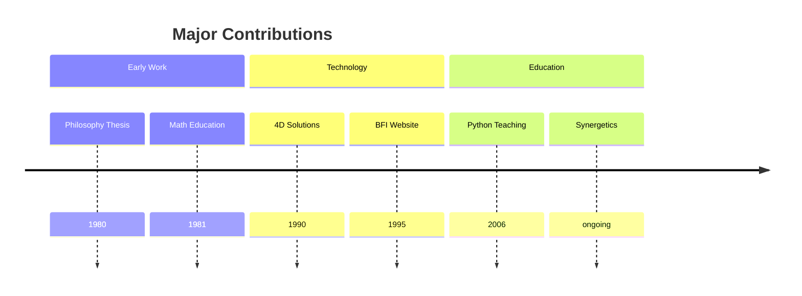
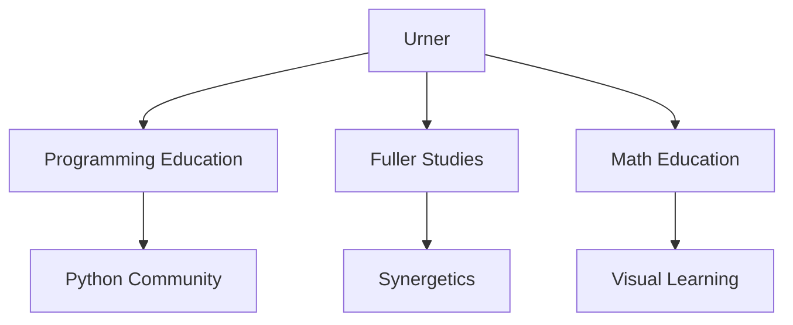
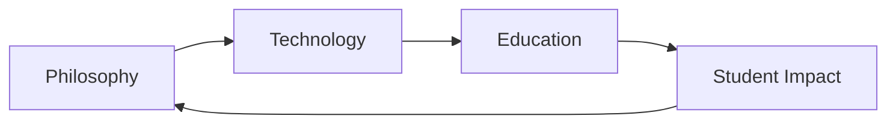

# Kirby Urner

Kirby Urner (born 1958) is an American educator, programmer, and Buckminster Fuller scholar known for his work in mathematics education, programming, and making Fuller's ideas accessible through modern technology and education.

## Quick Facts

```yaml
personal:
  birth: 1958
  birthplace: Chicago, Illinois
  nationality: American
  education:
    - [[Princeton University]] (BA Philosophy, 1980)
    - [[St. Peter's College]] (Graduate Studies, 1981)
  occupation: [Educator, Programmer, Curriculum Developer]
  known_for:
    - Python education
    - Synergetics exploration
    - Fuller scholarship
    - Educational technology
  current_role: Course Instructor at Clarusway
```

## Biography

### Family Tree


### Life Timeline


### Geographic Movement


## Professional Life

### Career Progression


### Influence Network
```mermaid
mindmap
    root((Urner))
        Technology
            [[Python Community]]
            [[Open Source]]
            [[Web Development]]
        Education
            [[Mathematics Education]]
            [[Programming Education]]
            [[Saturday Academy]]
        Philosophy
            [[R. Buckminster Fuller]]
            [[Ludwig Wittgenstein]]
            [[Synergetics]]
```

## Contributions

### Major Works
1. [[Synergetics Education]]
   - Integration with Python
   - Mathematical visualization
   - Educational curriculum

2. [[Python Programming Education]]
   - Curriculum development
   - Saturday Academy courses
   - Open source advocacy

3. [[Fuller's Legacy in Technology]]
   - BFI web presence
   - Digital preservation
   - Modern applications

### Innovation Map
```mermaid
mindmap
    root((Innovations))
        Education
            [[Python Curriculum]]
            [[Math Visualization]]
            [[Synergetics Teaching]]
        Technology
            [[4D Solutions]]
            [[Web Development]]
            [[Educational Software]]
        Research
            [[Fuller Studies]]
            [[Philosophy]]
            [[Digital Archives]]
```

### Publication Timeline


## Teaching and Research

### Educational Focus
1. Mathematics Education
   - Geometry through calculus
   - Synergetics integration
   - Visual mathematics

2. Programming Education
   - Python fundamentals
   - Computer graphics
   - Open source tools

### Research Areas
1. Synergetics
   - Tetravolumes
   - 4D geometry
   - Quadray coordinates

2. Educational Technology
   - Curriculum development
   - Digital tools
   - Online learning

## Current Projects

### Initiatives
1. [[Saturday Academy Programs]]
   - Python programming
   - Computer graphics
   - Mathematics education

2. [[Online Education]]
   - Clarusway instruction
   - Digital curriculum
   - Remote learning

## Legacy

### Impact Areas


### Knowledge Transfer


## Resources

### Archives
- [[4D Solutions Archives]]
- [[BFI Digital Archives]]
- [[Saturday Academy Materials]]

### Online Presence
- GitHub: @4dsolutions
- Medium: kirbyurner.medium.com
- Substack: kirbyurner.substack.com
- YouTube: Educational content
- Academia.edu: Princeton profile

### Bibliography
1. Technical Works
   - Programming guides
   - Educational materials
   - Curriculum documents

2. Philosophical Works
   - Wittgenstein thesis
   - Synergetics papers
   - Educational philosophy

## References
1. grunch.net/4dsolutions
2. GitHub profile
3. LinkedIn profile
4. YouTube presentations
5. Academic writings

## Notes
- Python Software Foundation member since 2009
- BFI Synergetics Explorer Award recipient (1991)
- First BFI webmaster
- Quaker background influences teaching approach

## Tags
#person #educator #programmer #fuller-scholar #philosopher #curriculum-developer 