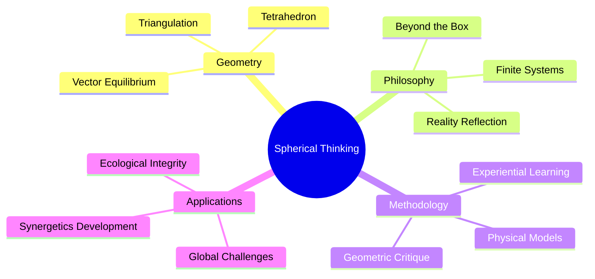
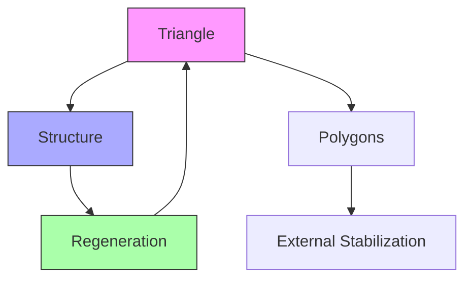
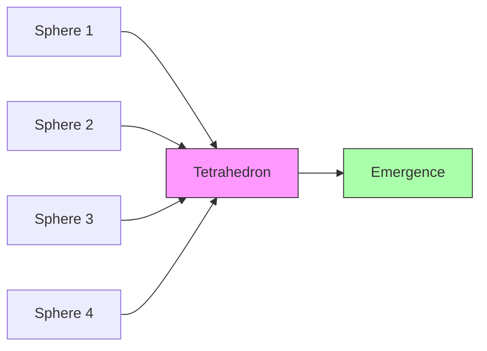
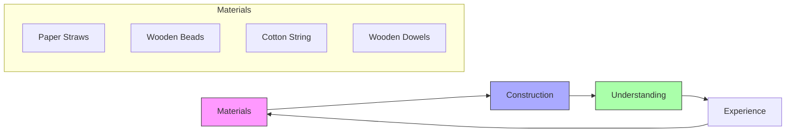
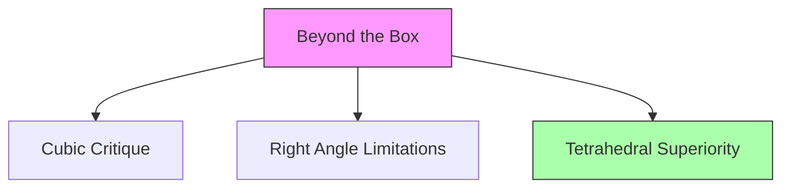
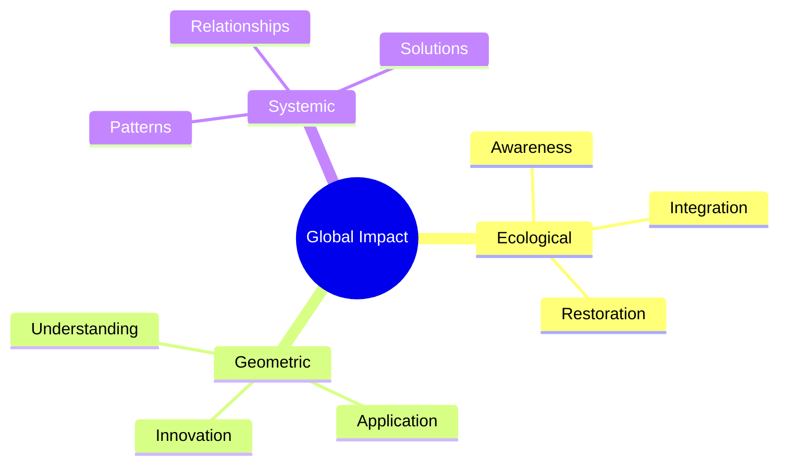

# Struppi Pohl

[[Struppi_Pohl]] is a contemporary philosopher and practitioner of [[Buckminster_Fuller]]'s [[synergetics]] who focuses on "[[spherical_thinking]]" and what he calls "[[Way_of_the_Spheres]]." His work centers on demonstrating [[geometric_principles]] through handmade physical models that illustrate fundamental concepts about [[structure]], [[space]], and [[reality]]. His approach aligns closely with [[Kirby_Urner]]'s work in educational geometry and [[Daniel_Ari_Friedman]]'s research in systems thinking, while embodying core principles of [[Design_Science]].

## Core Philosophical Concepts

Pohl's approach to [[synergetics]] emphasizes several key principles:

### [[Triangulation]] as Fundamental Structure
- "**Structure is [[Triangle]], [[Triangle]] is Structure**"
- [[Triangulation]] as basis of all [[self-regenerative_structure]]
- Comparative analysis with other [[polygons]] requiring external stabilization

### [[Tetrahedron]] (Four Eyes)
- Demonstration of [[tetrahedral_emergence]] from four [[spheres]]
- [[Synergetic_principle]]: 1+1=4 eyes (whole > sum of parts)
- [[Geometric_integrity]] through spatial manipulation

### [[Vector_Equilibrium]] 
- 12-around-1 [[sphere]] configuration
- Dynamic balance in [[SpaceTime]] through four [[hexagonal_planes]]
- Central role in [[synergetic_geometry]]

## Methodology and Teaching

### [[Experiential_Learning]] Approach

### [[Geometry_Critique]]
- [[Euclidean_geometry]] limitations
- [[Shape-structure_duality]] in synergetics
- [[Axiomatic_reality]] reassessment

## Philosophical Worldview

### [[Beyond_the_Box]] Philosophy

### [[Finite_Systems]] Framework
- [[Real-world_finiteness]] vs [[mathematical_infinity]]
- [[Starlight_expansion]] as [[spherical_phenomenon]]

### [[Spherical_Thinking]]
- [[Omnidirectional_relationships]]
- [[Non-hierarchical_patterns]]
- [[Reality_reflection]] through [[geometric_cognition]]

## Applications and Impact

### [[Global_Challenges]] Address

### [[Synergetics]] Development
- [[Fullerian_tradition]] continuation, aligned with [[Kirby_Urner]]'s educational approaches
- [[Experiential_geometry]] emphasis, complementing [[Daniel_Ari_Friedman]]'s systems research
- [[Philosophical_dimensions]] expansion through [[Design_Science]] principles

## References
- [YouTube: Spherical Thinking Demonstrations](https://www.youtube.com/watch?v=ZVvaSpzg-Wg)
- [Casey House Synergetics Resources](https://www.casey-house.com/single-post/synergetics-resources)
- [Math4Wisdom Discussion](https://coda.io/@daniel-ari-friedman/math4wisdom/struppi-pohl-96)
- [Language of Light Exploration](https://www.fullerfeedbacksystems.com/language-of-light-and-sphere.html)
- [Spherical Thinking Podcast](https://music.amazon.com/podcasts/679d5902-1b40-4bb3-a128-c444735611bb/the-language-of-creativity-podcast)

## Related Thinkers
- [[Kirby_Urner]] - Educational geometry and Python programming
- [[Daniel_Ari_Friedman]] - Systems science and active inference
- [[Design_Science]] - Foundational methodology
