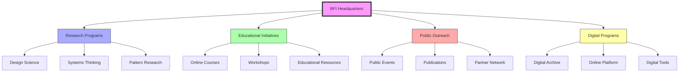

# BFI Headquarters

> The central organization dedicated to preserving and advancing R. Buckminster Fuller's legacy through research, education, and practical applications of his principles.

## Organizational Structure

### Core Functions

### Departments
- Research and Development
- Educational Programs
- Archive Management
- Public Engagement
- Digital Initiatives

## Programs and Initiatives

### Current Projects

## Research Areas

### Design Science
- [[Design_Science]] principles
- [[Comprehensive_Anticipatory_Design_Science]]
- [[Pattern_Recognition]]
- [[System_Analysis]]

### Educational Development
- [[Design_Science_Education]]
- [[Systems_Education]]
- [[Pattern_Learning]]
- Online learning platforms

## Timeline

## Collections and Resources

### Digital Archives
- [[BFI_Digital_Archives]]
- Online databases
- Digital tools
- Educational resources

### Physical Collections
- Historical documents
- Project materials
- Publications
- Research records

## Educational Programs

### Online Learning
- [[Design_Science]] courses
- [[Systems_Thinking]] workshops
- Professional development
- Certificate programs

### Physical Programs
- Workshops and seminars
- Research fellowships
- Student programs
- Professional training

## Network and Partnerships

### Academic Partners
- [[Southern_Illinois_University]]
- [[Harvard_University]]
- [[Stanford_Special_Collections]]
- Global institutions

### Research Partners
- [[Design_Science_Lab]]
- [[Design_Science_Studios]]
- Research institutions
- Professional organizations

## Impact Areas

### Research Impact

### Global Reach
- International programs
- Online presence
- Partner networks
- Resource distribution

## Digital Presence

### Online Platform
- Digital archives
- Learning management system
- Research tools
- Collaboration spaces

### Digital Resources
- Educational materials
- Research databases
- Project documentation
- Online tools

## Current Initiatives

### Research Projects
- Sustainability studies
- Systems analysis
- Pattern research
- Design methodology

### Educational Programs
- Professional development
- Student engagement
- Public education
- Online learning

## Future Development

### Strategic Plans
- Program expansion
- Digital enhancement
- Global outreach
- Research advancement

### Innovation Areas
- Virtual reality applications
- Interactive learning tools
- Research platforms
- Collaboration systems

## References

### Primary Sources
- BFI Documentation
- Annual Reports
- Program Materials
- Research Publications

### Secondary Sources
- Impact Studies
- Program Evaluations
- Academic Research
- Case Studies

## See Also

- [[Fuller_Archives]]
- [[Design_Science_Education]]
- [[BFI_Digital_Archives]]
- [[World_Game]]

## Notes

The BFI Headquarters serves as the central hub for preserving and advancing Fuller's legacy, combining research, education, and practical applications to continue his work in addressing global challenges through design science and systems thinking. 