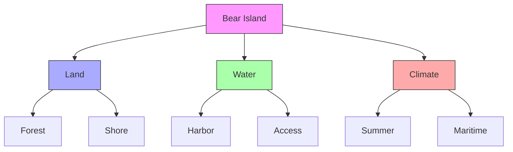
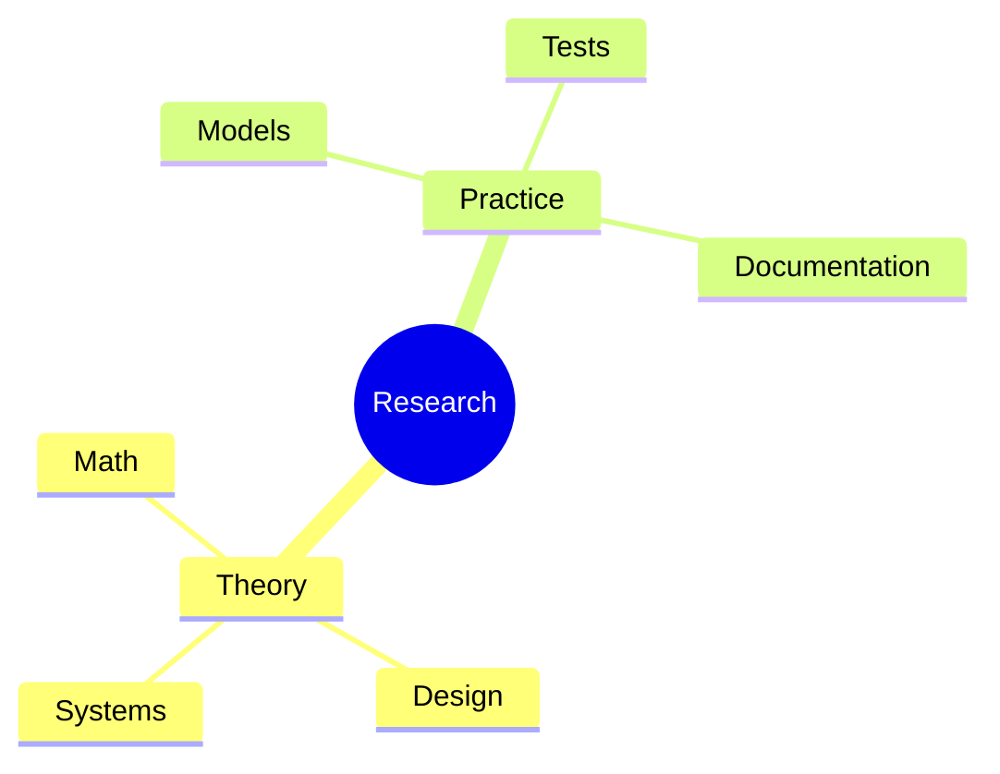
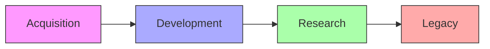
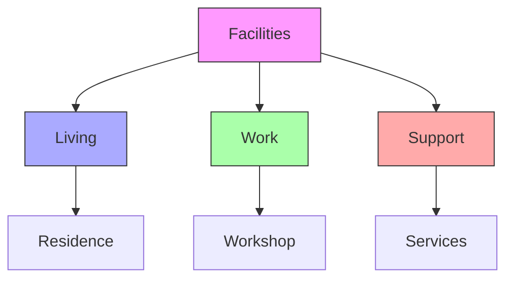
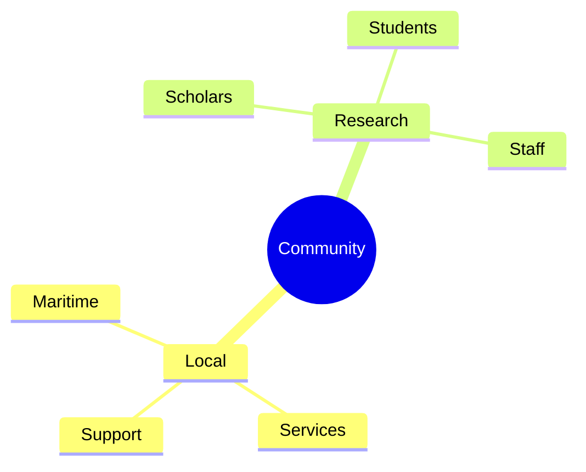
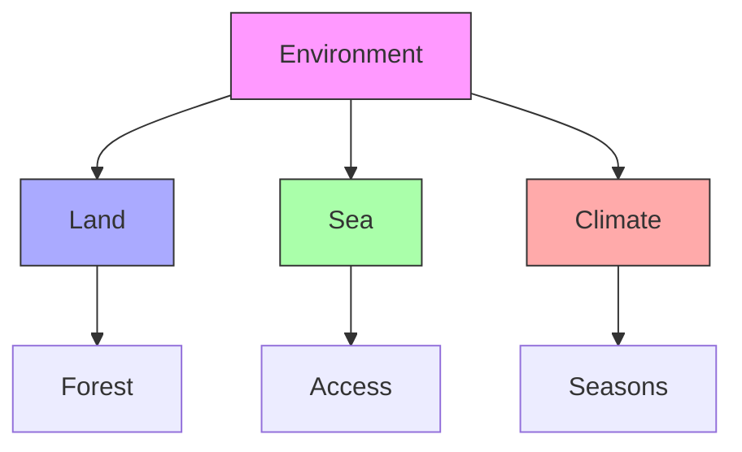
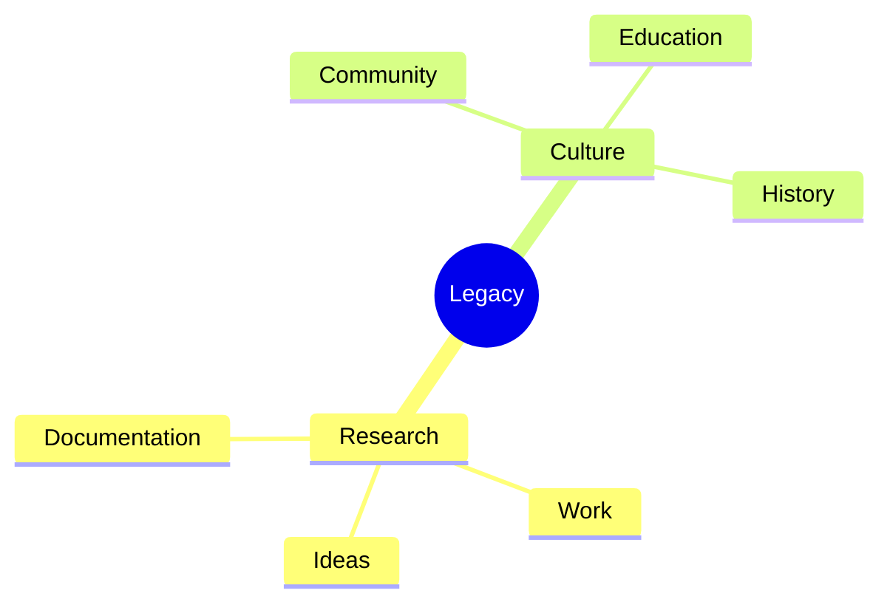

# Bear Island

Bear Island served as Buckminster Fuller's summer research location and retreat, where he developed many of his groundbreaking ideas and conducted intensive study sessions. The island environment provided both isolation and inspiration for his work.

## Location Details

### Geographic Features
```yaml
island_characteristics:
  area: ~20 acres
  coastline: Rocky Maine shore
  vegetation: Mixed forest
  access: Boat only
  climate: Maritime
  season: Summer focused
```

### Environmental Context


## Research Activities

### Study Areas
1. Theoretical Work
   - Mathematical studies
   - Design principles
   - Systems thinking
   - Writing projects

2. Practical Applications
   - Model building
   - Testing ideas
   - Documentation
   - Collaboration

### Activity Framework


## Historical Significance

### Time Periods
1. Early Years
   - Initial acquisition
   - Setup phase
   - Early research
   - Community building

2. Peak Activity
   - Major discoveries
   - Collaborative work
   - Documentation
   - Legacy development

### Timeline Framework


## Facilities

### Island Infrastructure
1. Living Spaces
   - Main residence
   - Guest quarters
   - Work areas
   - Support buildings

2. Research Areas
   - Study spaces
   - Workshop
   - Documentation center
   - Meeting areas

### Facility Layout


## Community Engagement

### Island Networks
1. Local Connections
   - Maritime community
   - Support services
   - Resource access
   - Emergency support

2. Research Community
   - Visiting scholars
   - Collaborators
   - Students
   - Support staff

### Community Framework


## Environmental Context

### Natural Setting
1. Island Environment
   - Coastal ecosystem
   - Forest resources
   - Marine access
   - Weather patterns

2. Seasonal Aspects
   - Summer focus
   - Weather impact
   - Access conditions
   - Resource availability

### Environmental Framework


## Legacy Impact

### Historical Value
1. Research Legacy
   - Discoveries made
   - Work developed
   - Ideas tested
   - Documentation created

2. Cultural Impact
   - Community influence
   - Educational value
   - Historical significance
   - Preservation efforts

### Legacy Framework


## References

### Primary Sources
1. [[books/Bear_Island_History|Bear Island Chronicles]]
2. [[books/Fuller_Summer_Research|Summer Research Records]]
3. [[books/Island_Documentation|Island Documentation]]

### Related Resources
1. [[papers/Island_Studies|Environmental Studies]]
2. [[papers/Research_Records|Research Documentation]]
3. [[papers/Community_Impact|Community Assessment]]

## Notes
- Significant research location
- Summer retreat setting
- Maritime environment
- Historical preservation site 