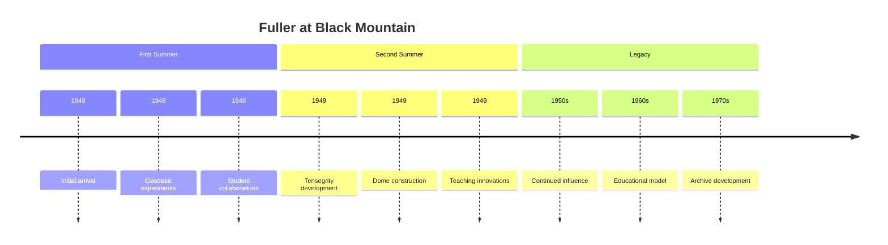
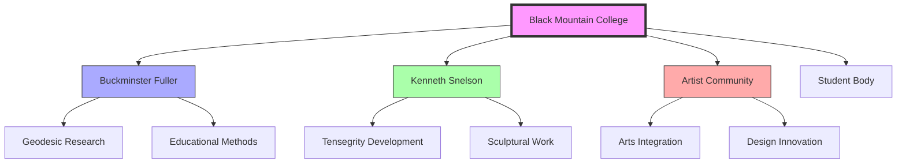
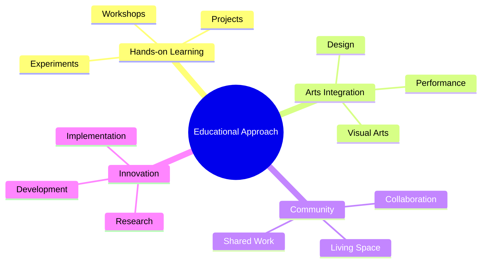
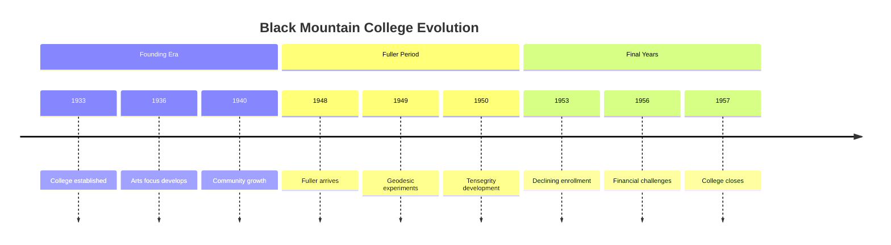

# Black Mountain College

> An experimental educational institution (1933-1957) that played a pivotal role in the development of [[Tensegrity]] and [[Design_Science]] through Fuller's summer sessions and collaborations.

## Historical Significance

### Experimental Education
- Progressive educational model
- Interdisciplinary approach
- Arts integration
- Hands-on learning philosophy

### Fuller's Involvement

## Key Collaborations

### Network Map

### Key Figures
- [[Kenneth_Snelson]] - [[Tensegrity]] collaborator
- [[Josef_Albers]] - Art and design
- [[Elaine_de_Kooning]] - Artist and writer
- [[John_Cage]] - Composer and theorist

## Educational Philosophy

### Core Principles
- Experiential learning
- [[Design_Science]] integration
- Interdisciplinary approach
- Community-based education

### Teaching Methods

## Research Areas

### Design Innovation
- [[Geodesic_Dome]] development
- [[Tensegrity]] principles
- [[Pattern_Recognition]]
- Structural systems

### Artistic Integration
- Sculptural applications
- Architectural design
- Visual arts
- Performance

## Physical Campus

### Key Spaces
- Experimental workshops
- Design laboratories
- Community spaces
- Living quarters

### Notable Structures
- Fuller's first geodesic dome
- Tensegrity sculptures
- Art studios
- Performance spaces

## Legacy Impact

### Educational Influence
- [[Design_Science_Education]]
- [[Systems_Education]]
- [[Pattern_Learning]]
- Interdisciplinary methods

### Cultural Contributions
- Experimental art
- Design innovation
- Educational reform
- Community models

## Timeline

## Research Projects

### Structural Studies
- Geodesic mathematics
- Tensegrity principles
- Material experiments
- Design prototypes

### Educational Experiments
- Learning methods
- Community integration
- Arts education
- Design thinking

## Archives

### Collections
- [[Black_Mountain_College_Museum]]
- [[North_Carolina_State_Archives]]
- Personal collections
- Project documentation

### Documentation
- Photographs
- Correspondence
- Project records
- Student work

## Influence on Fuller

### Conceptual Development
- [[Tensegrity]] principles
- [[Design_Science]] methods
- Educational philosophy
- Community models

### Professional Growth
- Teaching methods
- Collaborative work
- Experimental approach
- Design implementation

## Modern Relevance

### Contemporary Applications
- Experimental education
- Design thinking
- Community learning
- Arts integration

### Ongoing Research
- Educational models
- Design principles
- Community structures
- Innovation methods

## References

### Primary Sources
- Fuller, R. B. (1949). *Black Mountain College Bulletin*.
- Snelson, K. (1990). *The Art of Tensegrity*.
- College Records and Correspondence

### Secondary Sources
- Harris, M. E. (2002). *The Arts at Black Mountain College*.
- Duberman, M. (1972). *Black Mountain: An Exploration in Community*.

## See Also

- [[Design_Science_Education]]
- [[Tensegrity]]
- [[Geodesic_Dome]]
- [[Educational_Innovation]]

## Notes

Black Mountain College represents a unique convergence of experimental education, artistic innovation, and design science, particularly through Fuller's involvement and the development of tensegrity principles. Its influence continues to resonate in contemporary approaches to education and design. 