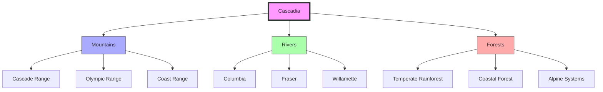
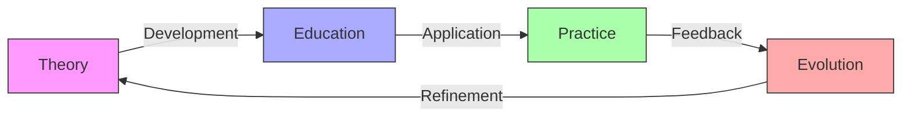
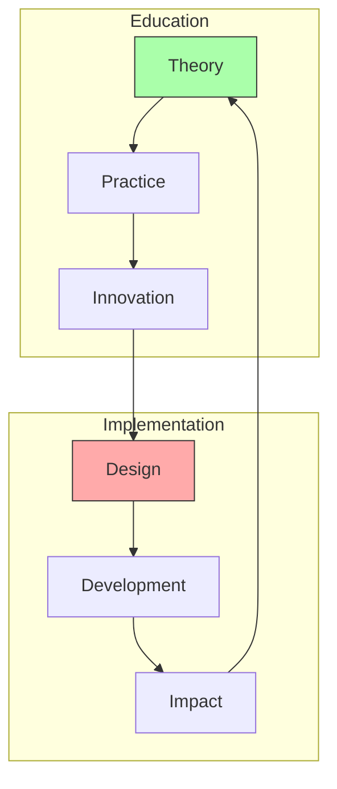
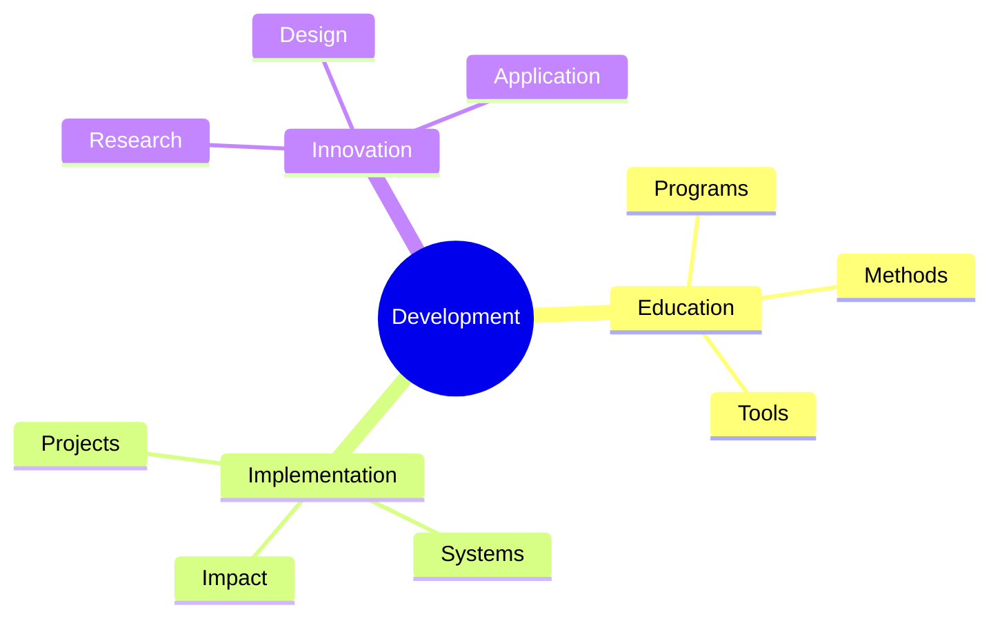

# Cascadia

Cascadia represents a bioregional and cultural area encompassing the Pacific Northwest, notable for its significant contributions to [[concepts/Synergetics|Synergetics]] and [[concepts/Design_Science|Design Science]] through key regional practitioners and educators.

## Geographic Context

### Regional Definition
```yaml
cascadia:
  core_regions:
    - Oregon
    - Washington
    - British Columbia
  bioregional_features:
    - Cascade Range
    - Pacific Coast
    - Columbia River
    - Temperate Rainforest
  cultural_centers:
    - Portland
    - Seattle
    - Vancouver
    - Eugene
    - Crescent City
```

### Natural Systems


## Synergetic Significance

### Regional Contributors
1. [[people/Kirby_Urner|Kirby Urner]] ([[Portland]])
   - Python and Synergetics integration
   - Educational curriculum development
   - Digital preservation of Fuller's work
   - Saturday Academy programs

2. [[people/Daniel_Ari_Friedman|Daniel Ari Friedman]] ([[Crescent_City]])
   - Synergetics research
   - Mathematical developments
   - Educational initiatives
   - Pattern language studies

### Educational Centers
```mermaid
mindmap
    root((Education))
        Portland
            [[Saturday Academy]]
            [[4D Solutions]]
            [[Python Education]]
        Crescent City
            [[Pattern Studies]]
            [[Research Center]]
            [[Educational Programs]]
        Regional
            [[Universities]]
            [[Workshops]]
            [[Conferences]]
```

## Design Science Integration

### Regional Applications
1. Sustainable Design
   - Geodesic structures
   - Green building practices
   - Resource optimization
   - Environmental harmony

2. Educational Programs
   - Mathematics education
   - Programming integration
   - System thinking
   - Pattern recognition

### Implementation Framework


## Cultural Impact

### Regional Influence
1. Educational Innovation
   - Integration of technology
   - Synergetic principles
   - Environmental awareness
   - System thinking

2. Sustainable Development
   - Resource management
   - Environmental design
   - Community planning
   - Future thinking

### Cultural Framework


## Future Development

### Innovation Areas
1. Educational Expansion
   - Curriculum development
   - Digital integration
   - Regional programs
   - Global connections

2. Sustainable Systems
   - Resource management
   - Environmental design
   - Community development
   - Future planning

### Development Framework


## References

### Primary Sources
1. [[papers/Cascadian_Synergetics|Synergetics in Cascadia]]
2. [[papers/Regional_Development|Regional Design Science]]
3. [[papers/Educational_Innovation|Educational Programs]]

### Technical Resources
1. [[resources/Educational_Materials|Educational Resources]]
2. [[resources/Implementation_Guides|Implementation Guides]]
3. [[resources/Research_Papers|Research Documentation]]

## Notes
- Significant regional contributions to Synergetics
- Strong educational focus
- Environmental integration
- Sustainable development emphasis

## Tags
#bioregion #synergetics #education #sustainability #pacific-northwest