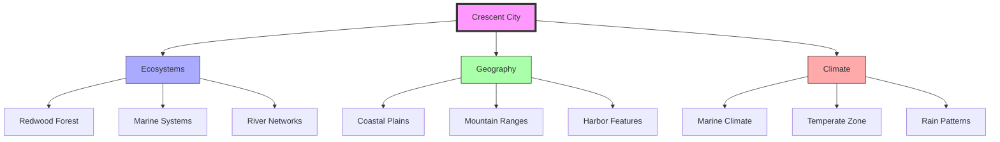
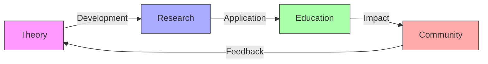
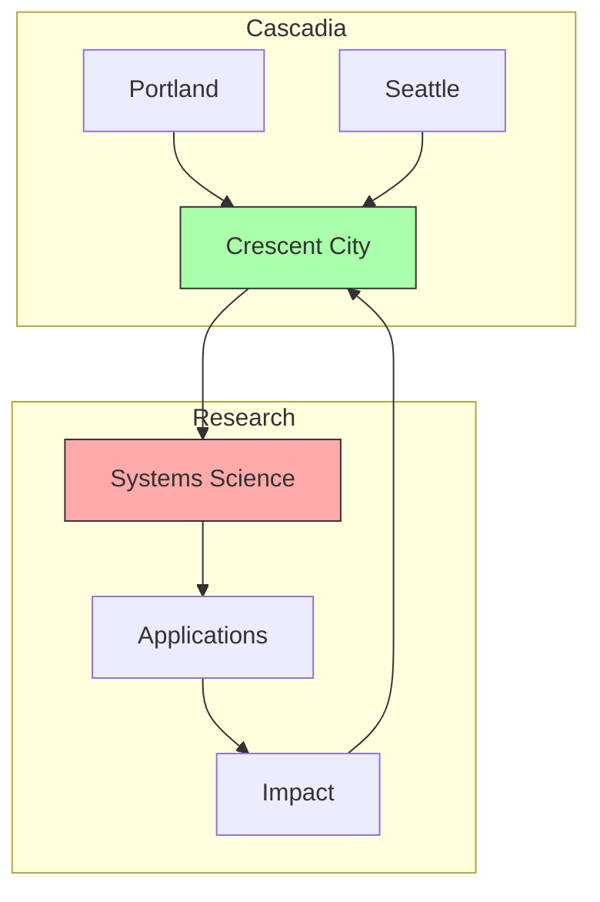
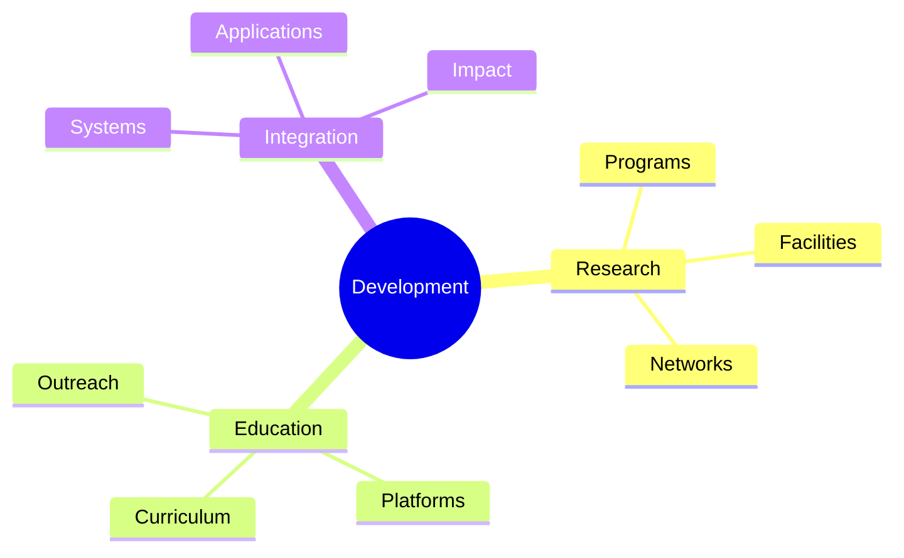

# Crescent City

Crescent City, California represents a significant node in the [[places/Cascadia|Cascadian]] network of [[concepts/Synergetics|Synergetics]] and [[concepts/Active_Inference|Active Inference]] research, particularly through the [[organizations/Active_Inference_Institute|Active Inference Institute]] led by [[people/Daniel_Ari_Friedman|Daniel Ari Friedman]].

## Geographic Context

### Location Details
```yaml
crescent_city:
  location:
    state: California
    region: Pacific Northwest
    coordinates: 41.7558° N, 124.2026° W
  features:
    - Pacific Coast
    - Redwood Forests
    - Harbor City
    - Natural Systems
  proximity:
    - Oregon Border
    - Pacific Ocean
    - Redwood National Park
    - Smith River
```

### Natural Systems


## Research Significance

### Systems Science Hub
1. [[Active_Inference_Institute]]
   - Educational programs on [[Active_Inference]]
   - Research initiatives
   - Theory development
   - Community engagement

2. [[Synergetics]] Research
   - Pattern studies
   - Systems integration
   - Educational innovation
   - Knowledge management

## Educational Initiatives

### Program Development
1. Research Programs
   - Systems science
   - Active inference
   - Pattern recognition
   - Complexity studies

2. Educational Outreach
   - Community programs
   - Online platforms
   - Workshop series
   - Collaborative projects

### Learning Framework


## Integration with Cascadia

### Regional Network


### Collaborative Projects
1. Research Initiatives
   - Cross-regional studies
   - Collaborative programs
   - Resource sharing
   - Knowledge exchange

2. Educational Programs
   - Workshop series
   - Online platforms
   - Community outreach
   - Practical applications

## Future Development

### Innovation Areas
1. Research Expansion
   - Program development
   - Facility enhancement
   - Network growth
   - Resource integration

2. Educational Growth
   - Curriculum development
   - Platform expansion
   - Community engagement
   - Global connections

### Development Framework


## Research Ecosystem

### Active Inference Institute
- Primary research center
- Educational programs
- Theory development
- Community engagement

### COGSEC Research
- [[concepts/Cognitive_Security|Cognitive Security]] initiatives
- Framework development
- Educational programs
- Security research

## Research Integration

### Active Inference Programs
- Theory development
- Educational initiatives
- Research collaborations
- Community building

### Cognitive Security Development
- Security framework research
- Educational programs
- Implementation strategies
- Protocol development

## References

### Primary Sources
1. [[papers/Active_Inference|Active Inference Research]]
2. [[papers/Systems_Science|Systems Science Studies]]
3. [[papers/Educational_Programs|Educational Initiatives]]

### Technical Resources
1. [[resources/Research_Materials|Research Documentation]]
2. [[resources/Program_Guides|Program Resources]]
3. [[resources/Implementation_Studies|Implementation Research]]

## Notes
- Emerging center for systems science research
- Integration of natural and theoretical systems
- Strong educational focus
- Growing research network

## Tags
#city #california #synergetics #systems-science #research-center #active-inference #cognitive-security 