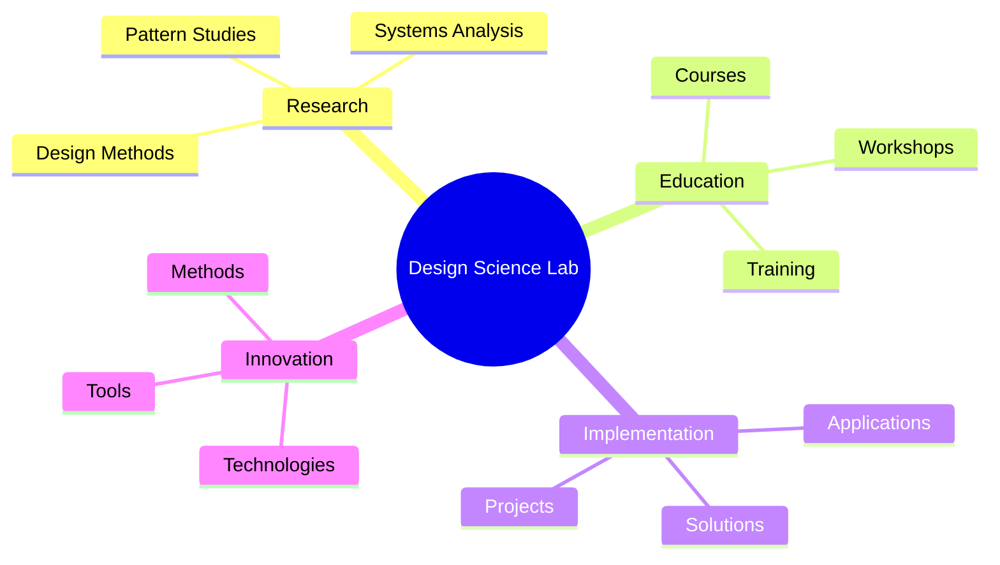
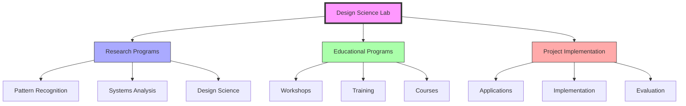
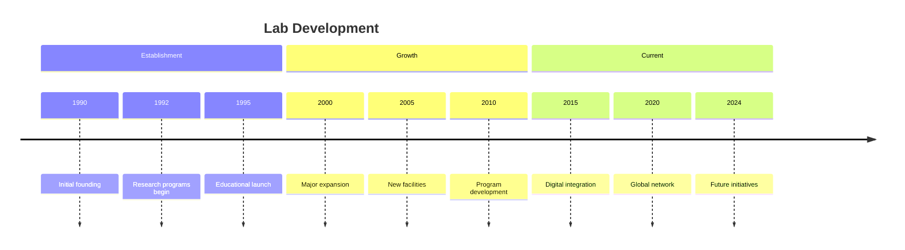
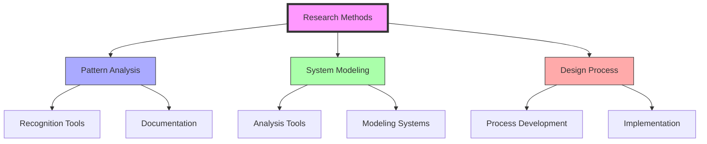

# Design Science Lab

> A research facility dedicated to the practical application and development of [[Design_Science]] principles, continuing Fuller's vision of comprehensive problem-solving.

## Mission

### Core Objectives
- Advancement of [[Design_Science]] methodology
- Integration of [[Pattern_Recognition]] research
- Development of [[System_Analysis]] tools
- Implementation of [[Comprehensive_Anticipatory_Design_Science]]

### Research Focus

## Research Programs

### Current Initiatives

## Key Areas

### Research Domains
- [[Pattern_Recognition]]
- [[System_Analysis]]
- [[Design_Science]]
- [[Living_Systems]]

### Educational Programs
- [[Design_Science_Education]]
- [[Systems_Education]]
- [[Pattern_Learning]]
- Professional training

## Timeline

## Facilities

### Research Spaces
- Pattern analysis lab
- Systems modeling center
- Design workshop
- Digital fabrication lab

### Educational Facilities
- Training rooms
- Lecture halls
- Workshop spaces
- Collaboration areas

## Research Impact

### Areas of Influence
- Sustainable design
- Systems thinking
- Pattern analysis
- Environmental solutions

### Applications
- Urban planning
- Environmental design
- Resource management
- Technology integration

## Collaboration Network

### Academic Partners
- [[Southern_Illinois_University]]
- [[Harvard_University]]
- [[Black_Mountain_College]]
- International institutions

### Research Partners
- [[BFI_Headquarters]]
- [[Design_Science_Studios]]
- [[Stanford_Special_Collections]]
- Global research centers

## Projects

### Current Research
- Pattern identification systems
- Systems analysis tools
- Design methodology development
- Sustainability solutions

### Educational Initiatives
- Professional training programs
- Workshop series
- Online courses
- Research fellowships

## Methods and Tools

### Research Methods

### Tools and Technologies
- Digital analysis systems
- Modeling software
- Documentation tools
- Collaboration platforms

## Educational Resources

### Training Materials
- Course curricula
- Workshop guides
- Research protocols
- Documentation systems

### Online Resources
- Digital library
- Research database
- Training videos
- Collaboration tools

## References

### Primary Sources
- Lab Documentation
- Research Papers
- Project Reports
- Educational Materials

### Secondary Sources
- Academic Publications
- Case Studies
- Implementation Reports
- Evaluation Studies

## See Also

- [[Design_Science]]
- [[Pattern_Recognition]]
- [[System_Analysis]]
- [[Design_Science_Education]]

## Notes

The Design Science Lab continues Fuller's legacy through practical research, education, and implementation of design science principles, serving as a hub for innovation and learning in comprehensive problem-solving approaches. 