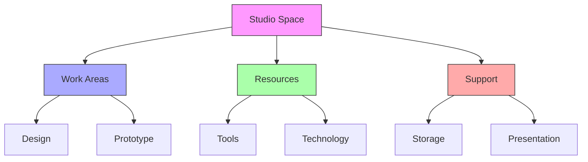
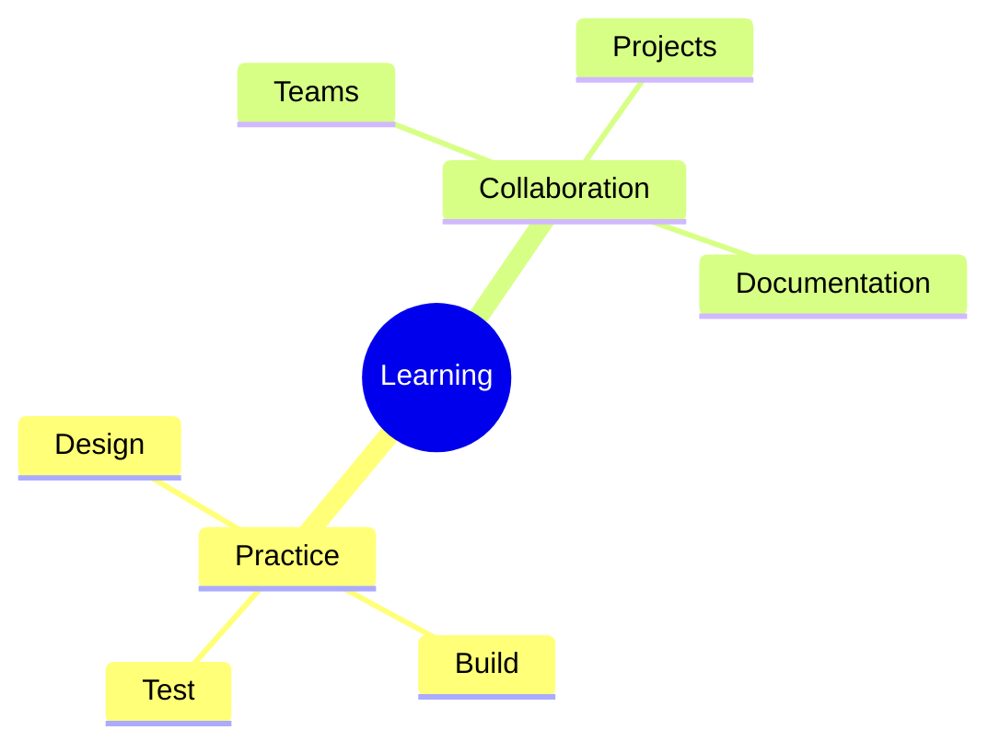
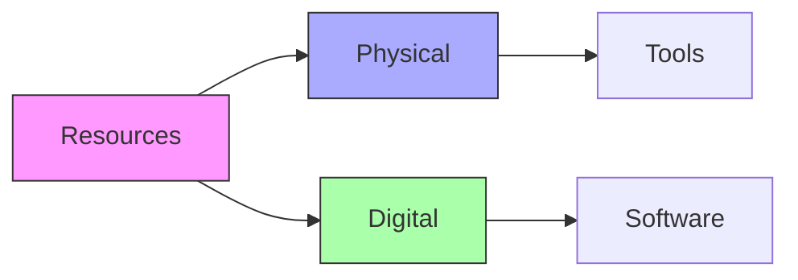
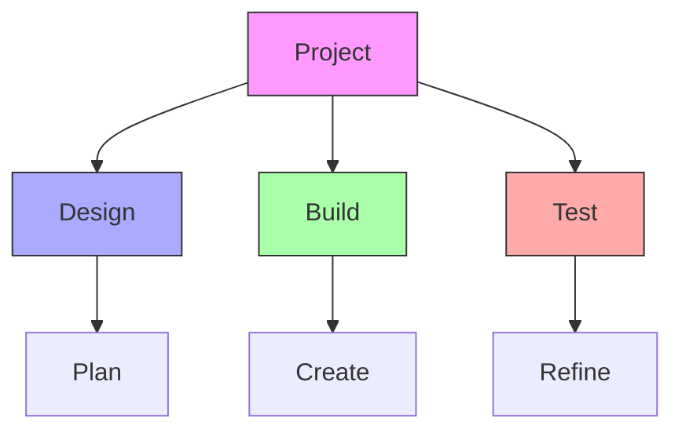
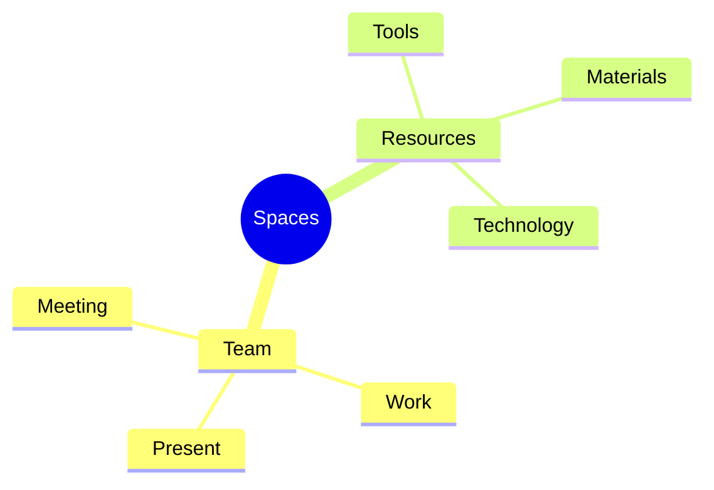
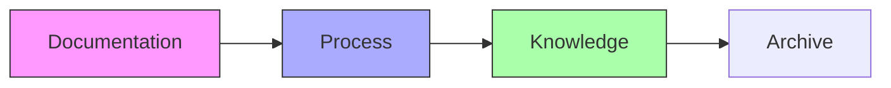
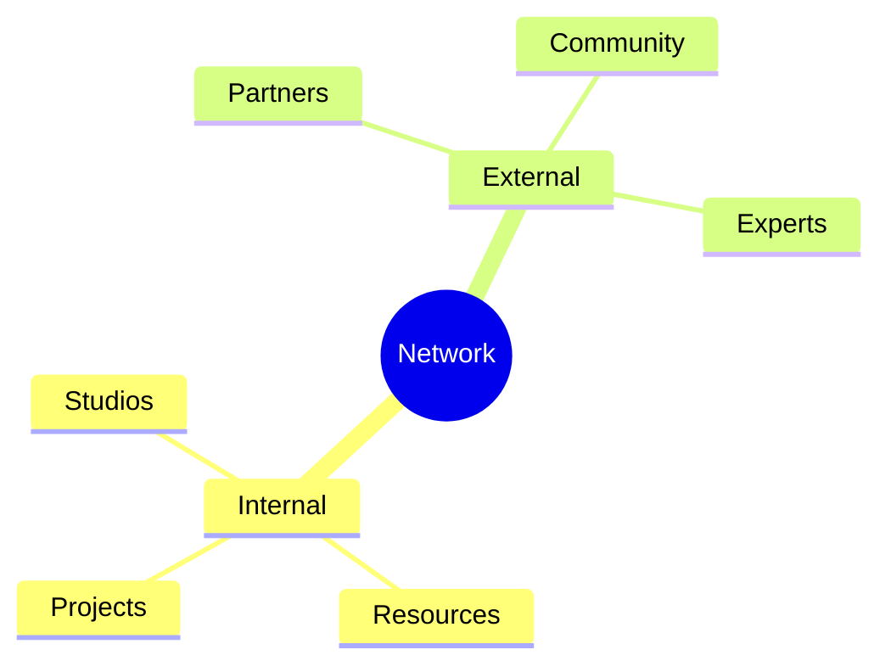

# Design Science Studios

Design Science Studios are dedicated practice spaces where Fuller's principles are actively applied through hands-on learning, prototyping, and collaborative design work. These studios serve as bridges between theoretical understanding and practical implementation.

## Studio Environment

### Space Configuration
```yaml
studio_elements:
  workspace: Flexible design areas
  equipment: Prototyping tools
  technology: Digital resources
  collaboration: Meeting spaces
  documentation: Recording facilities
  presentation: Display areas
```

### Layout Structure


## Learning Activities

### Practice Areas
1. Design Workshops
   - Problem framing
   - Solution development
   - Prototyping
   - Testing

2. Collaborative Projects
   - Team formation
   - Project planning
   - Implementation
   - Documentation

### Activity Framework


## Equipment Resources

### Tool Categories
1. Physical Tools
   - Hand tools
   - Power equipment
   - Measurement devices
   - Assembly stations

2. Digital Resources
   - Design software
   - Modeling tools
   - Documentation systems
   - Presentation technology

### Resource Framework


## Project Development

### Development Process
1. Design Phase
   - Concept development
   - Planning
   - Documentation
   - Review

2. Implementation
   - Resource allocation
   - Construction
   - Testing
   - Refinement

### Process Framework


## Collaboration Spaces

### Interaction Areas
1. Team Spaces
   - Meeting areas
   - Work zones
   - Discussion spaces
   - Presentation areas

2. Resource Centers
   - Tool stations
   - Material storage
   - Digital access
   - Documentation

### Space Framework


## Documentation

### Recording Systems
1. Project Documentation
   - Process records
   - Progress tracking
   - Results documentation
   - Learning outcomes

2. Knowledge Capture
   - Best practices
   - Lessons learned
   - Resource guides
   - Reference materials

### Documentation Framework


## Network Connection

### Collaboration Network
1. Studio Links
   - Inter-studio projects
   - Resource sharing
   - Knowledge exchange
   - Joint programs

2. External Partners
   - Industry connections
   - Academic partners
   - Community links
   - Expert network

### Network Framework


## Organization Structure

### Core Stewards and Leadership

**Current Core Stewards:**
- [[people/Roxi_Shohadaee|Roxi Shohadaee]] (Co-Founder, Ecosystem Director + ARTchitect)
- [[people/Marieam_Shohadaee|Marieam Shohadaee]]
- [[people/Bliss_Alberts|Bliss Alberts]]
- [[people/Stephen_Bau|Stephen Bau]]
- [[people/Mark_Smith|Mark Smith]]
- [[people/Dianne_Regisford|D-Empress Dr. Dianne Regisford]]
- [[people/Mariette_Papic|Mariette Papic]]
- [[people/Ari_Lazer|Ari Lazer]]
- [[people/Eve_Rose|Eve Rose]]
- [[people/John_Ash|Speaker John Ash]]
- [[people/Julia_Russotti|Julia Russotti]]

**Founding Team:**
- [[people/Roxi_Shohadaee|Roxi Shohadaee]] (Co-Founder, Ecosystem Director + ARTchitect)
- [[people/Faith_Flanigan|Faith Flanigan]] (Co-Founder, Advisor)
- [[people/Nicolas_Alcala|Nicolás Alcalá]] (Co-Founder, Studio Imagineer, Advisor)
- [[people/Amanda_Joy_Ravenhill|Amanda Joy Ravenhill]] (Co-Founder, Advisor)

### Additional Team Members and Contributors

**Active Contributors:**
- [[people/Tyler_Hanson|Tyler Hanson]]
- [[people/Veronica_Anderson|Veronica Anderson]]
- [[people/Ceci|Ceci]]

**Pod Leaders and Participants:**
- [[people/Ganga_Devi_Braun|Ganga Devi Braun]] (Regenerative Counselor and Systems Change Consultant)
- MetaBau Pod (POD9) Members:
  - [[people/Marieam_Shohadaee|Marieam Shohadaee]]
  - [[people/Casey_House|Casey House]]
  - [[people/Carson_Linforth_Bowley|Carson Linforth Bowley]]
  - [[people/Peter_Lokken|Peter Lokken]]
  - [[people/Stephen_Bau|Stephen Bau]] (Pod Captain)

**Collaborators:**
- [[people/Ilaria_Forte|Ilaria Forte]] (Plenum: A Collective Story of Regeneration)
- [[people/Michael_Saup|Michael Saup]] (Orbis Lumen project)
- [[people/Maxinne_Leighton|Maxinne Leighton, PhD]] (Leadership and Change)
- [[people/Agathe_Basset|Agathe Basset]]

### Partner Organizations

The Design Science Studio has partnerships with several organizations:
- [[organizations/Gray_Area|Gray Area]]
- [[organizations/Future_of_Cities|Future of Cities]]
- [[organizations/Climate_Designers|Climate Designers]]
- [[organizations/nRhythm|nRhythm]]
- [[organizations/Rebuild|Re:build]]
- [[organizations/Buckminster_Fuller_Institute|Buckminster Fuller Institute (BFI)]]
- [[organizations/habRitual|habRitual]]
- [[organizations/GDC|Graphic Designers of Canada (GDC)]] - BC Chapter:
  - [[people/Carolina_Becerra|Carolina Becerra]] (President)
  - [[people/Marga_Lopez|Marga Lopez]] (Partnership Chair)
  - [[people/Stephen_Bau|Stephen Bau]] (Web Communications Chair)
- [[organizations/Emergent_Media_DesignLab|The Emergent Media DesignLab]] at the University of California, Irvine

## References

### Primary Sources
1. [[books/Studio_Manual|Studio Operations Manual]]
2. [[books/Practice_Guide|Practice Space Guide]]
3. [[books/Equipment_Documentation|Equipment Documentation]]

### Related Resources
1. [[papers/Studio_Projects|Project Documentation]]
2. [[papers/Learning_Outcomes|Learning Assessment]]
3. [[papers/Resource_Management|Resource Guidelines]]

## Notes
- Active learning environment
- Hands-on practice focus
- Collaborative workspace
- Resource-rich setting 