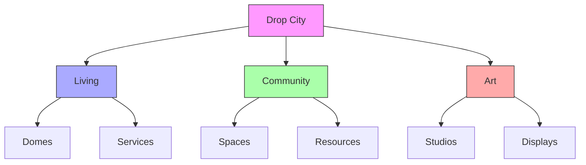
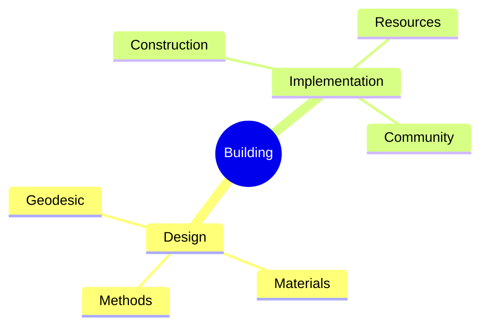
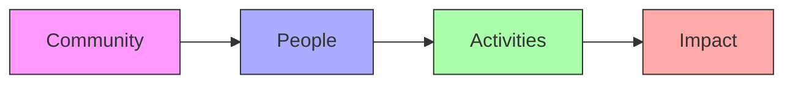
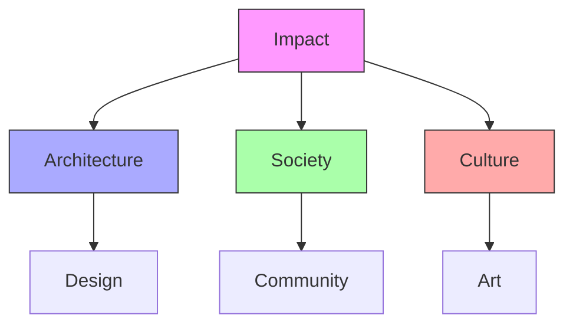
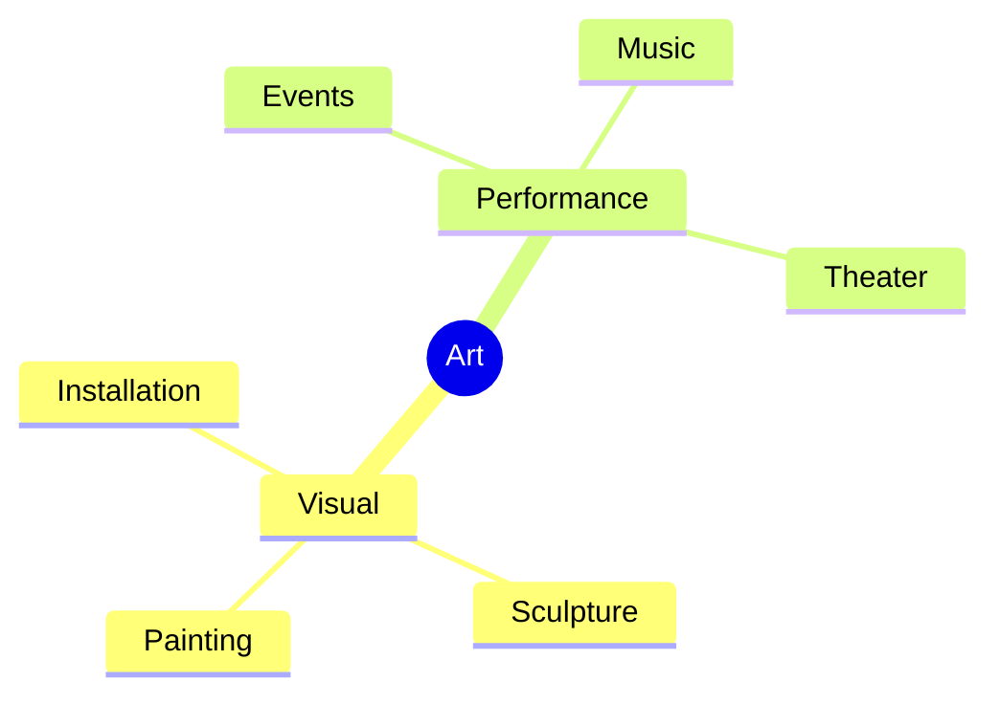
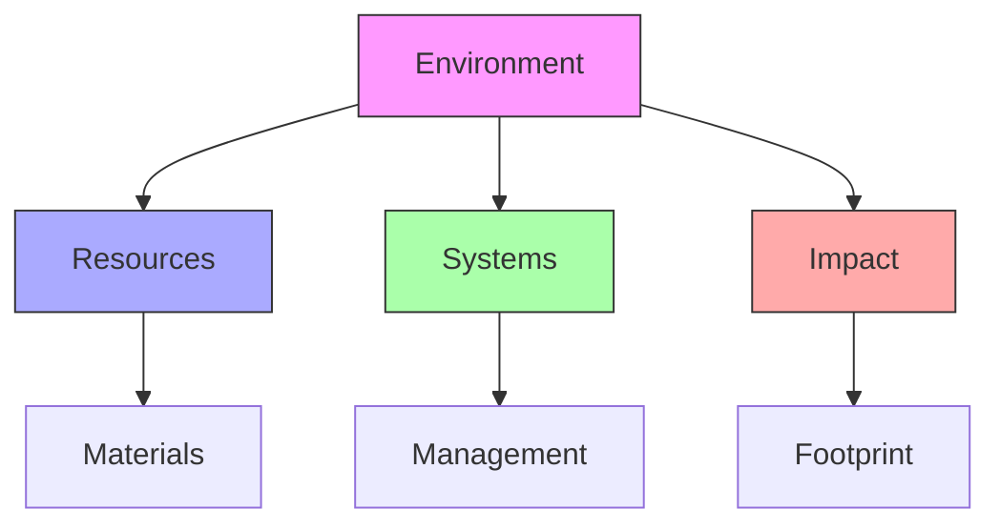
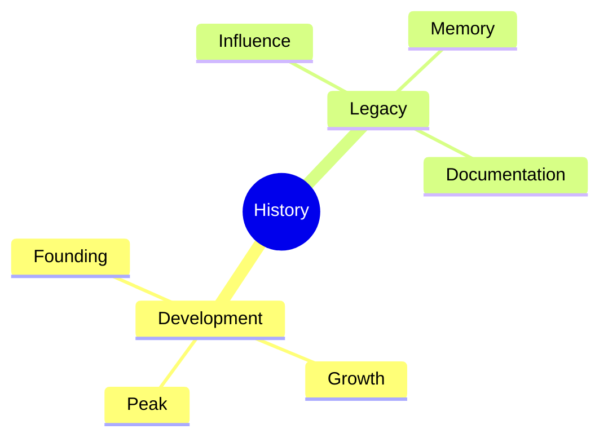

# Drop City

Drop City was an experimental artist community and counterculture settlement founded in 1965, known for its distinctive geodesic dome structures inspired by Buckminster Fuller's designs. It represented one of the first rural hippie communes and a practical application of Fuller's architectural principles.

## Community Structure

### Physical Layout
```yaml
community_features:
  location: Southern Colorado
  land_area: ~7 acres
  structures: Multiple geodesic domes
  materials: Recycled materials
  period: 1965-1973
  style: Experimental architecture
```

### Site Organization


## Architectural Innovation

### Building Methods
1. Dome Construction
   - Geodesic principles
   - Recycled materials
   - DIY techniques
   - Community labor

2. Material Usage
   - Car tops
   - Salvaged materials
   - Local resources
   - Innovative solutions

### Construction Framework


## Community Life

### Social Structure
1. Resident Groups
   - Artists
   - Builders
   - Innovators
   - Visitors

2. Activities
   - Construction
   - Art creation
   - Community events
   - Sustainable living

### Community Framework


## Cultural Impact

### Influence Areas
1. Architectural
   - Geodesic adoption
   - DIY building
   - Sustainable design
   - Community architecture

2. Social Movement
   - Commune model
   - Alternative living
   - Artist communities
   - Environmental awareness

### Impact Framework


## Artistic Expression

### Creative Activities
1. Visual Arts
   - Installations
   - Sculptures
   - Paintings
   - Environmental art

2. Performance
   - Events
   - Happenings
   - Music
   - Theater

### Art Framework


## Environmental Approach

### Sustainability Practices
1. Resource Use
   - Recycling
   - Repurposing
   - Local materials
   - Energy efficiency

2. Living Systems
   - Food production
   - Water management
   - Waste handling
   - Energy systems

### Environmental Framework


## Historical Legacy

### Time Periods
1. Development Phase
   - Founding
   - Construction
   - Community growth
   - Peak activity

2. Legacy Impact
   - Influence
   - Documentation
   - Preservation
   - Cultural memory

### Timeline Framework


## References

### Primary Sources
1. [[books/Drop_City_History|Drop City Chronicles]]
2. [[books/Dome_Building|Dome Construction Records]]
3. [[books/Community_Documentation|Community Documentation]]

### Related Resources
1. [[papers/Alternative_Architecture|Architectural Studies]]
2. [[papers/Commune_Movement|Community Analysis]]
3. [[papers/Cultural_Impact|Cultural Assessment]]

## Notes
- Pioneering geodesic community
- Experimental architecture
- Artist commune
- Cultural landmark 