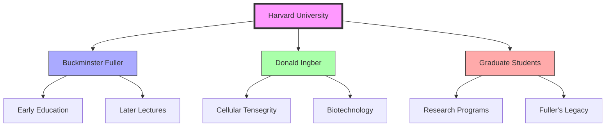
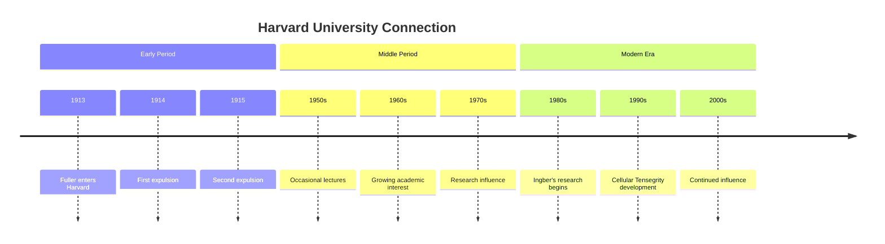

# Harvard University

> A pivotal institution in Fuller's early education and later scientific influence, particularly in the fields of [[Cellular_Tensegrity]] and [[Systems_Philosophy]].

## Historical Significance

### Fuller's Early Years
- Attended 1913-1915
- Expelled twice
- Formative experience that influenced his unconventional approach
- Early exposure to advanced mathematics and engineering concepts

### Later Influence
- Return visits as lecturer
- Collaboration with [[Donald_Ingber]] on [[Cellular_Tensegrity]]
- Influence on biotechnology research
- Archive contributions

## Key Connections

### People

### Concepts Developed
- [[Cellular_Tensegrity]]
- [[Systems_Philosophy]]
- [[Pattern_Recognition]]
- [[Living_Systems]]
- [[Biotechnology]] applications

## Research Areas

### Tensegrity in Biology
- Development of [[Cellular_Tensegrity]] theory
- Application to medical research
- Influence on biotechnology
- Integration with [[System_Analysis]]

### Systems Thinking
- Connection to [[Systems_Philosophy]]
- Integration with [[Pattern_Recognition]]
- Application in [[Living_Systems]]
- Influence on [[Design_Science]]

## Timeline

## Physical Spaces

### Historical Sites
- Memorial Hall - Early classes
- Science Center - Later lectures
- Wyss Institute - Modern research

### Research Facilities
- Bioengineering laboratories
- Systems biology centers
- Archive collections

## Academic Impact

### Fields Influenced
- Architecture
- Biology
- Systems Theory
- Engineering
- Design Science

### Research Programs
- Biotechnology
- Systems Biology
- Architectural Science
- Environmental Studies

## Modern Applications

### Current Research
- Biomimetic materials
- Cellular mechanics
- Systems biology
- Sustainable design

### Educational Programs
- Design Science integration
- Systems thinking courses
- Biomechanical engineering
- Environmental studies

## Related Locations

- [[MIT]] - Collaborative research
- [[Stanford_Special_Collections]] - Archive materials
- [[BFI_Headquarters]] - Ongoing connection
- [[Design_Science_Lab]] - Research application

## References

### Primary Sources
- Fuller, R. B. (1981). *Critical Path*. St. Martin's Press.
- Ingber, D. E. (1998). "The Architecture of Life." *Scientific American*, 278(1), 48-57.

### Secondary Sources
- Edmondson, A. C. (2007). *A Fuller Explanation*. EmergentWorld LLC.
- Ingber, D. E. (2003). "Tensegrity I." *Cell Structure and Hierarchical Systems Biology*.

## See Also

- [[Black_Mountain_College]]
- [[Southern_Illinois_University]]
- [[MIT]]
- [[Stanford_University]]

## Notes

Harvard University represents both the beginning of Fuller's formal education and a continuing thread in his legacy through modern research applications, particularly in the field of cellular biology and systems thinking. 