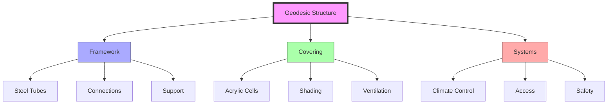
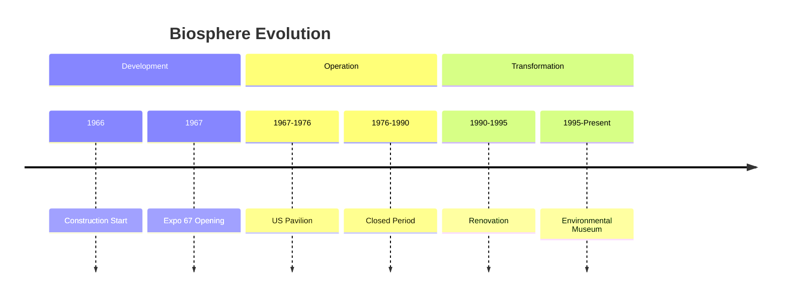
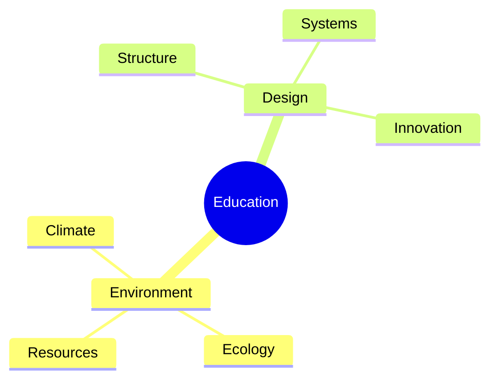
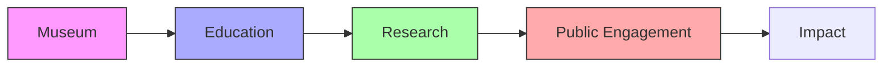
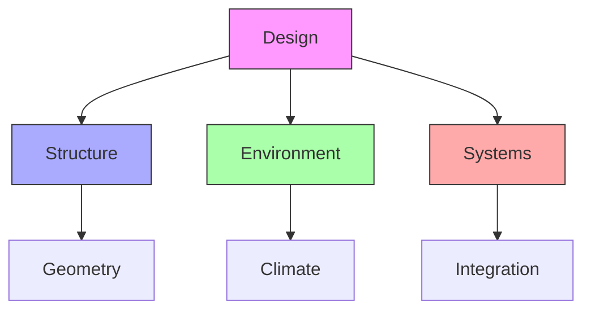
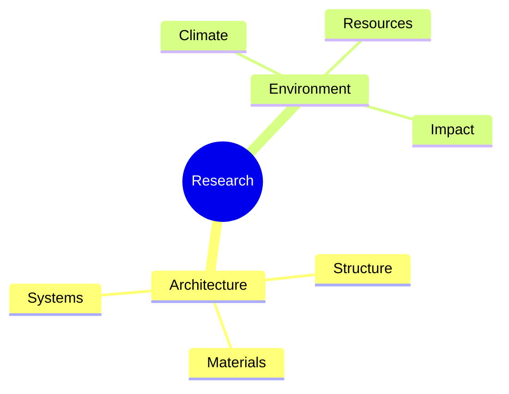
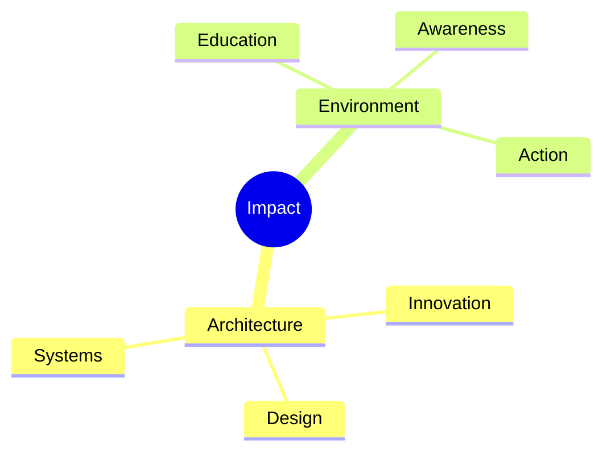

# Montreal Biosphere

The Montreal Biosphere, originally the United States Pavilion at Expo 67, represents one of the most significant physical manifestations of [[concepts/Geodesic_Dome|Fuller's geodesic principles]] and continues to serve as an environmental museum and educational center.

## Physical Structure

### Technical Specifications
```yaml
structure:
  type: Geodesic dome
  diameter: 76 meters (250 feet)
  height: 62 meters (203 feet)
  material: Steel and acrylic
  pattern: Icosahedron-based
  coverage: Originally transparent acrylic cells
  current_state: Steel framework preserved
```

### Architectural Design


## Historical Significance

### Timeline


### Key Events
1. Expo 67
   - US Pavilion showcase
   - Fuller's principles demonstrated
   - International recognition
   - Public engagement
   - [[Montreal_Biosphere]]

2. Environmental Museum
   - Environmental education
   - Sustainable design
   - Public awareness
   - Research center

## Educational Role

### Learning Programs
1. [[concepts/Environmental_Education|Environmental Education]]
   - Climate change awareness
   - Sustainable development
   - Ecological systems
   - Resource management

2. [[concepts/Design_Science_Education|Design Science]]
   - Structural principles
   - [[Education_Automation]] 
   - Geodesic mathematics
   - System integration
   - Sustainable design

### Program Framework


## Current Function

### Museum Operations
1. Exhibition Areas
   - Environmental displays
   - Interactive exhibits
   - Educational programs
   - Research facilities

2. Public Programs
   - Guided tours
   - Workshops
   - Special events
   - Community outreach

### Operational Framework


## Design Principles

### Structural Integration
1. [[concepts/Geodesic_Mathematics|Geodesic Design]]
   - Mathematical principles
   - Structural efficiency
   - Material optimization
   - System integration

2. [[concepts/Environmental_Design|Environmental Systems]]
   - Climate control
   - Natural ventilation
   - Energy efficiency
   - Resource management

### Design Framework


## Research Value

### Study Areas
1. Architectural Research
   - Structural analysis
   - Material performance
   - System efficiency
   - Environmental impact

2. Environmental Studies
   - Climate monitoring
   - Resource management
   - Sustainability metrics
   - Impact assessment

### Research Framework


## Cultural Impact

### Influence Areas
1. Architectural Innovation
   - Geodesic principles
   - Sustainable design
   - System integration
   - Public architecture

2. Environmental Awareness
   - Public education
   - Sustainability
   - Resource management
   - Climate action

### Legacy Effects


## References

### Primary Sources
1. [[books/Expo_67_Documentation|Expo 67 Documentation]]
2. [[books/Biosphere_History|Montreal Biosphere History]]
3. [[books/Environmental_Museum|Environmental Museum Records]]

### Related Resources
1. [[papers/Geodesic_Studies|Geodesic Structure Analysis]]
2. [[papers/Environmental_Impact|Environmental Impact Studies]]
3. [[papers/Museum_Programs|Museum Program Development]]

## Notes
- Significant demonstration of Fuller's principles
- Continuing environmental education role
- Integration of design and function
- Global cultural impact

## Tags
#geodesic-dome #expo-67 #environmental-museum #demonstration-site 