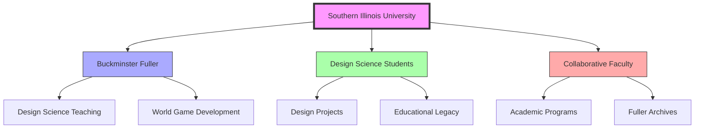
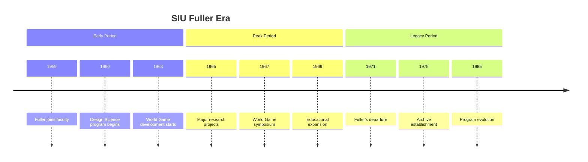

# Southern Illinois University

> A primary center for Fuller's academic work and the development of [[Design_Science_Education]], serving as his academic home from 1959 to 1971.

## Historical Significance

### Fuller's Tenure
- Professor 1959-1971
- Distinguished University Professor
- Development of [[World_Game]]
- Establishment of [[Design_Science]] program

### Legacy Impact
- Creation of [[Design_Science_Education]] curriculum
- Development of [[World_Game]] methodology
- Establishment of Fuller archives
- Influence on architectural education

## Key Connections

### People Network

### Key Figures
- [[Amy_Edmondson]] - Student and researcher
- [[Ed_J_Applewhite]] - Collaborator
- [[Medard_Gabel]] - [[World_Game]] development
- Department faculty and administrators

## Research Areas

### Design Science
- [[Design_Science_Education]]
- [[Comprehensive_Anticipatory_Design_Science]]
- [[Pattern_Recognition]]
- [[System_Analysis]]

### World Game Development
- [[World_Game]] methodology
- Global simulation techniques
- Resource management studies
- Educational applications

## Timeline

## Physical Campus

### Key Facilities
- Design Department
- World Game facilities
- Research laboratories
- Fuller dome residence

### Archive Locations
- [[Southern_Illinois_University_Archives]]
- Special Collections
- Design Science materials
- World Game documentation

## Academic Programs

### Historical Programs
- Design Science curriculum
- World Game workshops
- Architectural studies
- Systems thinking courses

### Modern Programs
- Design thinking
- Sustainable development
- Environmental design
- Systems analysis

## Research Impact

### Areas of Influence
- [[Design_Science]]
- [[World_Game]]
- [[Systems_Education]]
- [[Pattern_Learning]]

### Ongoing Research
- Sustainability studies
- Design methodology
- Systems thinking
- Environmental design

## Educational Legacy

### Teaching Methods
- Hands-on learning
- Systems thinking
- Comprehensive design
- Global perspective

### Student Projects
- Design implementations
- World Game sessions
- Research initiatives
- Community engagement

## Related Locations

- [[Design_Science_Lab]]
- [[BFI_Headquarters]]
- [[Stanford_Special_Collections]]
- [[Black_Mountain_College]]

## Archives

### Collections
- Fuller's papers
- Design Science materials
- World Game documentation
- Student projects
- Research records

### Access
- Digital archives
- Research facilities
- Educational resources
- Historical documents

## References

### Primary Sources
- Fuller, R. B. (1969). *Operating Manual for Spaceship Earth*. Southern Illinois University Press.
- Fuller, R. B. (1971). *The World Game: Integrative Resource Utilization Planning Tool*.

### Secondary Sources
- Edmondson, A. C. (2007). *A Fuller Explanation*. EmergentWorld LLC.
- Gabel, M. (1975). *Energy, Earth, and Everyone*. Doubleday.

## See Also

- [[Design_Science_Education]]
- [[World_Game]]
- [[Fuller_Archives]]
- [[Design_Science_Timeline]]

## Notes

Southern Illinois University served as the primary academic base for Fuller's later career, where he developed and implemented many of his most significant educational and research initiatives. The institution continues to maintain important archives and educational programs related to his work. 