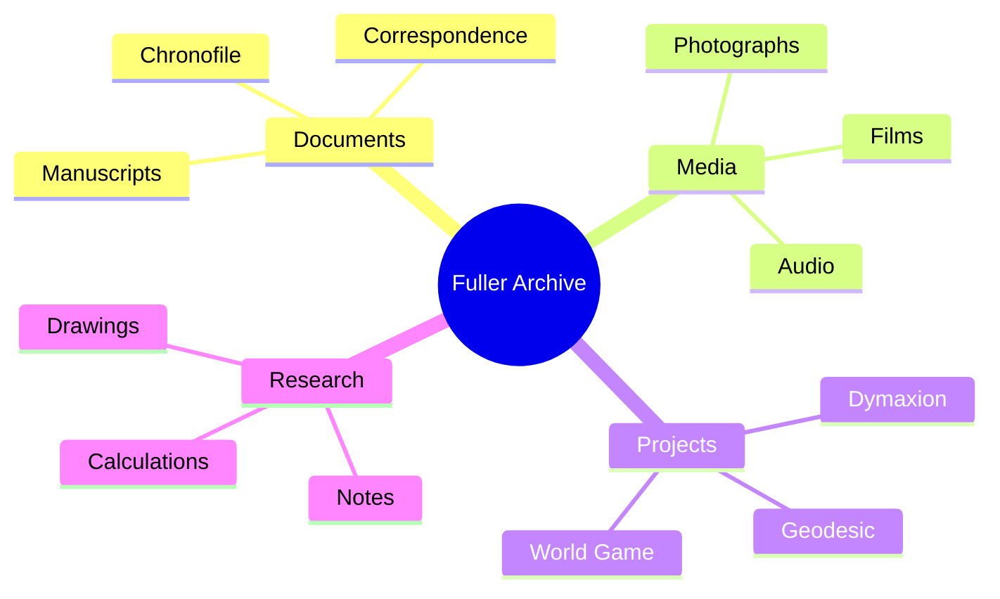
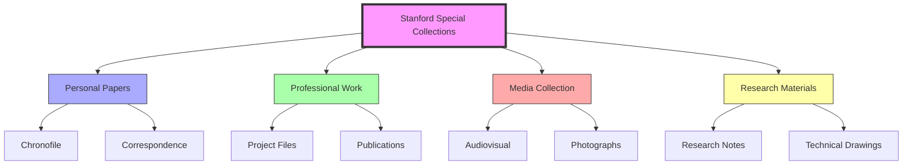
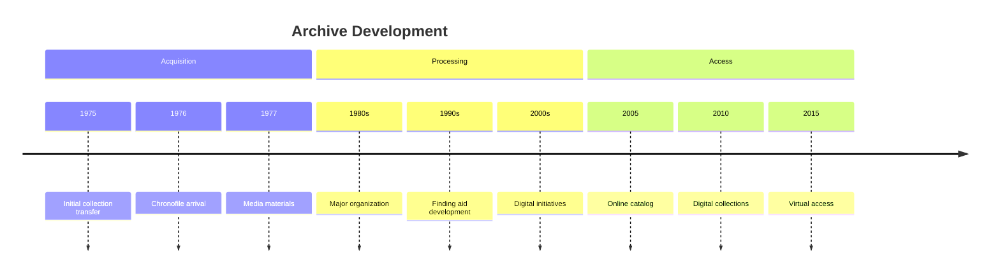

# Stanford Special Collections

> Home to the R. Buckminster Fuller Collection, one of the most comprehensive archives of Fuller's work, writings, and legacy materials.

## Collection Overview

### Scope
- [[Chronofile]] - Fuller's life documentation
- Personal papers and correspondence
- Project documentation
- Publications and manuscripts
- Audio-visual materials

### Key Materials

## Archive Organization

### Collection Structure

## Research Access

### Physical Access
- Reading room protocols
- Research services
- Material handling guidelines
- Reproduction services

### Digital Access
- Online finding aids
- Digital collections
- Research guides
- Virtual exhibitions

## Collection Areas

### Personal Materials
- [[Chronofile]] documentation
- Personal correspondence
- Family materials
- Biographical documents

### Professional Work
- [[Design_Science]] materials
- [[World_Game]] documentation
- [[Synergetics]] research
- [[Dymaxion]] projects

### Research Materials
- [[Pattern_Recognition]] studies
- [[System_Analysis]] documents
- [[Geodesic_Mathematics]] calculations
- [[Vector_Equilibrium]] research

## Timeline

## Research Impact

### Academic Studies
- [[Design_Science]] research
- Architectural studies
- Systems theory
- Environmental design

### Publications
- Books and monographs
- Journal articles
- Research papers
- Dissertations

## Collection Use

### Researchers
- [[Amy_Edmondson]] - [[Tensegrity]] research
- [[Bonnie_DeVarco]] - Digital archives
- [[Alec_Nevala-Lee]] - Biography research
- Academic scholars

### Projects
- [[Design_Science_Education]]
- [[Systems_Philosophy]]
- [[Pattern_Learning]]
- Historical documentation

## Related Collections

### Other Archives
- [[Southern_Illinois_University_Archives]]
- [[BFI_Digital_Archives]]
- [[Black_Mountain_College]] records

### Complementary Materials
- [[Design_Science_Lab]] documents
- [[World_Game]] records
- [[Fuller_Bibliography]] sources

## Digital Initiatives

### Current Projects
- Digitization of [[Chronofile]]
- Online exhibitions
- Research databases
- Virtual access tools

### Future Plans
- 3D model archives
- Interactive timelines
- Virtual reality tours
- Educational resources

## References

### Primary Sources
- Fuller Collection Finding Aid
- Stanford Special Collections Guide
- Archive Documentation

### Secondary Sources
- Archival journals
- Research publications
- Collection studies

## See Also

- [[Fuller_Archives]]
- [[BFI_Digital_Archives]]
- [[Design_Science_Timeline]]
- [[Chronofile]]

## Notes

The Stanford Special Collections serves as the primary repository for Fuller's legacy, providing essential resources for researchers, scholars, and practitioners continuing his work. The collection's comprehensive nature and ongoing digital initiatives ensure its accessibility for future generations. 